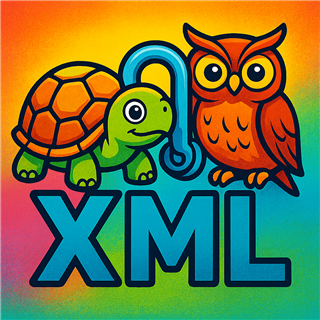
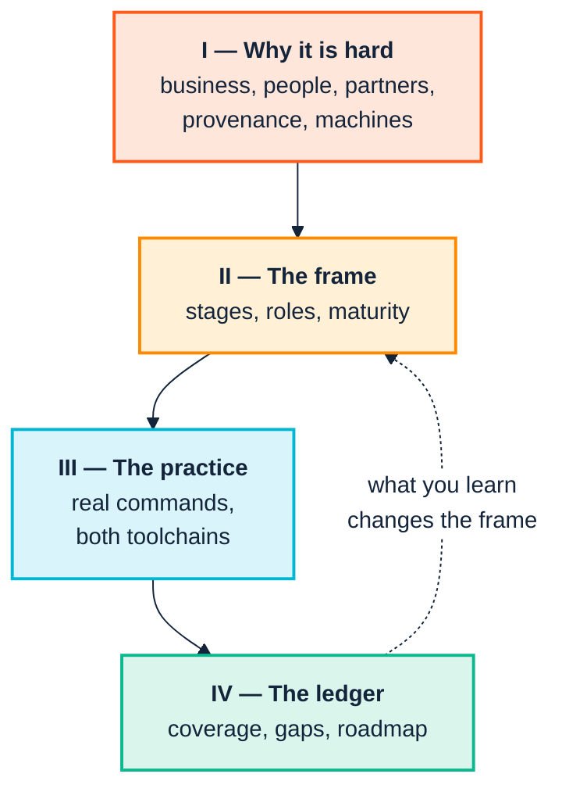

  

<h1 align="center">The SemOps Manual</h1>

  <em>Running a semantic practice the way you run software — 
  people, process, and a toolchain that actually exists.</em>

---

## What this is

**SemOps** is the operational discipline required to build, deploy, govern and
evolve semantic knowledge systems continuously — what DevOps did for software,
applied to ontologies, mappings, rules and knowledge graphs.

There is a lot of SemOps *strategy* about: maturity models, operating models,
nine-stage pipeline blueprints, polyglot technology menus. Strategy is cheap.
The reason semantic programmes stall is almost never that nobody drew the
diagram — it is that the diagram had no commands under it, no named owner, and
no answer for the person who has to justify the spend in October.

This manual is the missing middle. It takes the SemOps strategy material as
given and connects it, stage by stage, to **two toolchains that are built,
tested and runnable today**:

| Toolchain | What it is | Where it fits |
|---|---|---|
| `consolidated_ontology_suite_python` | A Python CLI and library — 50-check registry, OWL2 reasoning, version diffing, CSV→RDF triplification, auto-repair, live-triplestore checks. Published to PyPI as `ontology-quality-suite` | Automation: CI gates, release control, pipelines |
| `consolidated_ontology_suite_webapp` | The **Ontology Development Suite** VS Code extension — in-process SPARQL/SHACL/OWL2-RL engines via WASM, live diagnostics, graph view, query workbench | The author's desk: the loop before CI |

Every command shown in Part III was **executed for real** while writing this
manual, against the ontology suite's own bundled `examples/acme_robotics/`
fixture. Where the output in this manual differs from what a strategy document
would lead you to expect, the manual reports what actually happened and explains
why — see [Chapter 9](docs/09-continuous-integration.md) for the sharpest
example, where the obvious flag is the wrong one.

Where the toolchain has no answer for a SemOps concept, this manual says so
plainly and marks it grey. [Chapter 13](docs/13-coverage-and-gaps.md) is the
honest ledger.

---

## The shape of the argument

Part I is unusual in a technical manual, and it is first on purpose. The
failure modes that kill semantic programmes are overwhelmingly organisational,
cognitive and commercial rather than technical. A team that can run every
command in Part III and has not read Part I will build something correct that
nobody adopts.

---

## Read it on paper

**[Download the A4 PDF](https://github.com/pwin/SemOpsManual/releases/latest)** —
the whole manual as a 76-page A4 document: title page, contents with page
numbers, every diagram rendered, and an index of commands, flags and check
identifiers.

The PDF is published as a release asset rather than committed, so the repository
does not carry a fresh multi-megabyte binary for every revision. Build it
yourself with `cd tools && npm install && node build-pdf.mjs` — see
[tools/](tools/).

---

## Contents

### Part I — Why this is hard

| # | Chapter | What it covers |
|---|---|---|
| 1 | [The business case](docs/01-the-business-case.md) | The problems semantics actually solves, why they are invisible on a balance sheet, and how to fund work whose payoff is a cost that never arrives |
| 2 | [People and cognition](docs/02-people-and-cognition.md) | Social challenges inside the enterprise; cognitive styles and cognitive capacity as first-class design constraints, not soft-skill garnish |
| 3 | [Across the boundary](docs/03-across-the-boundary.md) | Working with peers, consortia and supply chains — where the incentives, not the RDF, are the hard part |
| 4 | [From research to industry](docs/04-from-research-to-industry.md) | What university projects produce, what industry needs, and the specific gap between them |
| 5 | [GenAI and agents](docs/05-genai-and-agents.md) | What large models change, what they emphatically do not, and why agents raise the value of exactly the discipline SemOps describes |

### Part II — The SemOps frame

| # | Chapter | What it covers |
|---|---|---|
| 6 | [Stages and stories](docs/06-stages-and-stories.md) | The nine pipeline stages, the six operating-model layers, the five maturity levels, and the cast of roles — reconciled into one picture |
| 7 | [The toolchain](docs/07-the-toolchain.md) | Both tools, what each is for, installation, and a decision table from question to command |

### Part III — The practice

| # | Chapter | What it covers |
|---|---|---|
| 8 | [Model and validate](docs/08-model-and-validate.md) | Stage 2 — the author's loop, in the editor, before anything reaches CI |
| 9 | [Continuous integration](docs/09-continuous-integration.md) | Stage 3 — the gate; and the verified reason the obvious flag is the wrong one |
| 10 | [Ingest and transform](docs/10-ingest-and-transform.md) | Stage 6 — CSV→RDF, cheapest check first, and whose problem a finding is |
| 11 | [Release and change](docs/11-release-and-change.md) | Stages 1 and 4 — evidence-based semver, impact analysis, and repairs that apply themselves |
| 12 | [Operate and consume](docs/12-operate-and-consume.md) | Stages 7–9 — live triplestores, documentation, and knowledge products |

### Part IV — The ledger

| # | Chapter | What it covers |
|---|---|---|
| 13 | [Coverage and gaps](docs/13-coverage-and-gaps.md) | The honest matrix: SemOps concept → command, or → grey |
| 14 | [Adoption roadmap](docs/14-adoption-roadmap.md) | A sequenced path from Level 1 to Level 3, with what to do on the first day of each |
| A | [Diagram and brand conventions](docs/diagram-style.md) | The palette, and the width rules that keep every diagram readable on screen and on A4 |

---

## How to read it

**If you are deciding whether to fund this** — Chapters 1, 3 and 4, then the
coverage matrix in 13. About forty minutes.

**If you have been handed a stalled semantic programme** — Chapter 2 first. The
diagnosis is usually there rather than in the technology.

**If you are the engineer** — skim 6 and 7, then work through Part III with a
terminal open. Every command runs against fixtures bundled in the ontology
suite, so nothing needs inventing to follow along.

**If you are writing the business case** — Chapters 1 and 14, and steal the
maturity-level framing wholesale.

---

## Conventions

Findings, commands and outputs in Part III are real. Where a number appears
(*"296 findings"*, *"confidence 100%"*) it is the number the tool printed on the
run described, not an illustrative figure.

Grey boxes and dashed borders in diagrams mean **not covered by this
toolchain**. They are a deliberate, load-bearing part of the notation — see
[Appendix A](docs/diagram-style.md).

Diagrams are Mermaid and render natively on GitHub. They are built to stay
readable when printed A4 portrait; the rules that achieve that are documented in
Appendix A for anyone extending the manual.

---

## Licence

MIT — © 2026 Peter Winstanley. See [LICENSE](LICENSE).

This covers the text, the diagrams and the build tooling: use it, adapt it, and
put it in front of your own organisation. Attribution is required; a warranty is
not offered.

Two things the licence does not reach. The **Semantechs mark** in
[`assets/`](assets/) is a trademark, and a copyright licence does not grant
rights in it — reuse the manual freely, but replace the branding if you
republish. The **third-party vocabularies** referenced throughout (the W3C
Organization Ontology, FOAF) carry their own terms, as do the two toolchains the
manual documents.

---

   
  <b>Semantechs</b> · Turtle, OWL, SPARQL — and the operating discipline around them

