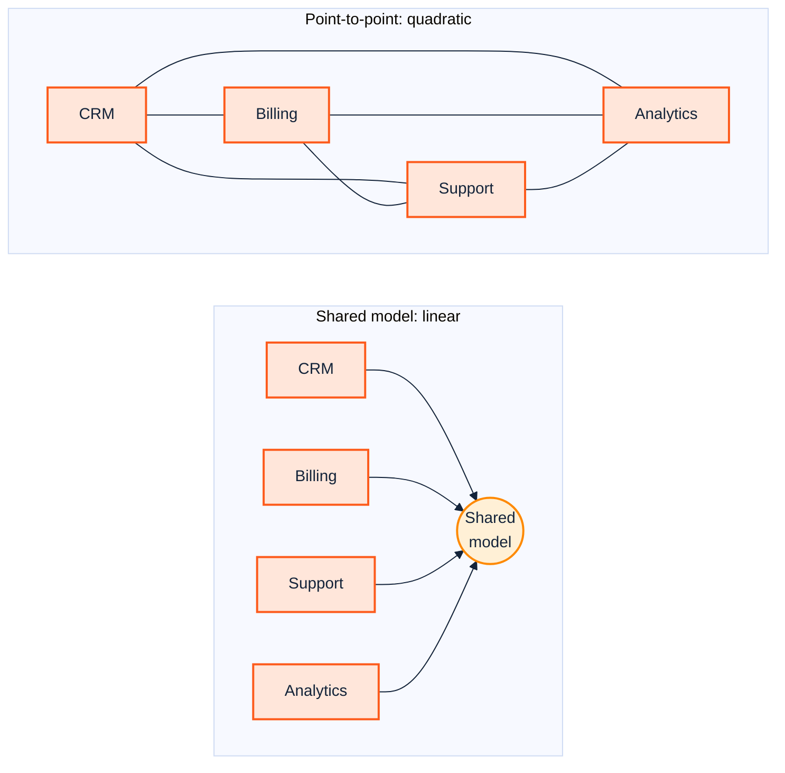
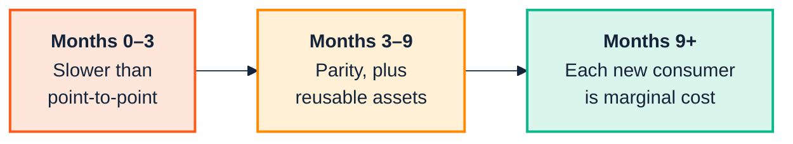

  

# 1. The business case

> *Part I — Why this is hard*

The SemOps strategy material opens with capability: knowledge lifecycle
management, CI/CD, observability, governance. All correct, and all of it answers
the question *"what would good look like?"* — which is not the question anyone
gets asked when they request budget. The question they get asked is *"what is
broken today, what does it cost, and how will I know this fixed it?"*

This chapter is about answering **that** question, because semantic programmes
fail at the funding stage far more often than at the modelling stage.

---

## 1.1 The four business problems that are actually semantic

Most data problems are not semantic problems and should not be sold as such. The
ones that genuinely are share a signature: **the data is present, correct, and
still produces the wrong answer, because two systems disagree about what a word
means.**

Four patterns cover most of the real cases.

### Reconciliation tax

Two departments report a number. The numbers differ. Nobody can say which is
wrong, because "active customer" means *billed in the last 90 days* in finance
and *logged in within 90 days* in product. Neither is wrong; they are answers to
different questions wearing the same label.

The cost is not the discrepancy. It is the **standing army of reconciliation** —
the recurring analyst hours spent explaining the difference, the meeting that
happens every month, the fortnight before every board pack. This cost is
measurable, and almost nobody measures it, because it is distributed across
dozens of people's calendars in slices too small to appear in any budget line.

> **Instrument it first.** Before proposing an ontology, count the hours. Ask
> four analysts to tag a fortnight of calendar time as "reconciling definitions."
> The resulting number is usually large enough to fund the programme on its own,
> and — critically — it is a number that already exists in the business's own
> terms, rather than one you have to teach them to care about.

### Integration cost that scales quadratically

Every new system integrated point-to-point with *n* existing systems costs *n*
mappings. Ten systems is forty-five potential pairings; twenty is a hundred and
ninety. Teams feel this as "integrations take longer every year" and diagnose it
as a staffing problem.

A shared model changes the exponent, not the constant. Each system maps once, to
the model. The pitch is not "we will make this integration cheaper" — it will
not, the first one is *more* expensive — it is **"we will stop the curve
bending."**

The honest caveat, which you should say out loud before someone else does: the
shared model is itself an asset that must be maintained, and an unmaintained
shared model is worse than point-to-point mappings because it carries authority
it no longer deserves. That maintenance burden is precisely what the rest of
this manual automates — it is the reason SemOps exists as a discipline rather
than as a modelling exercise.

### Provenance you cannot reconstruct

A regulator, an auditor, or a customer asks *"where did this figure come from?"*
and the answer takes three weeks and two people who happen to remember. In
regulated sectors this is not an efficiency problem, it is an existential one:
the inability to evidence lineage can invalidate the figure regardless of
whether it was correct.

This is the pattern with the clearest financial framing, because the downside is
a number someone has already written down — the fine, the qualification, the
remediation programme.

### Knowledge that leaves with the person

The system works because Margaret knows that the `STATUS` field means something
different for records created before the 2019 migration. Margaret retires in
March. Nothing in any system records what Margaret knows.

The failure mode is delayed and therefore rarely attributed to its cause: the
programme that breaks in eighteen months' time is not connected, in anyone's
mind, to the retirement that caused it.

---

## 1.2 Why the payoff is invisible

Semantic work has an awkward economic shape. Done well, its payoff is **a cost
that does not arrive** — the outage that did not happen, the reconciliation
meeting that got cancelled, the integration that took two weeks rather than two
months.

Organisations are structurally poor at valuing avoided costs. The team that
prevents ten incidents is less visible than the team that heroically resolves
one. This is not irrationality; it is a measurement problem, and it has three
practical consequences worth planning around.

**Baseline before you build.** Once the ontology is in place you can no longer
measure what it saved, because the counterfactual is gone. The reconciliation
hours, the mean integration lead time, the mean time to answer a lineage
question — capture them *before* anything changes, or you will spend the rest of
the programme asserting benefits you cannot evidence.

**Pick a first use case with a visible failure.** Not the most valuable one; the
most *legible* one. A use case whose current failure mode is embarrassing and
specific — a regulator's question that took three weeks — produces a before/after
story an executive can retell. A use case whose failure mode is diffuse
inefficiency produces a slide nobody remembers.

**Expect the trough.** The first delivery is slower than the point-to-point
alternative, because you are building the shared asset and the first consumer of
it simultaneously. Say so at the start. A programme that promised acceleration
and delivered a trough loses its sponsor in month four; one that predicted the
trough and hit it on schedule gains credibility.

---

## 1.3 The decay problem, which is the SemOps problem

There is one failure mode that dwarfs the others, and it is the reason this
manual exists.

> **An ontology is most accurate the day it ships. Every day after that, without
> deliberate maintenance, it decays.**

Enterprise ontologies fail in a small number of well-documented ways, and almost
all of them are variations on decay:

| Failure mode | What it looks like eighteen months in |
|---|---|
| **Business-model drift** | Definitions that were precise last year are now misleading — the product line changed, the model did not |
| **Unknown unknowns** | Expert interviews captured what experts knew; what nobody thought to mention is now baked into the structure |
| **Maintenance fatigue** | Domain experts stop accepting refinement-workshop invitations. Calendar declines end the programme, not a decision |
| **Cross-domain collision** | Two separately-built ontologies must reconcile; the integration costs more than either original |
| **Governance abandonment** | The project ends, the owner moves on, no feedback loop remains, drift is now silent |

Read that table as a specification. Each row is a requirement:

- Drift must be **detected mechanically**, because humans will not notice it →
  [Chapter 11](11-release-and-change.md), `version-diff` and `consistency`.
- Maintenance must cost **minutes, not workshops**, or fatigue wins →
  [Chapter 8](08-model-and-validate.md), the in-editor loop.
- Breakage must be **caught at the gate**, not in production →
  [Chapter 9](09-continuous-integration.md), `--fail-on Violation`.
- Ownership must be **named and enforced by the pipeline**, not by goodwill →
  [Chapter 6](06-stages-and-stories.md), roles.

This is the actual argument for SemOps, and it is worth stating baldly to a
sponsor: **the risk is not that you build the wrong ontology. It is that you
build the right one and then let it rot**, at which point it is worse than
nothing, because systems and people now trust it.

---

## 1.4 What to write on the slide

Three sentences, in this order, is usually enough:

1. *"Today, [specific, instrumented cost] — N analyst-hours a month, or a
   three-week lineage question, or an integration curve that has bent 40% in two
   years."*
2. *"We will fix it for one legible use case, and we expect to be slower for the
   first quarter."*
3. *"The ongoing cost is automated maintenance, not a standing modelling team —
   here is the pipeline that does it."*

Sentence 3 is the one this manual equips you to make truthfully. Without it,
sentence 1 has been pitched — and declined — in most large organisations
already.

---

## Sources

- [How Enterprise Ontologies Fail, And How to Stop It — Modern Data 101](https://www.moderndata101.com/blogs/how-enterprise-ontologies-fail-and-how-to-stop-it)
- [Enterprise Knowledge Graph Use Cases & Adoption Strategies 2026](https://www.aisearchrankings.com/content/knowledge-graph-for-2026/enterprise-knowledge-graph-use-cases-adoption-strategies-2026.php)
- [Semantic Web and Knowledge Graphs for Industry 4.0 — MDPI](https://www.mdpi.com/2076-3417/11/11/5110)

---

| ← [Contents](../README.md) | [2. People and cognition →](02-people-and-cognition.md) |
|---|---|
