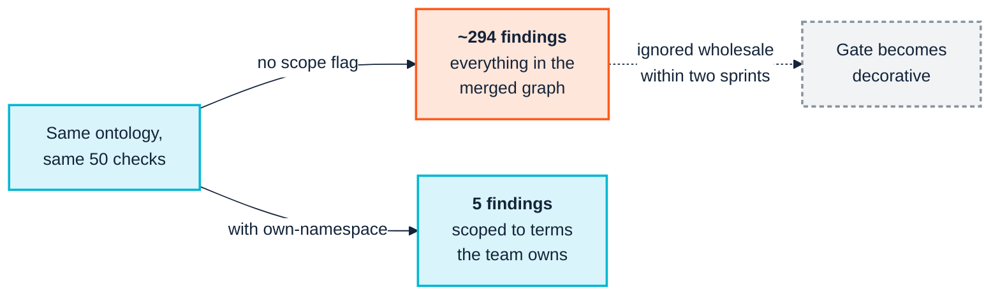

  

# 2. People and cognition

> *Part I — Why this is hard*

Semantic technology has an unusual property among enterprise technologies: **its
artefacts are arguments about meaning, and meaning is political.** A schema
change is a technical act. A definition change is a negotiation about whose
account of the business is correct.

This chapter is about the human system the toolchain has to survive contact
with. It is not soft-skills garnish appended to the engineering — it determines
which technical choices are viable. The reason [Chapter 9](09-continuous-integration.md)
recommends a particular CI flag over the obvious one is, in the end, a cognitive
argument as much as a correctness one.

---

## 2.1 Definitions are territory

When finance and product disagree about "active customer," the disagreement is
not a misunderstanding to be cleared up. Each definition is load-bearing for
someone's targets, someone's forecast, someone's bonus. Asking the two teams to
"agree a single definition" asks one of them to accept a number that makes their
performance look worse.

The naive semantic response — *both can exist, we will model them as distinct
subclasses with clear labels* — is technically correct and socially incomplete.
It resolves the representation problem while leaving the actual question
untouched: **which one goes in the board pack?**

Three practical consequences:

**Model the disagreement, do not resolve it.** `BilledActiveCustomer` and
`EngagedActiveCustomer` as distinct, well-labelled terms is a better outcome
than a compromise definition that neither team uses. The ontology's job is to
make the distinction visible and unambiguous, not to adjudicate it.

**Get the adjudication done by someone with the authority to do it.** If the
programme requires a decision about which definition is canonical, that decision
needs an owner senior enough to make it stick. A knowledge engineer does not
have that authority and should not be manoeuvred into pretending they do — the
common failure is a modeller quietly picking one, shipping it, and discovering
six months later that half the business has been ignoring the model.

**Record who decided, and when.** Definitions get relitigated. Without the
decision trail, the same argument recurs annually with fresh participants and no
memory of why the current answer was chosen.

---

## 2.2 The priesthood problem

Semantic technology attracts a particular failure: a small group becomes fluent
in OWL, SHACL and SPARQL, and gradually becomes the only group that can read the
organisation's most important asset.

This feels like success — the team is indispensable — and it is the surest
predictor of decay. It produces:

- **A review bottleneck.** Every change queues behind the same three people.
- **Unchallengeable models.** Domain experts cannot read the artefact well
  enough to notice it is wrong, so they stop trying, and the modelling loses its
  only real error-correction mechanism.
- **A bus factor of two**, applied to the asset the organisation was told to
  treat as strategic.
- **A veneer of consultation.** Workshops happen; experts nod at diagrams they
  cannot verify; the model records the modeller's understanding, not the
  expert's.

The counter-measure is not "train everyone in OWL." It is to ensure **the
artefacts that domain experts must validate are rendered in a form they can
actually validate**, and that the formal artefact is generated from or checked
against that form. Concretely, in this toolchain:

- Generated reference documentation, not raw Turtle, is what goes to a domain
  expert for review ([Chapter 12](12-operate-and-consume.md), `docgen`).
- The extension's hierarchical outline and graph view render structure
  visually — a domain expert can see that `Contractor` sits under `Employee` and
  say "no, it does not," without reading a single axiom
  ([Chapter 8](08-model-and-validate.md)).
- Check findings carry a human-readable `message` and `remediation` field, not
  just a rule identifier, so a non-specialist can tell whether a finding matters.

> A useful test: pick a domain expert who has never written RDF and ask them to
> find the deliberate error in your model using only the artefacts you would
> normally send them. If they cannot, your review process is theatre, and the
> priesthood has already formed.

---

## 2.3 Cognitive styles: people do not categorise the same way

Ontology work assumes a particular cognitive style — comfort with abstraction,
hierarchy, and the discipline of saying only what is formally true — and then
treats people who do not share it as obstacles. They are not; they are the
domain.

Four styles show up reliably in modelling sessions. None is wrong, and a session
that only accommodates the first will produce a model that is formally elegant
and factually incomplete.

| Style | How they answer *"what is a Customer?"* | What they contribute | How they get lost |
|---|---|---|---|
| **Taxonomic** | Starts with the general case, refines downward, wants the hierarchy settled first | Structural coherence; spots inconsistent partitioning | Over-abstracts; builds levels nobody needs |
| **Narrative / procedural** | *"Well, when an order comes in…"* — tells you the process, not the type | Real edge cases; how the business actually behaves | Frustrated by requests to state things atemporally |
| **Exemplar-driven** | *"Acme Ltd is a customer. So is Bob, sort of."* — reasons from instances | Fast falsification of an over-clean model | Resists generalising; every case is special |
| **Formal / logical** | Asks whether the classes are disjoint and whether the property is functional | Precision; finds the contradictions | Optimises for logical tidiness over usefulness |

The practical move is to **elicit in the style the expert has, and translate**.
An exemplar-driven expert should be shown instances, not a class hierarchy. A
narrative expert should be allowed to tell the story, with the modeller
extracting types afterwards and playing them back as a story to confirm.

This is also why the fixture in Part III is a small org chart rather than an
abstract domain. `Employee`, `Contractor`, `worksIn` are things every style can
reason about, which makes it a fair test of tooling rather than a test of
whether the reader thinks like a taxonomist.

A specific trap worth naming: **the exemplar-driven expert is usually right and
usually ignored.** When someone says "Bob is sort of a customer," they have
found a genuine boundary problem. The taxonomic instinct is to rule it out of
scope. Eighteen months later, "sort of" cases are 15% of the data and the model
has no place to put them.

---

## 2.4 Cognitive capacity is a hard budget

Working memory holds roughly four items. Not four ontology classes — four
*chunks*, where a chunk is whatever the person has already internalised well
enough to treat as one thing. An experienced modeller may hold "the employment
subtree" as one chunk; a newcomer holds five classes and has nothing left over
to reason with.

Every design decision in a semantic toolchain either spends or conserves this
budget. Three places where the spending is visible and avoidable:

### The ~300-finding report

Running the full check registry over the manual's fixture with its real `org:`
and FOAF imports resolved produces **close to 300 findings** — five consecutive
runs gave 290, 292, 294, 294 and 295. Adding a single flag that scopes the
report to the terms the team actually owns produces **5**, exactly and
repeatably.

Both numbers are correct. The wide run is genuinely checking every triple in the
merged graph, including the internal documentation habits of the W3C
Organization Ontology. It is also **cognitively useless as a gate**: no team
triages three hundred findings per commit, so within two sprints the gate is
either switched off or ignored, and the handful of findings that were actually
theirs are lost with the rest.

That the wide number also drifts by a few between runs is a second, smaller
argument for the same conclusion — a gate whose output a reader cannot
reproduce teaches them not to trust it. [Chapter 9](09-continuous-integration.md)
traces that drift to a single check.

This is the single most important practical lesson in the manual, and
[Chapter 9](09-continuous-integration.md) works through it with the real
outputs — including why the *obvious* way to cut the noise introduces four false
findings of its own.

### Ontology size versus the review budget

A 40-class ontology can be reviewed by a domain expert in a sitting. A 400-class
ontology cannot be reviewed by anyone, in any sitting, ever — it can only be
spot-checked. Past that scale, correctness stops being a function of human
attention and becomes entirely a function of mechanical checking. Teams
routinely cross this threshold without noticing that their quality model has
silently changed.

### Error messages as cognitive artefacts

`LOG-001` means nothing. *"Class `acme:Contractor` is asserted disjoint with its
own transitive superclass `acme:Employee`, which makes `acme:Contractor`
logically unsatisfiable"* — followed by *"remove either the subclass axiom or
the disjointness axiom; the two together are contradictory"* — means something
to a competent engineer who has never studied description logic. The second form
is what the suite actually emits, and it is the difference between a check that
teaches and a check that gates.

---

## 2.5 The workshop is a social event with a technical output

Domain experts have finite patience for refinement workshops, and maintenance
fatigue is a documented killer of enterprise ontology programmes. Calendar
declines end more semantic initiatives than technical failures do.

Design accordingly:

- **Front-load the expensive human time; automate the recurring part.** The
  first elicitation genuinely needs a room. The 400 subsequent consistency
  questions do not, and if you spend expert goodwill on them, it will not be
  there when you need it for the questions only a human can answer.
- **Bring falsifiable artefacts, not blank paper.** A wrong draft gets corrected
  in ten minutes; an open question gets a forty-minute discussion and no
  decision. Experts are far better critics than authors — this is not a failing,
  it is how expertise works.
- **Close the loop visibly.** An expert who never sees their correction land
  concludes, correctly, that the session was extractive. Show the diff.

---

## 2.6 What this implies for the toolchain

Everything above resolves into four requirements that Part III should be read
against:

| Human problem | Toolchain requirement | Where it lands |
|---|---|---|
| Priesthood, unreadable artefacts | Generated docs and visual structure for non-specialists | [Ch. 8](08-model-and-validate.md), [Ch. 12](12-operate-and-consume.md) |
| Cognitive overload at the gate | Findings scoped to what the team owns | [Ch. 9](09-continuous-integration.md) |
| Maintenance fatigue | Drift detected mechanically; repairs proposed automatically | [Ch. 11](11-release-and-change.md) |
| Territorial definitions | Change impact made explicit before merge, so decisions have evidence | [Ch. 11](11-release-and-change.md) |

If a tool does not reduce the load on the humans, it will be abandoned
regardless of correctness. That is the whole argument, and it is worth carrying
into every tooling decision the programme makes.

---

## Sources

- [How Enterprise Ontologies Fail, And How to Stop It — Modern Data 101](https://www.moderndata101.com/blogs/how-enterprise-ontologies-fail-and-how-to-stop-it)
- [Enterprise Knowledge Graph Platform Comparison 2026 — OvalEdge](https://www.ovaledge.com/blog/enterprise-knowledge-graph-platform)
- [My Ontologist: Evaluating BFO-Based AI for Definition Support (arXiv)](https://arxiv.org/pdf/2407.17657)

---

| ← [1. The business case](01-the-business-case.md) | [3. Across the boundary →](03-across-the-boundary.md) |
|---|---|
