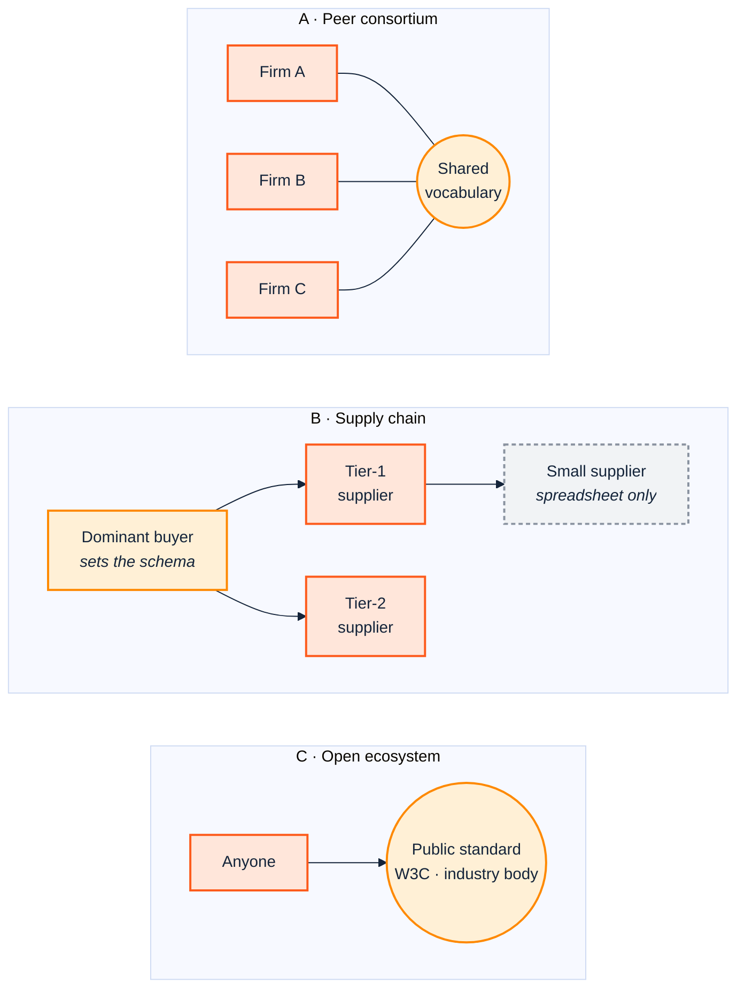
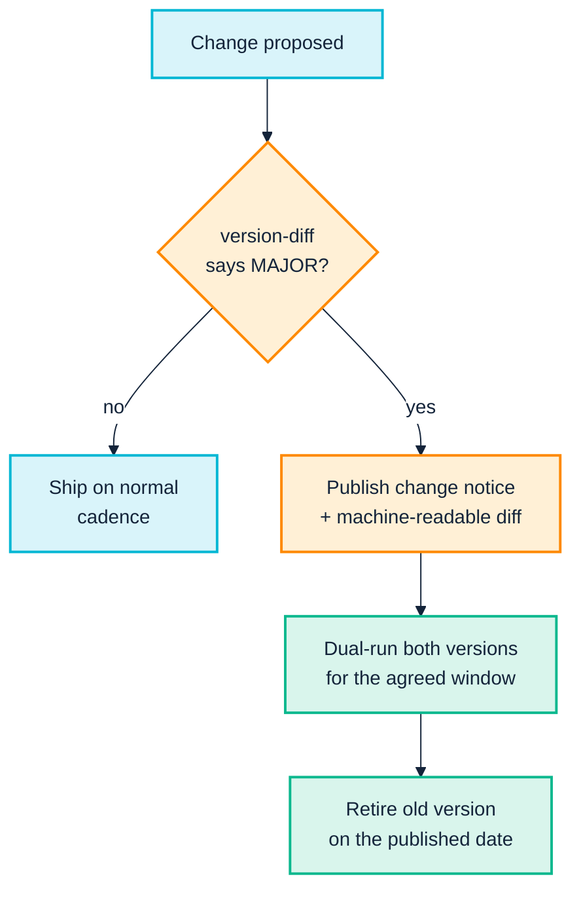

<p align="center">
  
</p>

# 3. Across the boundary: peers and supply chains

> *Part I — Why this is hard*

Everything in [Chapter 2](02-people-and-cognition.md) assumed a shared employer:
one budget, one CI system, and — ultimately — someone senior enough to settle an
argument. Cross out those three assumptions and you have the cross-enterprise
case, which is where semantic technology is simultaneously most valuable and
most likely to fail.

It is most valuable because shared meaning across organisations cannot be
achieved by a shared database — nobody will accept one. It is most likely to
fail because **every enforcement mechanism SemOps relies on stops at the
company boundary.** You cannot fail someone else's build.

---

## 3.1 What changes at the boundary

| Inside one enterprise | Across enterprises |
|---|---|
| One CI system can gate every change | You cannot gate a partner's pipeline; you can only detect and notify |
| A senior owner can settle a definition dispute | No shared authority — disputes are settled by negotiation or by power |
| Breaking changes can be fixed downstream by the same team | Downstream is someone else's backlog, with its own priorities |
| Cost of coordination is internal overhead | Cost of coordination is a commercial term someone must agree to pay |
| Sharing a model is uncontroversial | A model can reveal commercially sensitive structure |
| Capability is roughly uniform | Partners range from a semantics team to a spreadsheet and one IT contractor |

The last row is the one most often missed, and it dominates supply-chain work.

---

## 3.2 Three topologies, three different problems



### A. Peer consortium — the coordination problem

Competitors or near-peers agree a shared vocabulary: trade associations,
regulatory reporting groups, interbank messaging, research consortia.

The hard parts are not technical:

- **Nobody can compel anyone.** Progress is by consensus, which means the model
  drifts towards the union of everyone's requirements and the intersection of
  everyone's willingness to constrain. Consortium ontologies are characteristically
  under-constrained — everything is optional, because making anything mandatory
  requires unanimity.
- **Commercial sensitivity has a modelling shadow.** How you model your customer
  segmentation reveals your customer segmentation. Members will decline to model
  the very areas where alignment would be most valuable, and will not always say
  that is why.
- **Competition-law caution is real** and worth taking seriously rather than
  routing around. Legal review of a shared model in a concentrated market is a
  legitimate step, not obstruction.
- **Release cadence is set by the slowest member**, because a change nobody has
  implemented is not a change.

*What works:* a deliberately small mandatory core, with extension points. Publish
the core with real constraints; let each member extend in their own namespace.
This is exactly the pattern Part III uses at company scale — import the shared
vocabulary, own your extensions, and check only what you own
([Chapter 9](09-continuous-integration.md)).

### B. Supply chain — the capability-asymmetry problem

One organisation has the leverage to mandate a schema — a large manufacturer, a
retailer, a public body. Compliance is a condition of doing business, so
adoption is not the problem.

The problems are:

- **Capability asymmetry.** A tier-1 supplier may have a data team. Their
  sub-supplier has a spreadsheet and a part-time IT contractor. A mandate that
  assumes RDF fluency does not produce compliance; it produces a cottage industry
  of consultants filling in forms on suppliers' behalf, and the data quality that
  implies.
- **The mandate arrives without the tooling.** "Send us this in the standard
  format" is not an ask, it is a project — and the cost lands on the party least
  able to absorb it.
- **Verification is one-directional.** The buyer validates what arrives. The
  supplier gets a rejection with no way to test in advance, so the loop is: send,
  get rejected, guess, resend.

*What works:* **give the supplier the gate.** The single highest-leverage
intervention in supply-chain semantics is publishing the validation as something
the supplier can run themselves, before submitting. Concretely, from Part III's
toolchain:

- Publish your SHACL shapes and check registry as files, not as prose in a PDF.
  The suite reads a registry directory from `--registry`/`--shapes`/`--sparql`,
  so a shared registry is a distributable artefact
  ([Chapter 8](08-model-and-validate.md)).
- Accept CSV. Most of the supply chain has CSV, and the CSV→RDF path
  ([Chapter 10](10-ingest-and-transform.md)) means the supplier never has to
  author RDF at all — they produce the tabular extract they already have, and
  the transformation is yours to own and version.
- Ship the check as an editor experience, not a batch report. The VS Code
  extension runs its checks in-process via WASM, with no Python or Java runtime
  required — which for a small supplier is the difference between "we can run
  this" and "we need to procure something."

That last point deserves emphasis: **the runtime dependency is a governance
decision.** Mandating a validation step that requires a JVM excludes a class of
suppliers from self-service compliance as surely as mandating a language they do
not speak.

### C. Open ecosystem — the stability problem

You depend on a public vocabulary you do not control: FOAF, the W3C Organization
Ontology, schema.org, an industry standard.

Here the risk inverts. You are not coordinating; you are **exposed**. The
vocabulary may change, stagnate, or turn out to encode conventions that break
your tooling in ways nobody documented.

Part III contains a verified, live example of exactly this. FOAF deliberately
declares `foaf:name` with `rdfs:domain owl:Thing` — an intentional "usable on
anything" convention. A conformance checker that walks asserted `rdfs:subClassOf`
edges does not know that every class is implicitly a subtype of `owl:Thing`
under OWL semantics, because that is an axiomatic fact rather than an ordinary
triple. The result is a domain/range "violation" on every single `foaf:name`
triple in otherwise perfect data
([Chapter 10](10-ingest-and-transform.md)).

Nobody is at fault. FOAF is behaving as designed, the checker is behaving as
designed, and the finding is still wrong. **Depending on a public vocabulary
means inheriting its conventions, including the ones that were never written
down.** Budget for discovering them the hard way.

---

## 3.3 The cross-boundary release problem

Inside one enterprise, a breaking ontology change is manageable: detect it, find
the affected queries, fix them, ship together
([Chapter 12](12-release-and-change.md) does all three, and the last one
automatically).

Across a boundary, the same change is a **negotiation with a lead time**. You
cannot auto-repair a partner's queries; you often do not know they exist.

The protocol that works looks like this:



Two things make this workable rather than aspirational:

**The bump decision must be evidence-based, not a judgement call.**
`version-diff` classifies a change by inspecting what actually happened to the
axioms — a removed class is MAJOR whatever the author intended. In
[Chapter 12](12-release-and-change.md) it correctly returns `MAJOR` for the
fixture's release, on the evidence of one removed class, while still reporting
the additive changes as minor. Across a boundary this matters enormously,
because "is this breaking?" stops being a conversation and becomes a command
whose output both parties can run.

**The change notice should carry the machine-readable diff, not just prose.**
`version-diff --json` writes `diff.json` alongside the human-readable text. A
partner can then diff programmatically rather than reading your release notes
and hoping.

### Migration annotations are a cross-boundary contract

When you rename a term, assert the migration annotation **from the retiring IRI
to the new one**:

```turtle
acme:Engineer owl:equivalentClass acme:SoftwareEngineer .
```

`owl:equivalentClass` is logically symmetric, so a reasoner treats both
directions identically — but rename *detection* reads it directionally, from the
removed term to its replacement. Written the other way round, the tooling falls
back to name-similarity guessing and confidence drops sharply.

Inside one company that costs you an afternoon. Across a boundary it is the
difference between a partner's tooling automatically identifying the
replacement, and a human reading a PDF. Write the annotation in the direction
the tools read.

---

## 3.4 Trust, provenance and attribution

Once data crosses an organisational boundary, *"who said this?"* becomes as
important as *"what does it say?"* — and it is a question RDF is unusually well
equipped to answer, provided someone decided to answer it.

- **Keep each partner's contribution in its own named graph.** This is the
  single decision that most improves cross-enterprise operability, and it is
  nearly free at ingest time and nearly impossible to retrofit. The suite's
  live-triplestore checking is named-graph aware precisely because this is the
  expected topology ([Chapter 13](13-operate-and-consume.md)).
  **Note the limit:** named graphs give you provenance and lifecycle, not scoped
  validation — SHACL is defined over a single graph and validates the union, so
  checking one partner's contribution against one partner's contract means
  extracting that graph and validating it on its own
  ([Chapter 13](13-operate-and-consume.md) §13.1).
- **Do not merge on ingest.** A merged graph cannot answer "which supplier
  asserted this?", and that is the question the incident review will ask.
- **Record the conformance verdict, not just the data.** "This batch passed the
  agreed shapes at version 2.1 on this date" is the artefact that resolves
  disputes.

---

## 3.5 Where this leaves the practice

The cross-boundary case does not need a different toolchain. It needs the same
toolchain with three shifts of emphasis:

| Inside | Across |
|---|---|
| The gate fails the build | The gate produces a **notice** the other party can act on |
| Repairs are applied automatically | Repairs are **published as patches** for the other party to apply |
| Ownership is a role | Ownership is a **contract term** |
| Checks scoped to what we own | Checks scoped to what we own **and published so partners can run them too** |

The right-hand column is mostly a matter of *who receives the output*, which is
why the mechanics in Part III transfer largely unchanged. The failure mode is
assuming the left-hand column's enforcement model still applies — building a
beautiful gate, and discovering it has no jurisdiction.

---

## Sources

- [Semantic Web and Knowledge Graphs for Industry 4.0 — MDPI](https://www.mdpi.com/2076-3417/11/11/5110)
- [An ontology-based method for knowledge reuse in the design for maintenance of complex products — ScienceDirect](https://www.sciencedirect.com/science/article/abs/pii/S0166361524000526)
- [How Enterprise Ontologies Fail, And How to Stop It — Modern Data 101](https://www.moderndata101.com/blogs/how-enterprise-ontologies-fail-and-how-to-stop-it)

---

| ← [2. People and cognition](02-people-and-cognition.md) | [4. From research to industry →](04-from-research-to-industry.md) |
|---|---|
