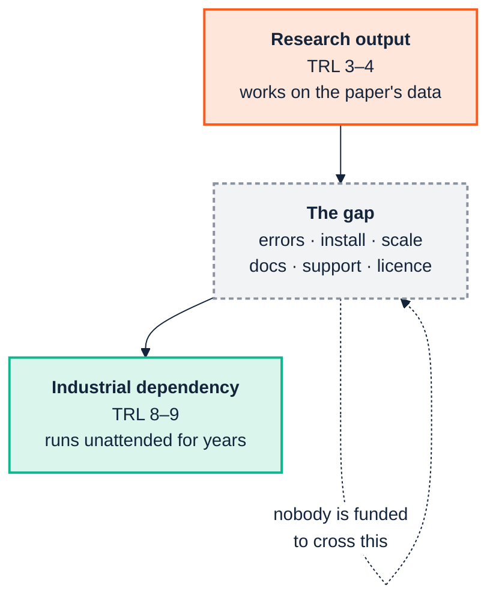

<p align="center">
  
</p>

# 4. From research to industry

> *Part I — Why this is hard*

Semantic technology has deeper academic roots than almost any other part of the
enterprise data stack. Description logics, OWL, SHACL, the reasoners, and a
large share of the libraries all originate in university research groups. This
is a genuine strength — the formal foundations are unusually solid — and it
creates a characteristic and under-discussed problem:

> **A research project and an industrial product optimise for different things,
> and the artefacts they produce are correspondingly different. Adopting a
> research artefact as though it were a product is one of the most reliable ways
> to derail a semantic programme.**

This chapter is about that mismatch, and about how to consume research output
responsibly rather than either naively or dismissively.

---

## 4.1 Different objective functions

Neither party is doing anything wrong. They are being rewarded for different
outcomes.

| | University project | Industrial product |
|---|---|---|
| **Success is** | A novel, defensible contribution, published | A system that runs unattended for years |
| **Rewarded for** | Novelty, generality, formal results | Reliability, predictability, supportability |
| **Timeline** | Funded 3 years; ends on a date | Indefinite; cost accrues after launch |
| **Team continuity** | The PhD student graduates | Deliberate handover and on-call |
| **Failure handling** | Out of scope; the paper reports the good case | The main event; most code is edge cases |
| **Evaluation** | Precision/recall against a gold standard | Did the build stay green, did anyone have to think |
| **Docs aimed at** | Reviewers who know the field | A newcomer at 4pm on a Friday |
| **"Done"** | Paper accepted | Never |

The consequential row is **timeline**. A research artefact's maintenance model is
usually *"the author will fix it if they have time and still care."* That is not
a criticism — no grant funds a decade of maintenance — but it means the artefact
carries an implicit expiry date that does not appear anywhere in its README.

---

## 4.2 What actually arrives

A research artefact typically arrives at roughly **TRL 3–4**: validated in a lab
setting, demonstrated on the paper's own dataset. Industrial dependency requires
roughly **TRL 8–9**. That is not a small increment; it is usually more work than
the original research.



Concretely, the things usually missing:

**Failure behaviour.** Research code tends to assume well-formed input, because
the paper's dataset was well-formed. Production input is not. The difference
shows up as stack traces rather than diagnostics.

**Installation as a solved problem.** "Requires Java 8, this specific JAR, and
these three environment variables" is acceptable in a lab and is a procurement
event in an enterprise.

**Scale characteristics.** Evaluated on 10,000 triples; your graph has 400
million. Reasoning in particular has complexity characteristics that make this
gap qualitative rather than quantitative.

**Error messages for non-specialists.** Compare `LOG-001` with the suite's
actual message — *"Class `acme:Contractor` is asserted disjoint with its own
transitive superclass `acme:Employee`, which makes `acme:Contractor` logically
unsatisfiable"*, plus a remediation line. The first is a research artefact's
idiom; the second is a product's.

**Licence and provenance clarity.** Research code frequently has no licence file
at all, which means it is not usable, which is rarely what the author intended.

**Backwards compatibility as a commitment.** Research artefacts change shape
between versions because the research changed shape. That is correct behaviour
for research and disqualifying for a dependency.

---

## 4.3 A verified example from this manual's own toolchain

This is not hypothetical, and it happened while writing this manual.

The ontology suite supports real OWL2 DL reasoning through external reasoners —
HermiT and Pellet, both research-lineage tools — as an **optional extra**.
Running the quality gate on the fixture without that extra installed produced,
verbatim:

```
LOG-001   logical    Class disjoint with its own ancestor              Violation
REA-022   reasoning  External DL reasoner unavailable --
                     only owlrl-based checks ran                       Info
```

with this message on `REA-022`:

> The external DL reasoner ('hermit') could not be run: `cannot access local
> variable 'entity' where it is not associated with a value`. Only the always-on
> owlrl RDFS/OWL2-RL closure and pattern checks (REA-001..004, LOG-001..007)
> ran. These are sound but not complete for full OWL2 DL — a class can be
> genuinely unsatisfiable without any of them firing.

Three things are worth extracting from that.

**The research-grade component failed in a research-grade way.** An internal
Python `UnboundLocalError` surfacing through the reasoner bridge is not a
diagnosable error for the team using it. There is nothing to act on in it.

**The industrial wrapper turned that into a usable signal.** Rather than
crashing, or — much worse — silently reporting "no problems found," the suite
emitted a first-class finding that states exactly which checks did not run, what
that means for the soundness/completeness of the result, and what to install to
fix it. The distinction between *"we checked and it is fine"* and *"we could not
check"* is preserved, and that distinction is the entire difference between a
gate you can trust and one you cannot.

**The dependency was optional by design.** The DL reasoner lives behind
`uv sync --extra reasoner` and requires a Java runtime. The core gate — the
always-on `owlrl` closure plus pattern checks — has no such dependency, and it
caught the deliberate contradiction in the fixture anyway, as `LOG-001`. The
research-grade capability is available to those who want it and load-bearing for
nobody.

That is the pattern to copy, and it generalises past this one tool:

> **Consume research artefacts as optional enhancements behind a stable
> interface, with a supported fallback that is sufficient on its own. Never let
> the research-grade component sit on the critical path.**

There is a second layer to the same story. Even when the DL reasoner *is*
installed and working, it has real limitations of its own — the suite's own
reasoning documentation records a case where HermiT trips on an ontology using
`xsd:date`. A tool being research-grade does not mean it is unreliable; it means
its failure modes are yours to discover, contain and route around.

---

## 4.4 The evaluation mismatch

The two worlds do not even measure the same thing.

Research asks: *does this technique find the errors, on a gold-standard corpus,
better than the prior technique?* Precision and recall against a labelled set.

Industry asks: *did this stop a bad change reaching production, without costing
the team more attention than the bad change would have?*

The second question has a term the first does not: **the human cost of the
output**. A checker with better recall that produces three hundred findings
where 5 are yours ([Chapter 2](02-people-and-cognition.md)) scores well on the
research metric and fails in practice, because a gate nobody triages is not a
gate.

Reproducibility divides the two cultures the same way. That unscoped run used to
drift by a few findings between identical invocations — immaterial to a recall
benchmark computed once against a gold standard, and disqualifying for a build
gate a team has to trust twenty times a day. It was fixed once someone measured
it repeatedly rather than once ([Chapter 9](09-continuous-integration.md) §9.2),
which is itself the difference between the two evaluation cultures.

This is why [Chapter 9](09-continuous-integration.md)'s central recommendation
is about *scoping the report*, not about check quality. The checks were already
good. The industrial problem was never detection; it was attention.

---

## 4.5 How to consume research output well

Neither naive adoption nor blanket refusal. Six practices:

1. **Pin exactly.** Research artefacts change shape between versions. Pin the
   version and upgrade deliberately.
2. **Wrap behind your own interface.** Never let a research library's API become
   your internal API, or you inherit its churn.
3. **Have a fallback that is sufficient alone.** As above: the optional extra is
   an enhancement, never the critical path.
4. **Convert its errors into your diagnostics.** `REA-022` above is the model —
   catch the incomprehensible failure, state what did not run and what that
   means.
5. **Check the licence before the capability.** An unlicensed artefact is not
   adoptable however good it is. Establish this first; it is cheap and it is
   occasionally fatal.
6. **Budget for the crossing.** If the artefact is load-bearing, someone must be
   funded to maintain the industrial wrapper. If nobody is, you have a
   dependency with an expiry date and no calendar entry.

---

## 4.6 The other direction

The traffic is not one-way, and industry's contribution is usually the
unglamorous half:

- **Real corpora.** Research is starved of realistic, messy, licensable data.
- **Failure reports.** The `xsd:date` reasoner limitation, the FOAF
  `owl:Thing` domain convention in [Chapter 10](10-ingest-and-transform.md), the
  SHACL engine that ignores `sh:severity` inside SPARQL-based constraints — these
  are findable only by running tools against real work.
- **Scale evidence.** The engine benchmarks in the suite's architecture
  documentation exist because someone ran both engines on a real-sized ontology
  and wrote down what happened.

The healthy relationship is: research supplies the formal foundations and the
novel techniques; industry supplies the corpora, the failure reports and the
maintenance. Both halves are needed, and the second half is the one that
determines whether any of it survives contact with an actual enterprise.

---

## Sources

- [Closing the gap between software engineering education and industrial needs (arXiv)](https://arxiv.org/pdf/1812.01954)
- [Generative AI solutions for software quality: Assessing industrial readiness — Software Quality Journal](https://link.springer.com/article/10.1007/s11219-026-09754-7)
- [A core ontology for modeling life cycle sustainability assessment on the Semantic Web — Journal of Industrial Ecology](https://onlinelibrary.wiley.com/doi/10.1111/jiec.13220)
- [Are Computer Science and Engineering Graduates Ready for the Software Industry? (arXiv)](https://arxiv.org/pdf/1805.08894)

---

| ← [3. Across the boundary](03-across-the-boundary.md) | [5. GenAI and agents →](05-genai-and-agents.md) |
|---|---|
