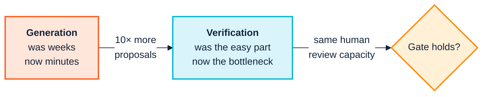
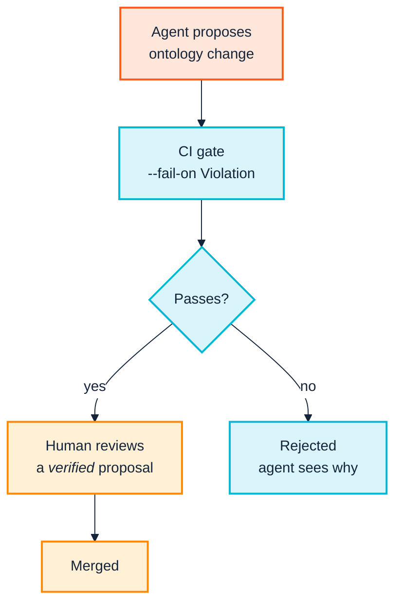

  

# 5. GenAI and agents

> *Part I — Why this is hard*

Generative AI affects semantic practice in two directions at once, and they are
usually discussed as if they were one thing:

- **AI for semantics** — large models help *build* ontologies: reading
  documents, proposing classes, drafting definitions and constraints.
- **Semantics for AI** — ontologies and knowledge graphs *ground* AI systems,
  giving agents typed, validated, authoritative structure to act against.

Both are real. Both change the economics of the work. Neither removes the need
for the discipline in this manual — and the second direction, in particular,
raises the value of it sharply.

---

## 5.1 AI for semantics: generation gets cheap

Large models are genuinely good at the tasks that used to consume the opening
months of an ontology project: reading a corpus and extracting candidate terms,
proposing class hierarchies, drafting definitions in consistent prose,
generating competency questions, suggesting where a constraint might belong,
translating between serialisations, and explaining an unfamiliar vocabulary to a
newcomer.

This is not marginal. It removes a genuine barrier — the specialist bottleneck
described in [Chapter 2](02-people-and-cognition.md) — and lets domain
specialists outside computer science participate in modelling their own domains.

But notice precisely what has changed. **The cost of producing a candidate model
has collapsed. The cost of knowing whether it is right has not.**

A model's output is *plausible by construction* — that is what it optimises. In
ontology work plausibility is a particularly treacherous property, because a
subtly wrong class hierarchy reads exactly like a correct one. A hallucinated
superclass does not look like a hallucination; it looks like a reasonable
modelling decision that a competent engineer might have made, and it will pass
casual review indefinitely.

Three consequences worth planning for:

**Review capacity, not generation capacity, is now the constraint.** If your
modelling throughput rises tenfold and your review throughput does not, the
surplus becomes unreviewed model. This is [Chapter 2](02-people-and-cognition.md)'s
cognitive-budget problem arriving with a much bigger firehose.

**Mechanical checking becomes more valuable, not less.** Precisely because
machine-generated models are fluent, the checks that do not care about fluency —
is this class satisfiable, is this property declared, does this contradict its
own ancestor — carry proportionally more of the load. `LOG-001` catches a
contradiction identically whether a human or a model introduced it, and it does
not find the surrounding prose persuasive.

**The decay clock speeds up.** [Chapter 1](01-the-business-case.md)'s decay
problem is a function of change rate. Raise the change rate tenfold and an
ontology that would have drifted quietly over three years drifts quietly over
four months.

> **The rule:** a model may propose. A human decides. A machine verifies. Any
> workflow that lets generation flow directly into an authoritative artefact has
> substituted fluency for correctness.

---

## 5.2 Semantics for AI: the grounding direction

The second direction is where the commercial energy currently is, and it is a
better argument for semantic investment than anything in the pre-LLM era.

Agentic systems have a structural weakness: they are probabilistic components
being asked to take consequential, typed actions against real systems. What they
lack is not intelligence but **constraint** — a specification of what things
are, how they relate, and what operations are legitimate.

That is an ontology's job description. The current framing in the field is that
ontologies provide the *logical guardrails* that turn a model from a fluent
text generator into a controllable actor: typed actions bound to authoritative
data objects, validated before execution.

The reported effects are directionally consistent, if early:

- Grounding each individual reasoning *step* against graph-structured data,
  rather than only the final answer, has been reported to improve results by
  roughly a quarter over chain-of-thought baselines.
- Ontology-grounded retrieval reports substantially better fact recall,
  particularly on relational, multi-hop questions — the ones where flat vector
  retrieval characteristically fails, because the answer requires traversing
  relationships rather than matching text.

Treat specific percentages as directional — much of this literature is
vendor-adjacent and the benchmarks are young. The qualitative claim is the
robust one: **multi-hop, relational questions are where a graph beats a vector
index, and that is exactly the question shape agents generate.**

### What agents actually require from you

An agent consuming your knowledge graph needs the things SemOps produces anyway,
which is a convenient alignment:

| Agent requirement | SemOps artefact | Chapter |
|---|---|---|
| Stable identifiers that do not silently change meaning | Versioned ontology, evidence-based semver | [12](12-release-and-change.md) |
| Machine-readable descriptions of terms | Generated documentation, `rdfs:label`, definitions | [13](13-operate-and-consume.md) |
| A guarantee the data conforms to the model | SHACL/registry validation at ingest | [10](10-ingest-and-transform.md) |
| Knowing what changed between versions | `version-diff`, migration annotations | [12](12-release-and-change.md) |
| Knowing who asserted what | Named graphs, provenance | [3](03-across-the-boundary.md), [13](13-operate-and-consume.md) |

Note the second row in particular. The `QUA-001` check — *a term has no
`rdfs:label`* — has always been easy to dismiss as documentation hygiene. When
the consumer is an agent selecting terms from your vocabulary, an unlabelled
term is one the agent cannot reliably use. Label coverage has quietly become a
functional requirement.

---

## 5.3 Agents as participants in the pipeline

The more interesting near-term shift is agents acting *inside* the SemOps
pipeline rather than only consuming its output: opening a pull request that adds
a class, drafting SHACL shapes from a specification, proposing repairs for
drift, triaging a check report.

This is safe **exactly to the degree that the gate is real**.

An organisation at maturity Level 1 — no version control, no automated
validation — that adds an agent to its modelling workflow has added an
untraceable, high-throughput source of plausible changes to an asset with no
gate. That is strictly worse than having neither.

An organisation at Level 3 — CI running linting, SHACL and reasoning checks on
every change — can accept agent contributions on the same terms as human ones,
because the same gate applies and the same evidence is produced. **The maturity
model has become a prerequisite for safely using the technology that makes the
work cheaper**, which is an argument worth making to a sponsor who wants the AI
benefits without the plumbing.

Two additional practices specific to agent participation:

**Record authorship provenance.** Which terms were machine-proposed, which were
human-authored, which were machine-proposed and human-approved? When a
definition is later disputed, this is the first question, and it is
unanswerable retrospectively.

**Keep the confidence gate.** [Chapter 12](12-release-and-change.md)'s repair
mechanism applies suggested fixes only at or above a confidence threshold — a
100%-confidence rename derived from an explicit migration annotation applies; a
name-similarity guess does not. That pattern generalises directly to agent
contributions: automate what is evidenced, escalate what is inferred.

---

## 5.4 What does not change

Worth stating plainly, because it is the part most easily lost in enthusiasm.

**Meaning is still political.** No model can adjudicate whether finance's or
product's definition of "active customer" goes in the board pack
([Chapter 2](02-people-and-cognition.md)). That is an authority question. A
model asked to resolve it will produce a fluent compromise nobody has agreed to,
and its fluency will make the absence of agreement harder to notice.

**Unknown unknowns stay unknown.** A model trained on documents knows what the
documents say. Margaret's undocumented knowledge about the 2019 migration is not
in the corpus, and the model will not flag its absence — it will produce a
confident account of the `STATUS` field that omits the one thing that matters.

**Someone still owns it.** Governance abandonment is the terminal failure mode
in [Chapter 1](01-the-business-case.md), and an agent cannot be the owner. It
can do the work of an owner; it cannot hold the accountability, and the moment
something goes wrong the organisation will look for a person.

**The cross-boundary problems are untouched.** [Chapter 3](03-across-the-boundary.md)'s
supply-chain capability asymmetry, competition-law caution and negotiated
release windows are commercial and legal facts. No model changes them.

---

## 5.5 The practical position

Adopt generative tooling for what it is good at — drafting, extracting,
explaining, translating, triaging — and hold the line on three things:

1. **Generation never writes directly to an authoritative artefact.** Propose,
   decide, verify, publish.
2. **The gate must exist before the throughput increases.** Sequence the
   automation before the acceleration, not after.
3. **Provenance of authorship is recorded from day one.** It cannot be
   reconstructed.

The pleasant irony is that a well-run SemOps practice is both the *best
consumer* of generative tooling — because it can safely absorb a much higher
change rate — and the *best supplier* to it, because grounded, versioned,
validated, well-labelled semantics is exactly what agentic systems are short of.
The discipline and the technology reinforce each other, provided the discipline
arrives first.

---

## Sources

- [Ontologies, Context Graphs, and Semantic Layers: What AI Actually Needs in 2026](https://contextandchaos.substack.com/p/ontologies-context-graphs-and-semantic)
- [Why Ontology Matters for Agentic AI in 2026: From World Models to Governable Decisions](https://kenhuangus.substack.com/p/why-ontology-matters-for-agentic)
- [Ontologies Are So Back: Why AI Agents Are Reviving the Semantic Web — Latent Space](https://www.latent.space/p/ontologies-agentic-systems)
- [LLM4KGOE 2026 — Workshop on LLM-driven Knowledge Graph and Ontology Engineering](https://koncordantlab.github.io/LLM4KGOE-ESWC/)
- [Ontologies for the Agentic Web — WordLift](https://wordlift.io/blog/en/ontologies-for-the-agentic-web/)
- [Research Brief: Ontologies for Agentic AI (2025–2026) — designpattern.fyi](https://www.designpattern.fyi/ontological-engineering/ontology-agentic-ai-research-brief/)

---

| ← [4. From research to industry](04-from-research-to-industry.md) | [6. Stages and stories →](06-stages-and-stories.md) |
|---|---|
