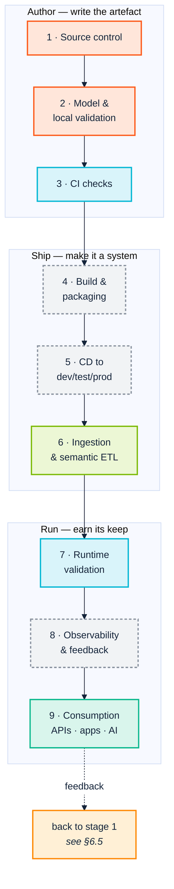
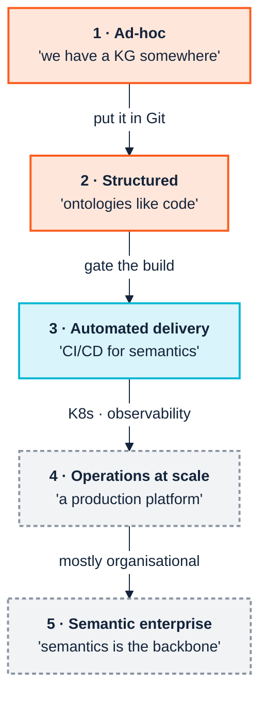
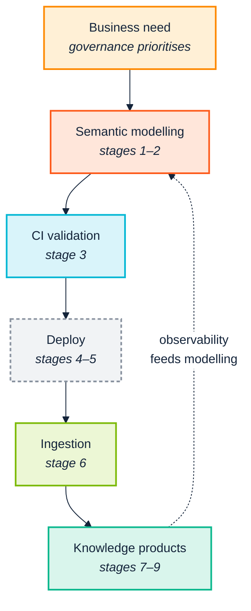

  

# 6. Stages and stories

> *Part II — The SemOps frame*

The SemOps strategy material describes the same practice three times, from three
angles, and it is easy to mistake this for three different frameworks:

- a **nine-stage pipeline** — what happens to an artefact, left to right;
- a **six-layer operating model** — who is accountable, top to bottom;
- a **five-level maturity model** — how good you currently are at it.

They are one thing viewed three ways. This chapter reconciles them into a single
frame, adds the **stories** — role-scoped narratives that recur throughout Part
III — and states plainly which parts this manual's toolchain reaches.

---

## 6.1 The nine stages

Per the width rule in [Appendix A](diagram-style.md), the pipeline is never
drawn as one nine-wide row. It is three groups of three, which also happens to
be how it decomposes conceptually:

The colours are load-bearing. Grey with a dashed border means **this manual's
toolchain does not cover it** — stages 4, 5 and 8 are packaging, deployment and
observability, and they are Kubernetes, Helm and Prometheus work rather than
semantic work. [Chapter 14](14-coverage-and-gaps.md) is the full ledger; the
short version is that this toolchain owns the author and validation stages
comprehensively, the ingestion stage substantially, and the deployment and
observability stages not at all.

That is not a defect. Stages 4, 5 and 8 are solved problems with mature,
non-semantic tooling — you deploy a triple store the way you deploy any other
stateful service. The stages that have *no* good general answer, and where
semantic programmes actually fail, are 2, 3, 6 and 7.

### The dotted line is the whole point

Stage 9 back to stage 1 is what makes this a practice rather than a project.
Without that edge you have a delivery, and [Chapter 1](01-the-business-case.md)'s
decay clock starts running the day it lands.

---

## 6.2 The six layers, and who is accountable

The pipeline says *what happens*. The operating model says *who answers for it*.

| Layer | Purpose | Roles | Covered here? |
|---|---|---|---|
| **1 · Strategy & Governance** | Standards, approvals, stewardship, access policy | Semantic Product Owner, Ontology Owner / Domain Steward, Data Governance Lead, Enterprise Architect | **Partly** — the tooling supplies *evidence for* decisions, not the decision process ([Ch. 12](12-release-and-change.md)) |
| **2 · Semantic Development** | Ontology design, versioning, SHACL, mappings, docs | Knowledge Engineer, Ontology Engineer, Semantic Modeller, Domain Expert | **Yes** — [Ch. 8](08-model-and-validate.md), [Ch. 13](13-operate-and-consume.md) |
| **3 · Semantic CI/CD** | Automated validation, packaging, deployment | SemOps Engineer, DevOps Engineer, Automation Engineer | **Validation yes, packaging/deployment no** — [Ch. 9](09-continuous-integration.md) |
| **4 · Data Integration** | ETL orchestration, quality checks, provenance | Data Engineer, ETL Developer, SemOps Engineer | **Partly** — transformation and quality yes; scheduling and orchestration no ([Ch. 10](10-ingest-and-transform.md)) |
| **5 · Platform & Infrastructure** | Kubernetes, triple-store ops, backup, security | Platform / Cloud / Security Engineer | **No** — see [Ch. 14](14-coverage-and-gaps.md) |
| **6 · Knowledge Consumption** | APIs, search, dashboards, products | App Developer, Data Scientist, Business Analyst, Product Owner | **Partly** — checking against a live store yes; serving an API no ([Ch. 13](13-operate-and-consume.md)) |

**Layer 1 deserves a specific caution.** It is the layer people assume software
will provide and it is the layer software never provides. No tool approves a
change. What a tool can do — and what this one does well — is ensure the human
who approves it is looking at evidence rather than an opinion: *this release
removes a class, therefore it is MAJOR; these three downstream queries break;
one of them can be repaired automatically with 100% confidence.* The decision
stays human. The **basis** for it stops being a matter of who is most confident
in the meeting.

---

## 6.3 The five maturity levels

The levels answer "how good are we at this?" — and, more usefully, "what is the
single next thing to fix?"

What each transition actually costs, in this toolchain:

| Level | Mindset | What you would actually run | Effort to reach |
|---|---|---|---|
| **1 · Ad-hoc** | "We have a knowledge graph somewhere" | Nothing — this is the before-state | — |
| **2 · Structured** | "We treat ontologies like code" | `ontology` and `checks` locally, on a Git-tracked ontology; the VS Code extension's live diagnostics | **Days.** Mostly a decision, not a project |
| **3 · Automated delivery** | "We have CI/CD for semantic artefacts" | The same commands with `--fail-on Violation` in CI, plus `version-diff` on release | **Weeks.** The highest-value transition in the model |
| **4 · Operations at scale** | "Semantics is a production platform" | `--engine native+sparql` for speed, `--sample N` for large graphs, `consistency-remote` against the live store — **plus** K8s, Helm and observability this toolchain does not provide | **Quarters**, and mostly not semantic work |
| **5 · Semantic enterprise** | "Semantics is the backbone" | The `version-diff` → `consistency` → auto-repair loop run routinely; but most of Level 5 is organisational | **Years**, and mostly not a tooling question |

Two observations that matter more than the table.

**Level 2 → 3 is where the return is.** It is the cheapest transition with the
largest effect, because it converts "we have standards" into "the standards are
enforced without anyone remembering to enforce them." Most of the value in this
manual is concentrated there, which is why [Chapter 15](15-adoption-roadmap.md)
sequences everything around reaching Level 3 and holding it.

**Levels 4 and 5 are grey for a reason.** Level 4 is largely platform
engineering; Level 5 is largely organisational change. A team that has genuinely
reached Level 3 and is frustrated that the toolchain will not carry them to
Level 5 has correctly identified that the remaining problem is not a tooling
problem. It is [Chapter 2](02-people-and-cognition.md)'s problem.

### The cross-cutting dimensions

The maturity model scores across eight dimensions rather than one, and the
extended version of it adds a pointed question to each. They are worth reading
as an assessment instrument, because a programme is rarely at one level
uniformly:

| Dimension | The question that actually discriminates |
|---|---|
| Ontology & model management | Are there explicit roles, and a real sign-off process? |
| Data integration & ETL | Are models and modelling patterns genuinely reused? |
| Reasoning & validation | Have you decided what to automate, what matters, and what can wait? |
| Deployment & infrastructure | Do services ship as versioned containers? APIs, content negotiation? |
| Observability & monitoring | Do you measure *awareness and engagement*, not just uptime? |
| Governance & access control | Who is the Product Owner? Who is the Service Owner? |
| Knowledge products | Is there a catalogue of them? |
| Culture & skills | Who is the *face* of the semantic service, and what culture do they promote? |

The last one is the one nobody scores and everybody feels. A semantic capability
with no visible, credible human face gets treated as infrastructure, and
infrastructure gets cut in the second round of budget review.

---

## 6.4 The stories

The stages say what happens and the layers say who owns it. **Stories** say what
someone is actually trying to get done, and they are how Part III is organised —
each chapter answers a small set of them with real commands.

### Authoring

> **As an ontology engineer**, I want to know whether the change I just typed
> broke anything, without leaving the editor or waiting for CI.
> → [Chapter 8](08-model-and-validate.md)

> **As a domain expert who does not read Turtle**, I want to check that the model
> matches how the business actually works.
> → [Chapter 8](08-model-and-validate.md) (outline, graph view),
> [Chapter 13](13-operate-and-consume.md) (`docgen`)

> **As a knowledge engineer**, I want our own house rules enforced, not just the
> generic ones.
> → [Chapter 8](08-model-and-validate.md) (`--registry`/`--shapes`/`--sparql`)

### Gating

> **As a SemOps engineer**, I want bad semantic changes rejected automatically,
> and I want the rejection to be about *our* code.
> → [Chapter 9](09-continuous-integration.md) (`--fail-on`, `--own-namespace`)

> **As a reviewer**, I want to see what a pull request actually changed
> semantically, not just textually.
> → [Chapter 12](12-release-and-change.md) (`version-diff`)

### Ingesting

> **As a data engineer**, I want to know a transformation is wrong before I run
> it over four million rows.
> → [Chapter 10](10-ingest-and-transform.md) (`sketch`, then `triplify`, then `data`)

> **As a data steward**, I want to know whether a finding is our problem or an
> upstream vocabulary's.
> → [Chapter 10](10-ingest-and-transform.md), [Chapter 9](09-continuous-integration.md)

### Releasing

> **As a domain steward**, I need to know whether this release is breaking, and
> what breaks, before I approve it.
> → [Chapter 12](12-release-and-change.md) (`version-diff`, `consistency`)

> **As the person who has to fix the fallout**, I want the mechanical part of the
> migration done for me.
> → [Chapter 12](12-release-and-change.md) (`--apply-repairs --min-confidence`)

### Operating and consuming

> **As a platform owner**, I want the same checks that guard the repository to
> run against what is actually in the triple store.
> → [Chapter 13](13-operate-and-consume.md) (`consistency-remote`)

> **As an application developer or an agent**, I need documentation of what the
> terms mean and a guarantee they will not change under me.
> → [Chapter 13](13-operate-and-consume.md), [Chapter 5](05-genai-and-agents.md)

---

## 6.5 The whole frame, once

This is the continuous semantic delivery loop, and the rest of the manual is an
account of how to run it with tools that exist. [Chapter 7](07-the-toolchain.md)
introduces them; Part III walks the loop.

---

| ← [5. GenAI and agents](05-genai-and-agents.md) | [7. The toolchain →](07-the-toolchain.md) |
|---|---|
