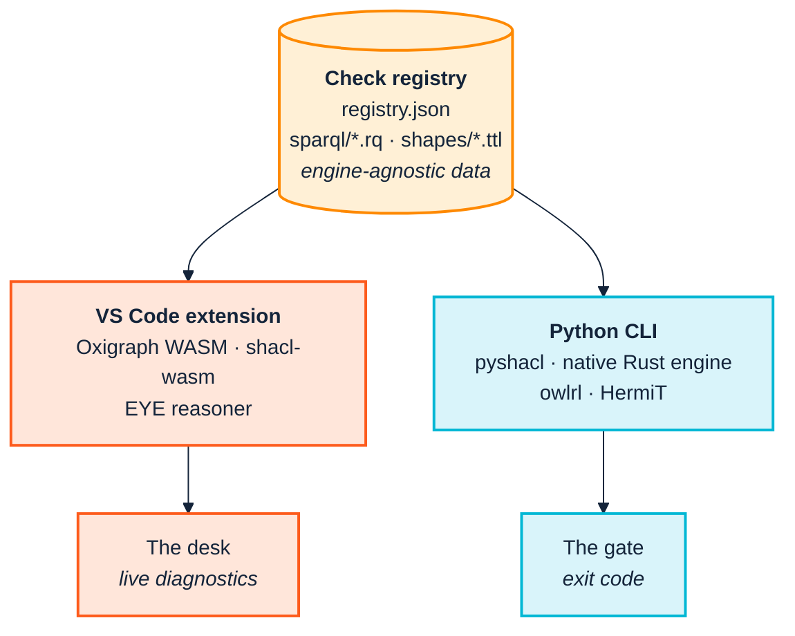

<p align="center">
  
</p>

# 7. The toolchain

> *Part II — The SemOps frame*

Two tools, and one architectural idea that matters more than either of them.

| | **Ontology Quality Suite** | **Ontology Development Suite** |
|---|---|---|
| Repository | [pwin/consolidated-ontology-quality-suite-python](https://github.com/pwin/consolidated-ontology-quality-suite-python) | [pwin/consolidated-ontology-quality-suite-webapp](https://github.com/pwin/consolidated-ontology-quality-suite-webapp) |
| Distribution | [PyPI: `ontology-quality-suite`](https://pypi.org/project/ontology-quality-suite/) | [`.vsix` from the latest release](https://github.com/pwin/consolidated-ontology-quality-suite-webapp/releases/latest) |
| Form | Python CLI + importable library | VS Code extension |
| Runtime | Python; optional Java for DL reasoning | In-process WASM/JS — no Python or Java needed |
| Belongs in | CI, release control, pipelines, scheduled jobs | The author's editor, before anything is committed |
| SemOps stages | 3, 6, 7, and the release parts of 1 | 1, 2 |
| Answers | "Does this pass?" | "What did I just do?" |

> **Versions this edition was measured against.** Every number in Part III comes
> from running these:
>
> | | Version | From |
> |---|---|---|
> | Ontology Quality Suite | **0.14.2** | PyPI `ontology-quality-suite` |
> | Ontology Development Suite | **0.13.6** | `.vsix` from the repository's releases |
> | SHACL Engine | **0.2.0** | PyPI `shacl`; npm `shacl-wasm`, `shacl-wasm-node` |
>
> These move quickly, and the counts in [Chapter 9](09-continuous-integration.md)
> in particular depend on how many checks the registry holds — 61 at the time of
> writing, up from 50 two editions ago. Expect your own numbers to differ if your
> versions do, and see §9.2 on why that is a reason to pin them rather than a
> reason to distrust the figures.

---

## 7.1 The idea: one registry, two runtimes

The suite's quality rules are not code. They are **data** — a `registry.json`
plus a directory of SPARQL `.rq` files and SHACL `.ttl` shape files. The Python
CLI reads that data and evaluates it with pySHACL, a native Rust engine, and
rdflib. The VS Code extension reads *the same data*, copied into its own
`resources/checks-registry/`, and evaluates it with Oxigraph compiled to WASM,
the same Rust SHACL engine compiled to WebAssembly, and the EYE reasoner.

> **The two runtimes recently converged.** Until version 0.10.0 the extension
> used a JavaScript SHACL implementation. It now runs `shacl-wasm-node` — a
> WebAssembly build of the same Rust engine the CLI uses natively. On the
> extension's own workload, all six registry shape files against its bundled
> ontology, the swap took **71,237 ms down to 324 ms** with identical findings
> and severities, and fixed two shape files that had been crashing outright, so
> `DAT-001` and `EFF-002` could never fire through the SHACL path at all.
>
> That makes the claim below stronger than it was: the rule that fails your
> build is not merely the same *data* as the rule that underlined the problem in
> your editor, it is now the same *engine* evaluating it.



The consequence is the thing to hold on to:

> **The rule that fails your build is the same rule that underlined the problem
> in your editor twenty minutes earlier.**

That property is worth more than any individual feature in either tool — and it
holds for forty-seven of the sixty-one checks, with the fourteen exceptions
named further down rather than left for you to discover. Read the claim as the
default and the exceptions as the specification. A team
whose local linting disagrees with its CI develops a learned distrust of both —
green locally, red in CI, and the gate becomes something to be worked around
rather than something that helps. Sharing the rules as data rather than
reimplementing them twice is what prevents that.

It also means a project-specific check written once ([Chapter 8](08-model-and-validate.md))
is available to both, which is how house rules stop being a wiki page nobody
reads.

**Shared does not mean identical.** The extension carries an exact copy of the
61-check registry — same ids, same ten categories — and then adds three of its
own with no CLI equivalent: `MDL-001`/`002`/`003`, gist-informed
modelling-guidance checks. So the editor can flag something CI will not. That is
the right way round — advice belongs where the author is, and a build gate
should not fail on a matter of modelling taste — but it is worth knowing before
someone asks why a warning they saw while typing never appears in the pipeline.

**And being in the registry is not the same as being runnable.** This is the
distinction that matters most for reading `registry.json`, and an earlier
edition of this manual got it wrong. `VOC-001`, the closed-world vocabulary
check in [Chapter 8](08-model-and-validate.md), moved out of the extension's
private extras *into the shared registry* — and this manual reported that as
"so CI runs it too". It does not. Verified directly: a graph asserting
`acme:bob a acme:Empolyee` against a CLI run produces eleven findings and
`VOC-001` is not among them, because nothing in the Python package implements
it. Only `registry.json` mentions the id.

What moving into the registry actually bought is worth understanding, because
it is a real gain and a smaller one than "both sides run it". The registry is
the **shared vocabulary of findings**: id, title, severity, category,
remediation text. The extension can be pointed at a checkout of the CLI's
registry, so an id it emits must be declared there too, or the finding arrives
with no title and no severity but whatever the emitting code hardcoded. Being
declared makes a finding *nameable by both sides*. Being implemented makes it
*producible by one*.

Neither side runs all sixty-one. Three are the extension's alone — `VOC-001`,
`REA-005` and `REA-006`, on top of the three `MDL` checks that are not in the
registry at all — and eleven are the CLI's: `REA-020`/`021`/`022` need a full
DL reasoner, `REA-010`/`011`/`012` are OWL2 profile membership the extension
computes but does not report as findings, `CNF-001`/`002`/`005` need a
two-graph split the editor does not have, and `TQL-004`/`005` read a graph only
the CLI builds.

**Both repositories pin their own exception list, and each names the other's.**
That is the part to copy. A shared registry with no such list is a promise the
UI does not keep: a reader opening `registry.json` has no way to tell which
entries can ever fire, and a check that cannot fire is indistinguishable from a
check that found nothing. Publishing the rules is the easy half; publishing
**what your implementation actually does with them** is the half that makes the
rules trustworthy across an organisational boundary
([Chapter 3](03-across-the-boundary.md)).

**Shared *data* is not shared *behaviour*, and only one of them is cheap to
pin.** The registry travels as data, so a test can compare the two copies
character for character — and one does. But not everything the two tools have
in common is data. A handful of algorithms are written twice, once in Python
and once in TypeScript, and those are invisible to a test that compares files.

The one that proved it decides which text a tool is allowed to rewrite:
`strip_comments` in the CLI, behind `--apply-repairs`; `stripComments` in the
extension, behind rename, find-references and go-to-definition. Both shipped
the same defect for the same reason — a scan that skipped a line *beginning*
with `#` but read a trailing comment in full — so this line

```turtle
ex:Dog a owl:Class .  # was ex:Dgo, renamed 2026-09-04
```

recorded an occurrence of `ex:Dgo` **inside the remark**. Rename it and the
note explaining the rename was itself rewritten, turning a true comment into a
false one, and find-references counted every prose mention of a term as a use
of it. Both sides were fixed in the same week, independently, in two languages,
and nothing noticed they had been wrong together. That coincidence is the
clearest evidence available that nothing was comparing them.

The existing parity test could never have caught it, and the reason is worth
sitting with: it compares the registry, the shapes, the queries and the repair
templates — shared **data**. Two hand-written ports of one algorithm are shared
**behaviour**, and the property that matters is the one nothing checked: *given
the same text, both must blank the same characters.* A rename that is safe
through one tool would be unsafe through the other, silently.

The fix is a fixture of sixteen cases that **both repositories carry**. Each
side runs its own port against its own copy, so the suite still works on a
machine with one checkout, and a final test compares the two copies for whoever
has both — precisely the person who is in a position to make them disagree. The
cases are hand-written rather than generated from either implementation, which
is the detail that makes it work: **a fixture derived from the code only
restates what the code already does, and would have agreed with both ports on
the day they were both wrong.**

Verified here with both checkouts present: the two copies are identical as
parsed JSON, the Python port passes all sixteen, and every expected output is
the same length as its input — because comments are blanked to spaces rather
than removed, so an offset found in the mask still indexes the real document.

The generalisation is not about these two tools. **Wherever one rule has two
runtimes — and that is the normal condition for anything shared across a
supply chain ([Chapter 3](03-across-the-boundary.md)) — sort what you share
into data and behaviour.** The data is easy: publish it, and compare copies.
The behaviour is the part that drifts, and the only defence is a fixture
written from the intent rather than from either implementation. A conformance
suite that a vendor generates from their own product tells you nothing about
whether they agree with anyone else.

---

## 7.2 Installing them

### The Python suite

[PyPI](https://pypi.org/project/ontology-quality-suite/) ·
[source](https://github.com/pwin/consolidated-ontology-quality-suite-python) ·
requires Python 3.11+

```bash
pip install ontology-quality-suite
```

or, working from a checkout:

```bash
uv sync                        # base install
uv sync --extra reasoner       # + owlready2 for real OWL2 DL reasoning (needs Java)
```

The `reasoner` extra is optional by design, and
[Chapter 4](04-from-research-to-industry.md) explains why that design matters.
Without it you still get the always-on `owlrl` closure and pattern checks, which
catch the fixture's deliberate contradiction on their own — you also get an
explicit `REA-022` finding telling you the DL reasoner did not run and what that
means for completeness. You are never silently under-checked.

Two invocation styles appear in this manual:

```bash
ontology-quality-suite <command> ...        # installed entry point
python -m ontology_suite <command> ...      # module form, from a checkout
```

They are equivalent. The module form is used in Part III because that is how the
commands were actually run while writing it.

### The VS Code extension

[Source](https://github.com/pwin/consolidated-ontology-quality-suite-webapp) ·
[latest release](https://github.com/pwin/consolidated-ontology-quality-suite-webapp/releases/latest)

It is not on the Marketplace, so download the `.vsix` from the release — not
from the repository tree, which carries older builds alongside the current one —
and install it with *Extensions: Install from VSIX…* in the command palette, or:

```bash
code --install-extension ontology-dev-suite-<version>.vsix
```

Core functionality — authoring, live diagnostics, local checks, metrics, graph
view, query workbench — has **no external runtime dependency at all**: Oxigraph,
`shacl-wasm` and `eyereasoner` are WebAssembly or pure JS.

The Python CLI is detected via the `ontologySuite.pythonCliPath` setting or on
`PATH`, and is used only for the two commands that genuinely need it — *Run Deep
Validation* (full OWL2 DL reasoning) and *Run Full Triplify* (the real `oxi-gen`
binary). Both degrade gracefully when it is absent.

That zero-dependency property is a governance fact, not just a convenience. As
[Chapter 3](03-across-the-boundary.md) argues, a validation step that requires a
JVM excludes a class of supply-chain partners from self-service compliance.

---

## 7.3 Decision table: question → command

| You want to… | Run | Chapter |
|---|---|---|
| Know if the ontology itself is sound — no data | `ontology` | [8](08-model-and-validate.md) |
| Run the full registry against ontology and/or data | `checks` | [8](08-model-and-validate.md), [9](09-continuous-integration.md) |
| See only findings in terms **you** own | `checks --own-namespace <IRI prefix>` | [9](09-continuous-integration.md) |
| Check CSV→RDF queries against the ontology, no CSV needed | `sketch` | [10](10-ingest-and-transform.md) |
| Actually produce RDF from CSV | `triplify` | [10](10-ingest-and-transform.md) |
| Assess real triplified data | `data` | [10](10-ingest-and-transform.md) |
| Compare two versions, get MAJOR/MINOR/PATCH | `version-diff` | [12](12-release-and-change.md) |
| Find and auto-repair ontology↔query drift | `consistency` | [12](12-release-and-change.md) |
| Check a controlled-vocabulary layer too | `pattern-consistency` | [12](12-release-and-change.md) |
| Run the checks against a **live** triplestore | `consistency-remote` | [13](13-operate-and-consume.md) |
| Produce something a stakeholder can read | `docgen` | [13](13-operate-and-consume.md) |
| Run everything applicable, one report | `run` | [9](09-continuous-integration.md) |

And the editor-side equivalents, by VS Code command:

| You want to… | Command |
|---|---|
| Start a new ontology with imports wired up | *New Ontology* |
| Add a class in the right place in the hierarchy | *Add Class or Category* / *Add Subclass* / *Add Sibling Class* |
| Run the registry locally, in-process | *Run Local Checks* |
| See the model as a picture | *Visualize Subject Graph* |
| Draft an ontology and query from a raw CSV | *Infer Ontology + Query from CSV* |
| Preview a transformation against sample rows | *Query Workbench* |
| See DL expressivity and OWL2 profile membership | *Show Metrics & DL Expressivity* |
| Escalate to full OWL2 DL reasoning | *Run Deep Validation* |

---

## 7.4 Two flags worth knowing before you start

### `--engine`

`checks`, `data` and `run` accept `--engine`. It defaults to `native+sparql`
when the optional Rust SHACL engine is installed, and `both` (pyshacl) otherwise.

Most documentation treats this as a speed switch. It is mostly that now, but it
was not always, and the history is instructive. All four modes, run against this
manual's fixture with `--own-namespace`, same ontology, same registry:

| `--engine` | Findings | Severity split | What it runs |
|---|---|---|---|
| `native` | **4** | 1 V / 3 W | The SHACL shapes only. **Misses `QUA-004`**, which exists only as a SPARQL check |
| `sparql` | **5** | 1 V / 4 W | The `.rq` checks only. The numbers used throughout this manual |
| `native+sparql` | **5** | 1 V / 4 W | Both, deduplicated |
| `both` | **5** | 1 V / 4 W | pyshacl + SPARQL, deduplicated |

Three of those four now agree exactly. One thing still follows, and one piece of
history is worth carrying.

**Neither formulation is complete alone.** The registry is implemented in two
formulations — 44 SPARQL `.rq` files and 6 SHACL shape files — and they do not
cover the same checks. `--engine native` silently misses `QUA-004` because that
check exists only as SPARQL. Do not use a single-formulation mode expecting full
coverage; if you want one, `sparql` is the one with the broader registry behind
it.

**The severity lesson is about shape authoring, not about engines.** Until
recently `--engine both` reported **5 Violations where `native+sparql` reported
2** on identical findings, and this manual — along with a long comment in the
suite's own source — attributed it to a pyshacl limitation. That was half right.
pyshacl does ignore `sh:severity` in the position it was written, but the
position was wrong: the shapes declared it inside each nested
`sh:sparql [ … ]` constraint block, where SHACL defines it as a property of the
**enclosing shape**. The native engine read it there anyway; pyshacl fell back to
the spec default of `sh:Violation`. Moving the declaration onto the shape made
both engines agree, and both now match `registry.json` exactly.

> The consequence while it lasted is worth remembering, because it is the
> failure mode a severity mistake always produces: with `--fail-on Violation`, a
> class named `person_record` failed CI exactly as hard as a logical
> contradiction. **If your gate is failing on things you deliberately declared
> `Warning`, check where `sh:severity` is attached before blaming the engine.**

There is a governance postscript, and it is the more transferable half. Because
the registry is shared, the same misplacement existed in the extension — which
had built a workaround for it, treating correct engine behaviour as an engine
bug. When the fix landed in the suite, the extension did not adopt the findings
on trust: it assessed each against its own stack, concluded two did not apply
and one applied in a different form, and then deleted its workaround.

> **Shared artefacts require propagation with independent assessment, not
> synchronisation.** A fix that is right for one runtime is a *hypothesis* about
> the other. This is [Chapter 3](03-across-the-boundary.md)'s cross-boundary
> problem in miniature, inside one organisation.

The speed difference is real too — the suite's architecture documentation
records benchmarks up to roughly 665× on a real-sized ontology, and the engine's
own harness measures 75–122× against pySHACL across 1k–100k instances with
identical result counts at every size.

### `--verbose`

Every subcommand takes `-v`/`--verbose`, which prints what each input option
actually resolved to *before* running: which files matched a glob, which
`owl:imports` resolved and from where, which engine ran.

Reach for it whenever a result looks surprising, before assuming a bug. Most
"the tool is wrong" reports turn out to be an `owl:imports` that silently did not
resolve, and `--verbose` shows that in one line. There is a worked instance of
exactly this class of mistake in [Chapter 9](09-continuous-integration.md), where
an IRI prefix off by one character produced a confidently empty report.

---

## 7.5 The fixture used throughout Part III

Every command in Part III runs against
[`examples/acme_robotics/`](https://github.com/pwin/consolidated-ontology-quality-suite-python/tree/main/examples/acme_robotics)
in the Python suite — a small org chart built on two real, standards-track
vocabularies rather than an invented domain:

| Vocabulary | Used for |
|---|---|
| W3C Organization Ontology (`org:`) | `org:OrganizationalUnit` as the base class for departments |
| FOAF (`foaf:`) | `foaf:Person` as the base for employees; `foaf:name`, `foaf:mbox` |

The fixture is **deliberately imperfect**, with each flaw commented with the
check it demonstrates:

| Term | Flaw | Check it triggers |
|---|---|---|
| `acme:Contractor` | `rdfs:subClassOf acme:Employee` **and** `owl:disjointWith acme:Employee` | `LOG-001` — logically unsatisfiable |
| `acme:hasSkill` | no `rdfs:label`, and no `skos:prefLabel` either | `QUA-001`, `QUA-004` |
| `acme:reports_to` | local name is not lowerCamelCase; no domain or range | `STY-002`, `STR-003` |

Each deliberate flaw produces **exactly one finding**, which is the property
that makes the fixture usable as a teaching example: every finding traces to a
line someone wrote on purpose.

The scoped run in [Chapter 9](09-continuous-integration.md) reports **23**, and
the gap is instructive rather than a discrepancy. Eighteen of those 23 are
`QUA-009` and `QUA-010`, nine each — a documentation policy the registry asks
for (a `skos:prefLabel` per language, a `skos:definition`) that this fixture
does not follow. **That is one decision you have not taken, reported nine times,
not nine mistakes** — and telling those two things apart is the whole subject of
[Chapter 9](09-continuous-integration.md) §9.4.

`acme-org-v2.ttl` is a plausible next release: it renames `acme:Engineer` to
`acme:SoftwareEngineer` — a breaking change, *with* a migration annotation — and
adds one genuinely additive class and property. It deliberately leaves the flaws
above untouched, because real releases do not fix everything at once.

Using real external vocabularies rather than toy ones is what makes Chapters 9
and 10 possible: the most valuable lessons in this manual come from the
collision between a general-purpose checker and the conventions real
vocabularies actually use.

---

## 7.6 Where the deeper documentation lives

This manual is the SemOps layer. For tool-level depth, the suite's own
[`docs/`](https://github.com/pwin/consolidated-ontology-quality-suite-python/tree/main/docs):

| Document | Covers |
|---|---|
| [`PRIMER.md`](https://github.com/pwin/consolidated-ontology-quality-suite-python/blob/main/docs/PRIMER.md) | Task-oriented guide, worked examples, CI wiring, adoption path |
| [`CHECKS.md`](https://github.com/pwin/consolidated-ontology-quality-suite-python/blob/main/docs/CHECKS.md) | All 61 checks, by category |
| [`ARCHITECTURE.md`](https://github.com/pwin/consolidated-ontology-quality-suite-python/blob/main/docs/ARCHITECTURE.md) | Engine comparison, benchmarks, file loading |
| [`REASONING.md`](https://github.com/pwin/consolidated-ontology-quality-suite-python/blob/main/docs/REASONING.md) | Reasoner backends and their real limitations |
| [`CONSISTENCY_AND_REPAIR.md`](https://github.com/pwin/consolidated-ontology-quality-suite-python/blob/main/docs/CONSISTENCY_AND_REPAIR.md) | Finding-kind → fix-kind → confidence table |
| [`EXTENDING.md`](https://github.com/pwin/consolidated-ontology-quality-suite-python/blob/main/docs/EXTENDING.md) | Authoring your own checks |
| [`FUSEKI.md`](https://github.com/pwin/consolidated-ontology-quality-suite-python/blob/main/docs/FUSEKI.md) | Live-triplestore manifest spec and Python API |
| [`VERSIONING.md`](https://github.com/pwin/consolidated-ontology-quality-suite-python/blob/main/docs/VERSIONING.md) | Semver rules for ontologies |
| [`UPDATING.md`](https://github.com/pwin/consolidated-ontology-quality-suite-python/blob/main/docs/UPDATING.md) | Sequencing and rollback for coordinated rollouts |
| [`ACME_ROBOTICS_WALKTHROUGH.md`](https://github.com/pwin/consolidated-ontology-quality-suite-python/blob/main/docs/ACME_ROBOTICS_WALKTHROUGH.md) | The fixture, end to end, plus two runnable notebooks |

The webapp repository's
[`README.md`](https://github.com/pwin/consolidated-ontology-quality-suite-webapp/blob/main/README.md)
and
[`TUTORIAL.md`](https://github.com/pwin/consolidated-ontology-quality-suite-webapp/blob/main/TUTORIAL.md)
do the same for the extension.

There is also a third repository worth knowing about, though you do not install
it: [`consolidated-ontology-quality-suite-python-testing`](https://github.com/pwin/consolidated-ontology-quality-suite-python-testing)
holds thirteen deliberately broken OWL2 ontologies and a harness asserting which
registry checks each one must trigger. Its
[`COMMANDS.md`](https://github.com/pwin/consolidated-ontology-quality-suite-python-testing/blob/main/COMMANDS.md)
gives every fixture as both a harness invocation and the equivalent bare CLI
command, which makes it a useful worked reference for the suite in general.
[Chapter 9](09-continuous-integration.md) §9.8 is about the practice it
demonstrates.

---

| ← [6. Stages and stories](06-stages-and-stories.md) | [8. Model and validate →](08-model-and-validate.md) |
|---|---|
