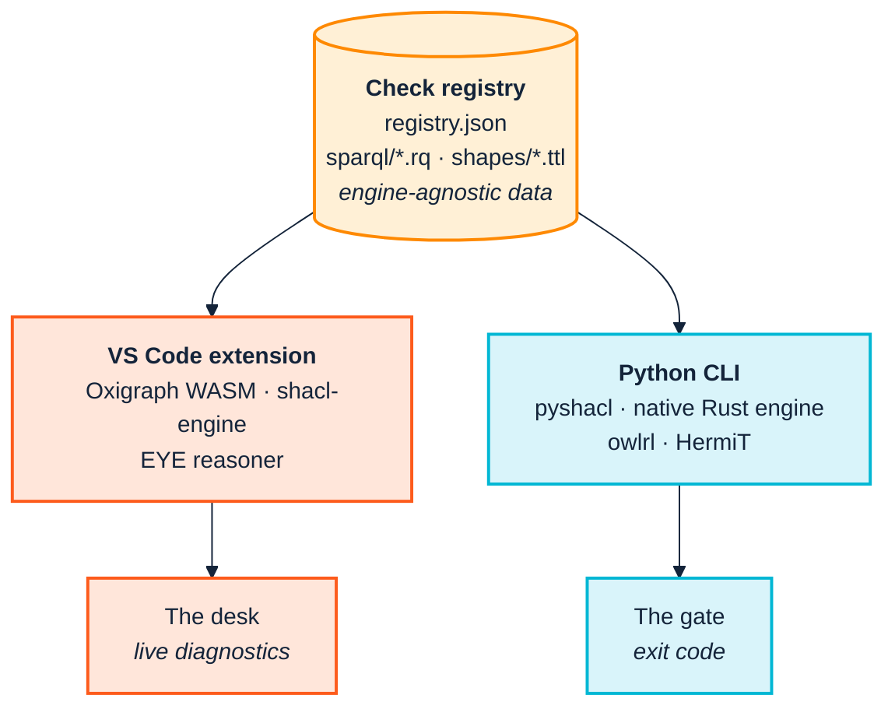

<p align="center">
  
</p>

# 7. The toolchain

> *Part II — The SemOps frame*

Two tools, and one architectural idea that matters more than either of them.

| | **Ontology Quality Suite** | **Ontology Development Suite** |
|---|---|---|
| Repository | `consolidated_ontology_suite_python` | `consolidated_ontology_suite_webapp` |
| Form | Python CLI + importable library | VS Code extension |
| Runtime | Python; optional Java for DL reasoning | In-process WASM/JS — no Python or Java needed |
| Belongs in | CI, release control, pipelines, scheduled jobs | The author's editor, before anything is committed |
| SemOps stages | 3, 6, 7, and the release parts of 1 | 1, 2 |
| Answers | "Does this pass?" | "What did I just do?" |

---

## 7.1 The idea: one registry, two runtimes

The suite's quality rules are not code. They are **data** — a `registry.json`
plus a directory of SPARQL `.rq` files and SHACL `.ttl` shape files. The Python
CLI reads that data and evaluates it with pySHACL, a native Rust engine, and
rdflib. The VS Code extension reads *the same data*, copied into its own
`resources/checks-registry/`, and evaluates it with Oxigraph compiled to WASM,
`shacl-engine`, and the EYE reasoner.



The consequence is the thing to hold on to:

> **The rule that fails your build is the same rule that underlined the problem
> in your editor twenty minutes earlier.**

That property is worth more than any individual feature in either tool. A team
whose local linting disagrees with its CI develops a learned distrust of both —
green locally, red in CI, and the gate becomes something to be worked around
rather than something that helps. Sharing the rules as data rather than
reimplementing them twice is what prevents that.

It also means a project-specific check written once ([Chapter 8](08-model-and-validate.md))
is available to both, which is how house rules stop being a wiki page nobody
reads.

---

## 7.2 Installing them

### The Python suite

```bash
pip install ontology-quality-suite
```

or, working from a checkout:

```bash
uv sync                        # base install
uv sync --extra reasoner       # + owlready2 for real OWL2 DL reasoning (needs Java)
```

The `reasoner` extra is optional by design, and
[Chapter 4](04-from-research-to-industry.md) explains why that design matters.
Without it you still get the always-on `owlrl` closure and pattern checks, which
catch the fixture's deliberate contradiction on their own — you also get an
explicit `REA-022` finding telling you the DL reasoner did not run and what that
means for completeness. You are never silently under-checked.

Two invocation styles appear in this manual:

```bash
ontology-quality-suite <command> ...        # installed entry point
python -m ontology_suite <command> ...      # module form, from a checkout
```

They are equivalent. The module form is used in Part III because that is how the
commands were actually run while writing it.

### The VS Code extension

Install the `.vsix` from the webapp repository. Core functionality — authoring,
live diagnostics, local checks, metrics, graph view, query workbench — has **no
external runtime dependency at all**: Oxigraph, `shacl-engine` and
`eyereasoner` are WASM or pure JS.

The Python CLI is detected via the `ontologySuite.pythonCliPath` setting or on
`PATH`, and is used only for the two commands that genuinely need it — *Run Deep
Validation* (full OWL2 DL reasoning) and *Run Full Triplify* (the real `oxi-gen`
binary). Both degrade gracefully when it is absent.

That zero-dependency property is a governance fact, not just a convenience. As
[Chapter 3](03-across-the-boundary.md) argues, a validation step that requires a
JVM excludes a class of supply-chain partners from self-service compliance.

---

## 7.3 Decision table: question → command

| You want to… | Run | Chapter |
|---|---|---|
| Know if the ontology itself is sound — no data | `ontology` | [8](08-model-and-validate.md) |
| Run the full registry against ontology and/or data | `checks` | [8](08-model-and-validate.md), [9](09-continuous-integration.md) |
| See only findings in terms **you** own | `checks --own-namespace <IRI prefix>` | [9](09-continuous-integration.md) |
| Check CSV→RDF queries against the ontology, no CSV needed | `sketch` | [10](10-ingest-and-transform.md) |
| Actually produce RDF from CSV | `triplify` | [10](10-ingest-and-transform.md) |
| Assess real triplified data | `data` | [10](10-ingest-and-transform.md) |
| Compare two versions, get MAJOR/MINOR/PATCH | `version-diff` | [11](11-release-and-change.md) |
| Find and auto-repair ontology↔query drift | `consistency` | [11](11-release-and-change.md) |
| Check a controlled-vocabulary layer too | `pattern-consistency` | [11](11-release-and-change.md) |
| Run the checks against a **live** triplestore | `consistency-remote` | [12](12-operate-and-consume.md) |
| Produce something a stakeholder can read | `docgen` | [12](12-operate-and-consume.md) |
| Run everything applicable, one report | `run` | [9](09-continuous-integration.md) |

And the editor-side equivalents, by VS Code command:

| You want to… | Command |
|---|---|
| Start a new ontology with imports wired up | *New Ontology* |
| Add a class in the right place in the hierarchy | *Add Class* / *Add Subclass* / *Add Sibling Class* |
| Run the registry locally, in-process | *Run Local Checks* |
| See the model as a picture | *Visualize Subject Graph* |
| Draft an ontology and query from a raw CSV | *Infer Ontology + Query from CSV* |
| Preview a transformation against sample rows | *Query Workbench* |
| See DL expressivity and OWL2 profile membership | *Show Metrics & DL Expressivity* |
| Escalate to full OWL2 DL reasoning | *Run Deep Validation* |

---

## 7.4 Two flags worth knowing before you start

### `--engine`

`checks`, `data` and `run` accept `--engine`. It defaults to `native+sparql`
when the optional Rust SHACL engine is installed, and `both` (pyshacl) otherwise.
This is not only about speed, though the speed difference is large — the suite's
architecture documentation records benchmarks up to roughly 665× on a real-sized
ontology.

It is also about correctness. **pySHACL has a confirmed bug: it ignores
`sh:severity` declared inside `sh:sparql` SPARQL-based constraints, reporting
`Violation` regardless of what the shape actually says.** The native engine
handles this correctly. If you have shapes that deliberately declare `Warning`
severity inside SPARQL constraints and your CI is failing on them, this is why.

### `--verbose`

Every subcommand takes `-v`/`--verbose`, which prints what each input option
actually resolved to *before* running: which files matched a glob, which
`owl:imports` resolved and from where, which engine ran.

Reach for it whenever a result looks surprising, before assuming a bug. Most
"the tool is wrong" reports turn out to be an `owl:imports` that silently did not
resolve, and `--verbose` shows that in one line. There is a worked instance of
exactly this class of mistake in [Chapter 9](09-continuous-integration.md), where
an IRI prefix off by one character produced a confidently empty report.

---

## 7.5 The fixture used throughout Part III

Every command in Part III runs against `examples/acme_robotics/` in the Python
suite — a small org chart built on two real, standards-track vocabularies rather
than an invented domain:

| Vocabulary | Used for |
|---|---|
| W3C Organization Ontology (`org:`) | `org:OrganizationalUnit` as the base class for departments |
| FOAF (`foaf:`) | `foaf:Person` as the base for employees; `foaf:name`, `foaf:mbox` |

The fixture is **deliberately imperfect**, with each flaw commented with the
check it demonstrates:

| Term | Flaw | Check it triggers |
|---|---|---|
| `acme:Contractor` | `rdfs:subClassOf acme:Employee` **and** `owl:disjointWith acme:Employee` | `LOG-001` — logically unsatisfiable |
| `acme:hasSkill` | no `rdfs:label` | `QUA-001` |
| `acme:reports_to` | local name is not lowerCamelCase; no domain or range | `STY-002`, `STR-003` |

`acme-org-v2.ttl` is a plausible next release: it renames `acme:Engineer` to
`acme:SoftwareEngineer` — a breaking change, *with* a migration annotation — and
adds one genuinely additive class and property. It deliberately leaves the flaws
above untouched, because real releases do not fix everything at once.

Using real external vocabularies rather than toy ones is what makes Chapters 9
and 10 possible: the most valuable lessons in this manual come from the
collision between a general-purpose checker and the conventions real
vocabularies actually use.

---

## 7.6 Where the deeper documentation lives

This manual is the SemOps layer. For tool-level depth, the suite's own docs:

| Document | Covers |
|---|---|
| `PRIMER.md` | Task-oriented guide, worked examples, CI wiring, adoption path |
| `CHECKS.md` | All 50 checks, by category |
| `ARCHITECTURE.md` | Engine comparison, benchmarks, file loading |
| `REASONING.md` | Reasoner backends and their real limitations |
| `CONSISTENCY_AND_REPAIR.md` | Finding-kind → fix-kind → confidence table |
| `EXTENDING.md` | Authoring your own checks |
| `FUSEKI.md` | Live-triplestore manifest spec and Python API |
| `VERSIONING.md` | Semver rules for ontologies |
| `UPDATING.md` | Sequencing and rollback for coordinated rollouts |
| `ACME_ROBOTICS_WALKTHROUGH.md` | The fixture, end to end, plus two runnable notebooks |

The webapp repository's `README.md` and `TUTORIAL.md` do the same for the
extension.

---

| ← [6. Stages and stories](06-stages-and-stories.md) | [8. Model and validate →](08-model-and-validate.md) |
|---|---|
