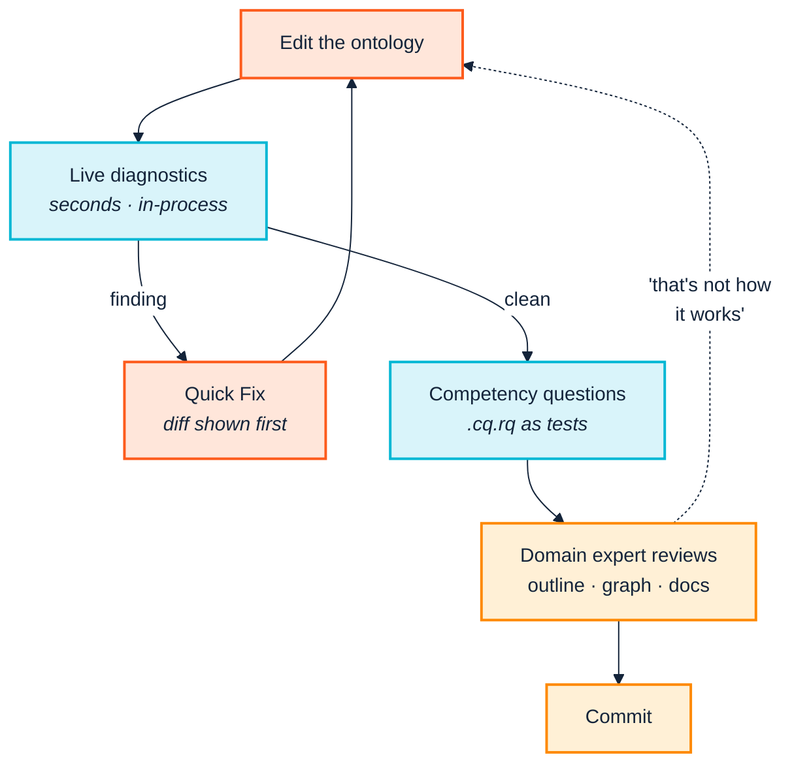

<p align="center">
  
</p>

# 8. Model and validate

> *Part III — The practice · SemOps stage 2 · Operating-model layer 2*

> **Stories answered here**
> *As an ontology engineer, I want to know whether the change I just typed broke
> anything, without leaving the editor.*
> *As a domain expert who does not read Turtle, I want to check the model matches
> how the business actually works.*
> *As a knowledge engineer, I want our own house rules enforced, not just generic
> ones.*

Stage 2 is where the artefact is written, and it is the stage with the highest
leverage per pound spent. A problem caught here costs a keystroke. The same
problem caught in CI costs a context switch; caught in production it costs an
incident and a meeting.

---

## 8.1 The inner loop belongs in the editor

The SemOps pipeline blueprint lists "modelling and local validation" as a stage
in its own right, before CI, and this is not a formality. If the only way to
find out whether a model is sound is to commit and wait, the feedback loop is
minutes long, and a minutes-long loop changes how people work: they batch
changes, they commit less often, and they stop experimenting.

The Ontology Development Suite exists to make that loop seconds long. Everything
below runs **in-process**, via WASM, with no Python or Java involved.

### Structure you can see

The Ontology Outline renders classes and properties as a nested, Protégé-style
hierarchy in the Explorer sidebar — object and datatype properties kept as
separate subtrees, rather than one flat list:

```
▾ Classes (4)
  ▾ Employee
      Contractor
      Engineer
    OrganizationalUnit
▾ Object Properties (2)
    works in
    reports to
▾ Datatype Properties (3)
    has skill
    has employee ID
```

This is the artefact from [Chapter 2](02-people-and-cognition.md) that a domain
expert can actually validate. Nobody needs to read an axiom to say *"Contractor
should not be under Employee — contractors are not on our payroll."* The
priesthood problem is defeated by rendering, not by training.

Authoring happens in the same tree: right-click any class or property node for
*Add Subclass*, *Add Sibling Class* (which inherits the sibling's own parents) or
*Add Sub-property*. Dragging one class onto another adds an **additional**
parent — deliberately never a destructive move, and the confirmation message
says so.

### Live diagnostics, including one SHACL cannot give you

*Run Local Checks* evaluates the registry's 39 SPARQL and 6 SHACL-SPARQL check
files — the same 50 checks the CLI runs — plus OWL2-RL-style inference and
contradiction detection, into the standard Problems panel.

It also runs **four checks the CLI does not have**: `VOC-001` below, and
`MDL-001`/`002`/`003`, three gist-informed modelling-guidance checks
([Chapter 7](07-the-toolchain.md) §7.1). Advice belongs where the author is,
so seeing something here that never appears in CI is the design rather than a
discrepancy.

One check is worth calling out because it addresses a genuine blind spot in
SHACL itself. **`VOC-001`, the closed-world vocabulary check**, catches the
typo:

```turtle
:bob a acme:Empolyee .     # note the transposition
```

SHACL's open-world semantics will never flag this. Nothing *contradicts* the
existence of an undeclared class — it is simply never asserted to. The graph is
valid; it is just about something that does not exist.

`VOC-001` walks every triple's predicate and, for a fixed set of
term-referencing predicates (`rdf:type`, `rdfs:subClassOf`, `rdfs:domain`,
`rdfs:range`, `owl:equivalentClass`, `sh:targetClass`, and others), its object
too — flagging any IRI not declared in the document or its resolved imports.

Critically, it is **scoped to namespaces the graph has some closed-world
knowledge of**: at least one term must already be declared there. An external
vocabulary that was never actually imported is left alone rather than flooded
with false positives, and `rdf:`/`rdfs:`/`owl:`/`sh:`/`skos:`/`xsd:` are excluded
automatically. That scoping decision is the same instinct as
[Chapter 9](09-continuous-integration.md)'s central lesson: **a check is only
useful if its findings are about things you control.**

### Quick Fix, with the diff shown first

Sixteen checks offer a one-click lightbulb repair, each computed from a real
SPARQL Update and completed where relevant by the project's own
`.ontology-suite/standards.json`. Nothing is ever written without an explicit
confirmation showing the exact triples that will change.

That confirmation step is not timidity. An auto-fix that silently rewrites an
ontology teaches the team not to trust the tool, and one bad silent rewrite
costs more confidence than fifty good ones earn.

### Metrics and expressivity, live

*Show Metrics & DL Expressivity* reports OntoQA-style schema metrics —
class and property counts, inheritance and relationship richness, hierarchy
depth — plus a DL-expressivity label such as `ALCHIQ(D)` and OWL2 EL/QL/RL
profile-membership badges. The expressivity label also sits in the status bar.

The ontology is never *restricted* to a profile. The display just shows where it
currently sits, which lets you develop deliberately in a lighter profile when a
downstream consumer needs one — and, more usefully, notice the moment a casual
edit pushes you out of it.

### Seeing what the reasoner adds

*Visualize Subject Graph* renders a subject neighbourhood as a real SVG via
Graphviz compiled to WASM. Its most instructive toggle is **Show inferred
(reasoner closure)**, which runs the EYE reasoner over the neighbourhood and
overlays derived triples as dashed edges alongside the asserted graph's solid
ones.

For anyone learning what an ontology actually *does*, this is the single most
valuable view in either tool: the difference between what you wrote and what
follows from what you wrote, drawn on one picture. It is also the fastest way to
discover that a subclass chain you thought was harmless entails something you
did not intend.

### Competency questions as tests

`.cq.rq` files — SPARQL `ASK`/`SELECT` with expected-result directives — appear
in the VS Code Test Explorer and run like unit tests.

This is worth more than it first appears. A competency question is the closest
thing ontology work has to a requirement: *"can this model answer 'which
contractors report to someone in Engineering?'"* Making them executable turns a
modelling discussion into a regression suite, which is exactly the move
[Chapter 2](02-people-and-cognition.md) recommends for surviving maintenance
fatigue — the expert's requirement, captured once, checked forever.

---

> **How the editor behaviour in this section was established.** By reading the
> extension's source and manifest, by its own test suite, and by driving the
> packaged `.vsix` from a real install layout — **not** by working through a
> live GUI session. The commands, checks and engines named here are verified to
> exist and to run; the feel of using them is not something this manual has
> measured. Treat screenshots-in-prose accordingly.

---

## 8.2 The tightest CLI loop: `ontology`

When you want the same judgement from a terminal — or from a script — the
narrowest command is `ontology`: no data, just *"is the schema itself sound?"*

```bash
python -m ontology_suite ontology \
  --ontology examples/acme_robotics/acme-org-v1.ttl \
  --import-dir examples/acme_robotics \
  --out-dir out/ontology
```

Real output from that command against the fixture:

```
Findings: 2 total (1 Violation, 0 Warning, 1 Info)
Reports written to: out/ontology
  - out/ontology/report.html (start here)
  - out/ontology/full_results.csv
```

The two findings:

| ID | Severity | What it found |
|---|---|---|
| `LOG-001` | **Violation** | `acme:Contractor` is disjoint with its own transitive superclass `acme:Employee`, making it unsatisfiable |
| `REA-022` | Info | The external DL reasoner could not run; only the always-on `owlrl` closure and pattern checks executed |

`LOG-001` is the deliberate contradiction in the fixture, caught without any
external reasoner. Its message is worth reading in full, because it is a model
of what a check message should be:

> Class `https://acme.example.org/ns/Contractor` is asserted disjoint with its
> own (transitive) superclass `https://acme.example.org/ns/Employee`, which makes
> `https://acme.example.org/ns/Contractor` logically unsatisfiable.
>
> **Remediation:** Remove either the subclass axiom or the disjointness axiom;
> the two together are contradictory.

No description-logic background is required to act on that.

`REA-022` is [Chapter 4](04-from-research-to-industry.md)'s worked example of
consuming research-grade components responsibly: the DL reasoner failed, and
rather than crashing or — far worse — silently reporting success, the suite
emitted a first-class finding naming exactly which checks did not run and what
that costs you in completeness.

> **You may see 3 findings here, not 2.** The DL reasoner is intermittently
> flaky; when it starts, `REA-022` is replaced by `REA-020` (the ontology is
> inconsistent) and `REA-021` (`acme:Contractor` is unsatisfiable), giving three
> independent confirmations of the same deliberate contradiction. Three runs of
> this exact command in one session gave the reasoner-working result once and
> the reasoner-failed result twice. Neither is an error;
> [Chapter 14](14-coverage-and-gaps.md) §14.4 has the detail.

**Want a specific OWL2 profile checked?** `--profile EL` (repeatable). It is off
by default; ask for it explicitly when a downstream consumer needs a lighter
profile.

---

## 8.3 The full registry: `checks`

`ontology` is the schema-soundness subset. `checks` runs the whole 50-check
catalogue across eight categories — structural integrity, logical cogency,
naming style, documentation, efficiency, data quality and more — against an
ontology, a data graph, or both.

```bash
python -m ontology_suite checks \
  --ontology examples/acme_robotics/acme-org-v1.ttl \
  --import-dir examples/acme_robotics \
  --engine sparql \
  --out-dir out/checks --fail-on never
```

Run exactly like that, against the fixture with its real `org:` and FOAF imports
resolved, this reports **close to 300 findings** — a representative run gave 294
(48 Violations, 162 Warnings, 84 Infos), and the total drifts by a few between
identical runs.

Five of those are Acme's. The rest are the registry doing its job thoroughly
against the internals of the W3C Organization Ontology and FOAF.

**That number is the subject of [Chapter 9](09-continuous-integration.md)**, and
it is the most important practical lesson in this manual. Do not wire this
command into CI as written.

---

## 8.4 Your own rules, without forking anything

SemOps layer 2 calls for SHACL constraint modelling as an ongoing knowledge-
engineering activity, and layer 1 lists "modelling standards" as a core artefact.
Both are hollow unless a project's own rules can be enforced as easily as the
built-in ones.

The registry is data, so this needs no code. Point the CLI at your own directory:

```bash
python -m ontology_suite checks \
  --ontology examples/acme_robotics/acme-org-v1.ttl \
  --data out/triplify/employees.ttl \
  --registry examples/acme_robotics/custom_checks/registry.json \
  --sparql examples/acme_robotics/custom_checks/sparql \
  --engine sparql --out-dir out/acm001
```

The fixture ships exactly one such check, `ACM-001`, which encodes an Acme HR
requirement no general-purpose registry could know about — every employee must
carry a traceable employee ID:

```sparql
CONSTRUCT {
  _:r a sh:ValidationResult ;
    sh:resultSeverity sh:Violation ;
    sh:focusNode ?this ;
    sh:resultMessage "Employee {$this} has no acme:hasEmployeeId." ;
    sh:sourceConstraintComponent acme:ACM-001 .
}
WHERE {
  ?this a acme:Employee .
  FILTER NOT EXISTS { ?this acme:hasEmployeeId ?id }
}
```

with a registry entry giving it a title, a category, a default severity, a
description and — notably — a **remediation** string:

```json
{
  "id": "ACM-001",
  "category": "structural",
  "default_severity": "Violation",
  "title": "Employee missing an employee ID",
  "description": "An acme:Employee individual has no acme:hasEmployeeId value -- every employee record must be traceable to Acme's HR system of record.",
  "remediation": "Add acme:hasEmployeeId \"ACM-NNNN\" to the employee, or fix the triplify query/CSV mapping that should have set it.",
  "cucumber_feature": "Acme HR Data Quality",
  "cucumber_scenario": "Every employee record carries a traceable employee ID"
}
```

Three things about this pattern are worth internalising.

**Checks are discovered by walking the directory**, not from a manifest list. To
remove a check, delete its `.rq` file; to add one, drop in a file and a registry
entry. This makes a project's rule set a normal, reviewable part of the
repository.

**A minimal registry replaces the defaults.** The fixture's registry contains
only `ACM-001`, so running as above runs *only* that check. To keep the built-in
50 running alongside, point `--shapes`/`--sparql` at the installed resources
directory as well. Find it with:

```bash
python -c "from ontology_suite import config; print(config.PACKAGE_RESOURCES)"
```

**Fill in the cucumber fields.** They are not decoration: every run writes a
`cucumber.json` in which each check becomes a scenario with a pass/fail status,
which most CI systems render natively alongside unit tests
([Chapter 9](09-continuous-integration.md) §9.5). A house rule with those two
fields blank still works, and still appears — as an anonymous row nobody outside
the team can interpret.

**The remediation field is the deliverable.** A rule that says "ACM-001 failed"
generates a ticket. A rule that says "add `acme:hasEmployeeId "ACM-NNNN"` to the
employee, or fix the triplify query that should have set it" generates a fix.
When you write house rules, spend the time on that field — it is where the
knowledge actually lives, and it is what makes the check legible to someone who
was not in the room when the rule was agreed.

This is also the artefact [Chapter 3](03-across-the-boundary.md) recommends
publishing to supply-chain partners. A registry directory is a distributable
thing: a partner can run your rules before submitting, instead of discovering
them through rejection.

### The contract a check has to satisfy

`ACM-001` above is a `CONSTRUCT` that builds a `sh:ValidationResult`. That is the
whole interface, and four properties are not optional:

| Property | Why |
|---|---|
| `sh:resultSeverity` | Decides whether `--fail-on Violation` stops the build |
| `sh:focusNode` | What the finding is *about*; also what `--own-namespace` filters on |
| `sh:resultMessage` | What a human reads ([Chapter 2](02-people-and-cognition.md)) |
| `sh:sourceConstraintComponent` | The check id, as `oq:<ID>` — without it the finding cannot be attributed |

Add `sh:resultPath` and `sh:value` when there is a natural predicate or offending
value. **Binding several of either on one result is fine and is often the honest
thing to do** — a check complaining about two inverse properties should name
both. They are sorted and joined, so the finding renders and deduplicates
identically however the engine happens to order them. (It did not always: an
arbitrary single pick was the cause of the wandering counts in
[Chapter 9](09-continuous-integration.md) §9.2.)

Queries must be self-contained — their own `PREFIX` declarations, no external
state — because the runner discovers them by walking the directory and executes
each on its own.

### Writing the SHACL half too

Most checks in the registry exist **twice**: once as a `.rq` file and once as a
shape in `shapes/<category>.ttl`. That is what makes `--engine native+sparql`
corroborate rather than merely combine, and it is worth copying for a check you
intend to rely on.

Prefer native SHACL core constraints — `sh:minCount`, `sh:pattern`, `sh:or`,
`sh:disjoint`, property paths — where the check maps onto them cleanly, and fall
back to `sh:sparql` with a `sh:select` mirroring the `.rq` file's `WHERE` clause
where it does not. Name the shape `oq:<ID>` and nothing further is needed to
attribute it.

> **Put `sh:severity` on the shape, never inside the `sh:sparql [ … ]` block.**
> SHACL defines it as a property of the shape. Inside the nested constraint it
> parses fine, and is then read by some processors and ignored by others —
> pyshacl substitutes `sh:Violation` — so the same shape yields different
> severities under different `--engine` values. This is not hypothetical: the
> suite's own shapes were authored that way, and the result was a class named
> `person_record` failing CI exactly as hard as a logical contradiction
> ([Chapter 7](07-the-toolchain.md) §7.4).
>
> If both formulations exist, they must also agree on `sh:resultPath` and
> `sh:value`, or the same finding arrives under two dedup keys and is reported
> twice.

### When a graph pattern will not do it

Some conditions cannot be expressed as a pattern over a single merged graph —
anything needing arithmetic across the whole graph, or a library call. The suite
supports a third form, a **native Python check**, for exactly those. It is the
right escape hatch and the wrong default: a SPARQL check is portable across both
engines and readable by anyone who knows SPARQL, and a Python one is neither.

### Prove it fires before you trust it

This is the step that gets skipped, and
[Chapter 9](09-continuous-integration.md) §9.8 is the full argument for it. The
short version: **a check that matches nothing looks exactly like a clean
ontology.** The suite has shipped four checks that quietly matched nothing —
including one whose `FILTER` assumed `owl:disjointWith` is symmetrised by
reasoning, which it is not.

Write a fixture that the check *must* flag, assert it fires, and keep it. The
suite's own `docs/EXTENDING.md` has the complete authoring walkthrough,
including registering a new category.

---

## 8.5 The loop, drawn



The dotted edge is the one that matters most and is most often missing. A
modelling process where the domain expert's correction has no path back into the
artefact is the extractive workshop from
[Chapter 2](02-people-and-cognition.md) wearing a process diagram.

---

## 8.6 Maturity checkpoint

Running the commands in this chapter, on a Git-tracked ontology, with the
extension installed on engineers' machines, puts a team at **maturity Level 2 —
Structured Semantic Development**: ontologies treated like code, repeatable
modelling, early governance, reduced risk of breaking changes.

Level 2 is a decision more than a project. What it does *not* yet give you is
enforcement: nothing here stops someone committing an ontology that fails every
check. That is [Chapter 9](09-continuous-integration.md), and it is the
transition worth spending real effort on.

---

| ← [7. The toolchain](07-the-toolchain.md) | [9. Continuous integration →](09-continuous-integration.md) |
|---|---|
