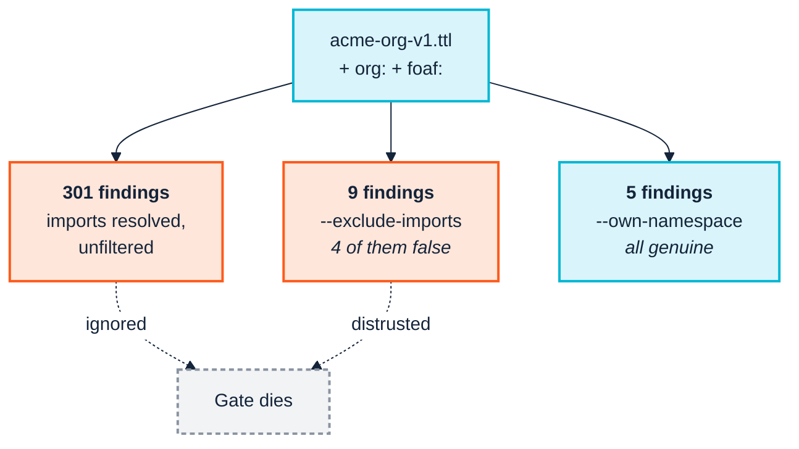

<p align="center">
  
</p>

# 9. Continuous integration

> *Part III — The practice · SemOps stage 3 · Operating-model layer 3*

> **Stories answered here**
> *As a SemOps engineer, I want bad semantic changes rejected automatically, and
> I want the rejection to be about* our *code.*

Stage 3 is where SemOps stops being a philosophy. The blueprint's stated goal is
blunt — *"automatically reject bad semantic changes"* — and the mechanism is
almost embarrassingly simple: one flag, `--fail-on`, and a non-zero exit code.

The simple part takes a paragraph. The rest of this chapter is about the part
that actually determines whether the gate survives its first month, which is
**what the gate reports**.

---

## 9.1 The mechanism

```bash
python -m ontology_suite ontology \
  --ontology examples/acme_robotics/acme-org-v1.ttl \
  --import-dir examples/acme_robotics \
  --fail-on Violation
```

`--fail-on` takes `Violation`, `Warning`, `Info` or `never`. The command exits
non-zero when a finding at or above that severity exists. Against the fixture
this exits non-zero, because `LOG-001` — the deliberate `Contractor`/`Employee`
contradiction — is a real Violation.

That is the whole gate. `version-diff` has its own variant (`--fail-on major`),
and `consistency` and `pattern-consistency` use `--fail-on-misalignment` and
`--fail-on-mismatch`; nothing more exotic is needed for a green/red build.

---

## 9.2 The problem: 301 findings

Now run the full registry the obvious way — the whole 50-check catalogue against
the ontology, with its real `org:` and FOAF imports resolved:

```bash
python -m ontology_suite checks \
  --ontology examples/acme_robotics/acme-org-v1.ttl \
  --import-dir examples/acme_robotics \
  --engine sparql --out-dir out/checks --fail-on never
```

```
Findings: 301 total (55 Violation, 162 Warning, 84 Info)
```

> **This number used to wander, and no longer does.** Five consecutive runs now
> give 301 every time. Earlier editions of this manual reported it as "close to
> 300" and documented a drift of 289–298, traced to `STR-007` returning anywhere
> between 12 and 21 findings on identical input.
>
> The cause was not the check. Several registry `CONSTRUCT`s deliberately bind
> **two** values per result — `LOG-004`'s two inverses, `LOG-006`/`007`'s domain
> and range, `REA-001`'s two disjoint classes, `STR-007`'s subject and object —
> while the merge step read a single one via `Graph.value()`, an arbitrary pick
> among them, and then deduplicated on it. Which value came back varied per run,
> so rows collapsed differently each time. Values are now sorted and joined, so
> the key is order-independent and the report shows both values instead of half
> the finding.
>
> The lesson outlived the bug, and [§9.8](#98-testing-the-gate-itself) is about
> it: **a count is a fragile thing to assert on.** The set of check identifiers
> reported was stable throughout, even while the totals moved.

Every one of those findings is real. The suite is genuinely checking every
triple in the merged graph — and the merged graph includes the entire W3C
Organization Ontology and the entire FOAF vocabulary, complete with their own
internal documentation habits, blank-node axiom style and naming choices.

Wire that into CI with `--fail-on Violation` and you have gated your build on
around fifty violations, of which approximately zero are yours. What happens
next is predictable and happens every time: the team triages it once, concludes
the tool is noisy, and either switches the gate off or adds `|| true`. The
five findings that were genuinely theirs are lost with the other 296.

> **This is the single most common way a semantic quality gate dies.** Not
> because the checks are wrong — they are not — but because
> [Chapter 2](02-people-and-cognition.md)'s cognitive budget was never
> considered. A gate nobody triages is not a gate.

So: whose problems are these? A domain steward owns the correctness of *their
own* additions to a shared vocabulary. They do not own the W3C's internal SHACL
cleanliness, and cannot fix it.

---

## 9.3 The obvious fix is wrong

The instinctive move is to stop resolving the imports at all:

```bash
python -m ontology_suite checks \
  --ontology examples/acme_robotics/acme-org-v1.ttl \
  --exclude-imports \
  --engine sparql --out-dir out/checks_excl --fail-on never
```

301 findings become **9** — and this one has always been
exact: three consecutive runs each gave `9 total (1 Violation, 8 Warning,
0 Info)`. Enormously better, and still wrong. Here is the full breakdown:

```
2 × DAT-002  Warning    Dangling IRI reference
1 × LOG-001  Violation  Class disjoint with its own ancestor
1 × QUA-001  Warning    (missing label)
3 × QUA-004  Warning    Resource missing skos:prefLabel
1 × STR-003  Warning    (missing domain/range)
1 × STY-002  Warning    (naming style)
```

Inspect the two `DAT-002` findings and the cause is immediate:

```
focus = acme:1.0.0            path = owl:imports        value = http://xmlns.com/foaf/0.1/
focus = acme:Employee         path = rdfs:subClassOf    value = http://xmlns.com/foaf/0.1/Person
```

Both point at FOAF. `acme:Employee` is a subclass of `foaf:Person`, and with
imports excluded, FOAF is not loaded, so `foaf:Person` looks like a dangling
reference. It is not dangling; it is simply absent. Two of the three `QUA-004`
findings are the same artefact — they are against `foaf:` itself and
`foaf:Person`, terms whose labels live upstream in a file you just declined to
read.

**`--exclude-imports` traded 296 irrelevant findings for 4 false ones.** In some
ways that is a worse failure: irrelevant findings get ignored, but false
findings get *investigated*, and an engineer who spends an afternoon proving that
`acme:Employee` is fine learns exactly the same lesson about the tool's
trustworthiness.

---

## 9.4 The right fix: `--own-namespace`

Keep the imports resolved — so upstream context is real, `foaf:Person` genuinely
exists, and cross-vocabulary reasoning works — and filter the **report** to
findings whose focus node lies in your own namespace:

```bash
python -m ontology_suite checks \
  --ontology examples/acme_robotics/acme-org-v1.ttl \
  --import-dir examples/acme_robotics \
  --engine sparql \
  --own-namespace "https://acme.example.org/ns/" \
  --out-dir out/checks_own --fail-on never
```

```
1 × LOG-001  Violation  Class disjoint with its own ancestor
1 × QUA-001  Warning    (missing label)
1 × QUA-004  Warning    Resource missing skos:prefLabel  -> acme:hasSkill
1 × STR-003  Warning    (missing domain/range)
1 × STY-002  Warning    (naming style)
```

**Five findings. All five are Acme's. None are artefacts.** Also exact: three
consecutive runs each gave `5 total (1 Violation, 4 Warning, 0 Info)`, with the
same five check identifiers every time.

Compare the three runs directly — all three are the same ontology, the same
registry, the same engine:

| Run | Findings | Genuinely yours | Upstream noise | False |
|---|---|---|---|---|
| `--import-dir` alone | **301** | 5 | 296 | 0 |
| `--exclude-imports` | **9** | 5 | 0 | **4** |
| `--own-namespace` | **5** | 5 | 0 | 0 |

All three are now exactly reproducible across repeated runs. That was not true
of the first row until recently, and the fact that it is the row you are being
told *not* to use was a happy accident rather than a design.



### A real mistake worth repeating

The first attempt at that command, while writing this manual, used
`--own-namespace "http://example.org/acme#"` and returned:

```
Findings: 0 total (0 Violation, 0 Warning, 0 Info)
```

A confidently empty report. The fixture's namespace is
`https://acme.example.org/ns/` — different scheme, different host, different
separator. `--own-namespace` is a **literal IRI-prefix string match**, not a
prefix-name lookup, and a near-miss produces silence rather than an error.

Zero findings is exactly what a passing gate looks like. Two lessons:

1. **Copy the namespace from the ontology, never from memory.** It is the string
   after `@prefix`, in full, including the trailing `/` or `#`.
2. **Verify the filter with a known-failing input once**, and keep that check.
   A gate that cannot fail is indistinguishable from a gate that passes.

`--verbose` prints what every option actually resolved to before running, and is
the first thing to reach for when a result looks surprising — including this
one.

### When to run the wide pass anyway

Do not discard the wide run; just stop putting it on the pull-request path. Run it **periodically, or when an imported vocabulary changes** — as an
audit rather than a gate. That is when "FOAF published a new version and
something in it now conflicts with our assumptions" becomes findable, and it is
a genuinely different question from "did this PR break anything."

| Cadence | Command | Purpose |
|---|---|---|
| Every PR | `checks --own-namespace <yours> --fail-on Violation` | Gate |
| Weekly / on upstream change | `checks --import-dir … --fail-on never` | Audit |

---

## 9.5 Wiring it up

The pattern generalises to three gate types, one per kind of pull request.

```yaml
name: semantic-ci
on: [pull_request]

jobs:
  ontology:
    runs-on: ubuntu-latest
    steps:
      - uses: actions/checkout@v4
        with:
          # version-diff compares against the base branch, so the default
          # shallow checkout is not enough.
          fetch-depth: 0
      - uses: astral-sh/setup-uv@v5
      - run: uv sync

      # 1. Is the schema itself sound?
      - name: Ontology quality gate
        run: |
          uv run ontology-quality-suite ontology \
            --ontology ontology/acme-org.ttl \
            --import-dir vendor/vocab \
            --fail-on Violation

      # 2. Does it pass our rules, scoped to terms we own?
      - name: Registry checks (our namespace only)
        run: |
          uv run ontology-quality-suite checks \
            --ontology ontology/acme-org.ttl \
            --import-dir vendor/vocab \
            --own-namespace "https://acme.example.org/ns/" \
            --engine sparql \
            --fail-on Violation

      # 3. Is this release breaking, and does anything downstream break with it?
      - name: Change impact
        run: |
          # The "old" side is the ontology as it stands on the base branch.
          git show "origin/${{ github.base_ref }}:ontology/acme-org.ttl" > /tmp/base.ttl
          uv run ontology-quality-suite version-diff \
            /tmp/base.ttl ontology/acme-org.ttl \
            --json --fail-on major
        continue-on-error: true   # informational: a MAJOR bump needs sign-off, not a block

      - uses: actions/upload-artifact@v4
        if: always()
        with:
          name: semantic-reports
          path: out/
```

Four points about that job.

**Vendor your imports.** `--import-dir vendor/vocab` resolves `owl:imports`
against local copies. `--allow-network` exists, and CI is the last place you
want it: a build whose result depends on a third party's uptime is not
reproducible, and an upstream vocabulary that changes silently changes your gate
silently.

**Upload the reports as artefacts.** Every run writes rather more than the two
files this manual has been quoting, and the extras are the ones that reach
people who do not read CSVs:

| File | Who it is for |
|---|---|
| `report.html` | A reviewer, reading the findings |
| `full_results.csv` | Diffing between runs; the raw record |
| `summary_by_check.md`, `summary_by_category.md` | A pull-request comment, or a status page |
| `top_offenders.md` | "What should we fix first?" |
| `cucumber.json` | Any CI system that already renders BDD results |
| `features/`, `plots/` | The generated feature files and charts behind the above |

`cucumber.json` is the one worth knowing about. Each check becomes a scenario
under its category, with `Given`/`Then` steps and a pass/fail status:

```
Feature:  Structural Integrity
Scenario: [STR-001] Every rdf:type used on an instance resolves to a
          declared class
  Given the combined ontology and data graph        passed
  Then  Every rdf:type used on an instance …        passed
```

That format is understood by essentially every CI system's test reporting, which
means semantic quality can appear on the same dashboard as unit tests without
anyone writing an integration — and, per
[Chapter 2](02-people-and-cognition.md), it renders findings in a form a
non-specialist can read. The `cucumber_feature` and `cucumber_scenario` fields
in a registry entry ([Chapter 8](08-model-and-validate.md)) are what populate it,
which is a reason to fill them in on your own house rules.

All of these are written on every run regardless of exit code.

**A MAJOR bump should not block the build.** It should *demand a human*. The
job above records it and continues; the enforcement belongs in a branch
protection rule requiring a named reviewer, which is a governance control rather
than a technical one. See [Chapter 12](12-release-and-change.md).

**Different PRs need different gates:**

| PR touches | Gate to run |
|---|---|
| The ontology | `ontology`, then `checks --own-namespace` |
| A transformation query | `sketch` first — it needs no CSV ([Ch. 10](10-ingest-and-transform.md)) |
| A taxonomy of controlled values | `pattern-consistency` ([Ch. 12](12-release-and-change.md)) |
| Data | `data`, with `--sample N` if the graph is large |

---

## 9.6 The one-command version

Once you know which stages apply, `run` composes them into a single merged
report:

```bash
python -m ontology_suite run \
  --ontology examples/acme_robotics/acme-org-v1.ttl \
  --import-dir examples/acme_robotics \
  --queries examples/acme_robotics \
  --own-namespace "https://acme.example.org/ns/" \
  --engine sparql --fail-on Violation --out-dir out
```

Convenient for a nightly job. Less good as a PR gate, because a single merged
pass/fail tells a reviewer less than three named steps that each fail for a
stated reason. Prefer the explicit steps where a human reads the result.

---

## 9.7 Across the boundary

[Chapter 3](03-across-the-boundary.md) noted that the gate has no jurisdiction
outside your own organisation. The mechanics are unchanged; the disposition of
the output is not:

| | Internal | Cross-boundary |
|---|---|---|
| Non-zero exit | Blocks the merge | Generates a notice with a deadline |
| `report.html` | A reviewer reads it | The partner reads it |
| The registry directory | Internal config | **A published artefact partners run themselves** |

That last row is the highest-leverage cross-boundary move available, and it
costs nothing you have not already built: your check registry is a directory of
files, and `--registry`/`--shapes`/`--sparql` means a partner can point at it and
validate before submitting rather than after being rejected.

---

> **Run it:** [notebook 1 — Validation and the gate](../notebooks/01-validation-and-the-gate.ipynb)
> builds a miniature version of this chapter's fixture and walks the same
> comparison, including the near-miss filter that returns an empty report.

## 9.8 Testing the gate itself

Everything so far has used the gate to test an ontology. This section is the
other direction: **how do you know the gate still works?**

It is a real question, and the suite's own history answers it. Four times it has
shipped a check that quietly matched nothing — `REA-001` on a bad symmetry
assumption, `DAT-001` twice (a `UNION` of `FILTER`-only branches that matches
nothing under rdflib, and a boolean branch made unreachable because rdflib
rewrites the stored lexical form of an ill-typed boolean), and `EFF-002` with an
unjoined `$this`. Each was found only by running it against real data.

> **A check that cannot fire is worse than no check, because it looks like
> coverage.** It sits in the registry, it appears in the catalogue, it never
> produces a finding, and everyone concludes that part of the model is clean.

### The pattern: a fixture per error category

The practice that catches this is a companion repository of **deliberately
broken ontologies**, each isolating one category of error, each asserting the
check identifiers it must trigger. The one this section describes is real and
public — [`consolidated-ontology-quality-suite-python-testing`](https://github.com/pwin/consolidated-ontology-quality-suite-python-testing) — so the
tables below can be read against
[the fixtures themselves](https://github.com/pwin/consolidated-ontology-quality-suite-python-testing/tree/main/ontologies) and
[the harness](https://github.com/pwin/consolidated-ontology-quality-suite-python-testing/blob/main/detect.py):

| Fixture | Seeded error | Must report |
|---|---|---|
| `01-clean` | *(none — control)* | no Violation, no Warning |
| `03-disjoint-classes` | class disjoint with its own superclass | `LOG-001`, `REA-001`, `REA-020` |
| `06-datatype-conformance` | ill-formed `xsd:date`/`integer`/`boolean` | `DAT-001`, `CNF-003`, `CNF-004` |
| `07-naming-style` | `snake_case` class, untagged label, deprecated term | `STY-001`, `STY-002`, `STY-003`, `QUA-001` |
| `09-profile-violations` | `unionOf`, `complementOf`, `minCardinality 4` | `REA-010`, `REA-011`, `REA-012` |

Three details make it work, and all three are worth copying.

**Assert check identifiers, not counts.** This is the whole trick. A regression
then shows up as *"`LOG-004` no longer fires"* — a named, actionable failure —
rather than as *"expected 85 findings, got 83"*, which tells you nothing about
what broke. It also survives exactly the kind of churn this manual has been
documenting: while the unscoped total was drifting between 289 and 298, the
**set of check identifiers never moved**, so a suite built on identifiers stayed
green and meaningful throughout.

**Keep a clean control.** One fixture with no seeded error at all, declaring its
labels, domains, ranges and metadata properly, producing **no Violation and no
Warning**. Without it you cannot attribute findings in the other fixtures to
their seeded errors rather than to background noise — and the first draft of
that control found a real inconsistency, `STR-002` flagging `skos:prefLabel`
where its broader sibling `STR-007` stayed quiet about the same predicate.

**Mark the error in the fixture.** Every seeded fault carries an `# ERROR:`
comment naming the check it should trigger, so the fixture documents its own
intent and a reader can tell a deliberate fault from an accidental one:

```turtle
# ERROR: class local name is snake_case, not UpperCamelCase -> STY-001
# ERROR: no rdfs:label / skos:prefLabel at all               -> QUA-001
:person_record a owl:Class ; rdfs:subClassOf owl:Thing .
```

### Four assertions, not one

"Did the expected checks fire" is the obvious test and the weakest of the four
worth writing. The full set:

| Assertion | Guards against |
|---|---|
| **Expected ids fired** | A check silently ceasing to work |
| **Forbidden ids did *not* fire** | False positives — a check becoming over-eager |
| **Severity ceiling** | A finding quietly escalating; the clean control must produce nothing above `Warning` |
| **Optional-reasoner ids** — asserted only when it ran | A flaky optional dependency turning into a red build |

The second is the one teams skip, and it is what caught `STR-002` flagging
`skos:prefLabel` where its broader sibling stayed quiet. **A check that starts
firing when it should not is as much a regression as one that stops firing** —
and it is the more damaging of the two, because it erodes trust in every other
finding in the report.

The fourth deserves its own note, because it is
[Chapter 4](04-from-research-to-industry.md)'s argument made executable. Findings
that only a full DL reasoner can produce — `REA-020`, `REA-021` — are asserted
**only when that reasoner actually ran**, and reported as skipped otherwise. An
optional dependency that fails a build when it is absent is not optional; one
that silently reduces coverage is worse. Skipping, visibly, is the third option
and the right one.

### Two practical traps

**Test against the library, not the report.** The harness imports
`ontology_suite.pipeline` and compares structured result rows rather than
scraping `report.html`. Report formats change; a test suite coupled to their
text breaks for reasons that have nothing to do with the ontology.

**A non-zero exit from a broken fixture is success.** The CLI exits 1 whenever a
Violation is found, so every deliberately-broken fixture exits 1 — that is the
fixture working. Wire that into CI naively and your fixture suite fails
permanently. Either assert on the findings rather than the exit code, or pass
`--fail-on never` when the exit code is not what you are testing.

### The stage decides which checks can fire at all

Worth knowing before you conclude a check is broken: the three stages expose
different layers, and a check cannot fire in a stage that never runs it.

| Stage | What runs | What cannot fire |
|---|---|---|
| `checks --ontology` | Registry SHACL + SPARQL over the ontology alone | Conformance (`CNF-*`), reasoning |
| `data <file> --ontology` | The full pass — registry, ontology-vs-data conformance, `owlrl` closure and HermiT | Nothing, but it is the slowest |
| `ontology --ontology` | The as-authored evaluation | Everything except profile membership — **and that only with `--profile`** |

`REA-010`/`011`/`012` — the OWL2 profile checks — are the sharp case: they fire
only from `ontology`, and only when `--profile` is passed. A team that runs
`checks` and concludes their ontology is EL-clean has not tested that at all.

### It pays for itself

That [companion repository](https://github.com/pwin/consolidated-ontology-quality-suite-python-testing) is what surfaced the merge nondeterminism in
[§9.2](#92-the-problem-301-findings), the severity misplacement in
[Chapter 7](07-the-toolchain.md) §7.4, and the unreachable `DAT-001` branch —
all of which are now fixed. Thirteen fixtures asserting 35 of the registry's 50
checks was enough to find four real defects in the tool they were testing.

Its [`COMMANDS.md`](https://github.com/pwin/consolidated-ontology-quality-suite-python-testing/blob/main/COMMANDS.md) gives every fixture as both a
harness invocation and the equivalent bare CLI command, which makes it usable as
a worked reference for the suite generally, not only as a test suite. The two
[`experiments/`](https://github.com/pwin/consolidated-ontology-quality-suite-python-testing/tree/main/experiments) scripts are worth a look as well:
each isolates one of the defects above to about thirty lines, which is a good
model for reporting a tool bug you want fixed rather than argued about.

The general form, for your own house rules
([Chapter 8](08-model-and-validate.md)): every check you write gets a fixture
that makes it fire, and the suite asserts it fires. Otherwise you find out it
never did on the day it mattered.

---

## 9.9 Maturity checkpoint

A team running these gates on every pull request, with reports retained, is at
**maturity Level 3 — Automated Semantic Delivery** for the validation dimension:
predictable releases, faster iteration, early detection of semantic regressions.

Level 3's other dimensions — automated packaging, deployment to dev/test,
orchestrated ETL, ingestion monitoring — are partly [Chapter 10](10-ingest-and-transform.md)
and partly not covered by this toolchain at all
([Chapter 14](14-coverage-and-gaps.md)).

This is the transition worth spending real effort on. It is also the one that
makes agent participation safe: as [Chapter 5](05-genai-and-agents.md) argues, a
gate that genuinely rejects bad changes is what lets you accept proposals from a
much higher-throughput source without accepting the risk that comes with it.

---

| ← [8. Model and validate](08-model-and-validate.md) | [10. Ingest and transform →](10-ingest-and-transform.md) |
|---|---|
