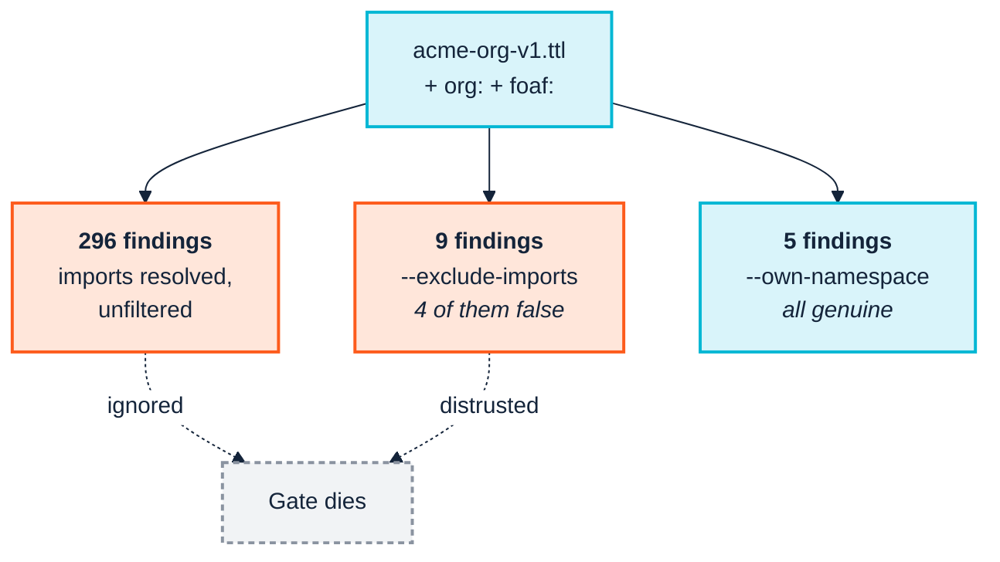

<p align="center">
  
</p>

# 9. Continuous integration

> *Part III — The practice · SemOps stage 3 · Operating-model layer 3*

> **Stories answered here**
> *As a SemOps engineer, I want bad semantic changes rejected automatically, and
> I want the rejection to be about* our *code.*

Stage 3 is where SemOps stops being a philosophy. The blueprint's stated goal is
blunt — *"automatically reject bad semantic changes"* — and the mechanism is
almost embarrassingly simple: one flag, `--fail-on`, and a non-zero exit code.

The simple part takes a paragraph. The rest of this chapter is about the part
that actually determines whether the gate survives its first month, which is
**what the gate reports**.

---

## 9.1 The mechanism

```bash
python -m ontology_suite ontology \
  --ontology examples/acme_robotics/acme-org-v1.ttl \
  --import-dir examples/acme_robotics \
  --fail-on Violation
```

`--fail-on` takes `Violation`, `Warning`, `Info` or `never`. The command exits
non-zero when a finding at or above that severity exists. Against the fixture
this exits non-zero, because `LOG-001` — the deliberate `Contractor`/`Employee`
contradiction — is a real Violation.

That is the whole gate. `version-diff` has its own variant (`--fail-on major`),
and `consistency` and `pattern-consistency` use `--fail-on-misalignment` and
`--fail-on-mismatch`; nothing more exotic is needed for a green/red build.

---

## 9.2 The problem: 296 findings

Now run the full registry the obvious way — the whole 50-check catalogue against
the ontology, with its real `org:` and FOAF imports resolved:

```bash
python -m ontology_suite checks \
  --ontology examples/acme_robotics/acme-org-v1.ttl \
  --import-dir examples/acme_robotics \
  --engine sparql --out-dir out/checks --fail-on never
```

```
Findings: 296 total (50 Violation, 162 Warning, 84 Info)
```

Every one of those findings is real. The suite is genuinely checking every
triple in the merged graph — and the merged graph includes the entire W3C
Organization Ontology and the entire FOAF vocabulary, complete with their own
internal documentation habits, blank-node axiom style and naming choices.

Wire that into CI with `--fail-on Violation` and you have gated your build on
fifty violations, of which approximately zero are yours. What happens next is
predictable and happens every time: the team triages it once, concludes the tool
is noisy, and either switches the gate off or adds `|| true`. The four findings
that were genuinely theirs are lost with the other 292.

> **This is the single most common way a semantic quality gate dies.** Not
> because the checks are wrong — they are not — but because
> [Chapter 2](02-people-and-cognition.md)'s cognitive budget was never
> considered. A gate nobody triages is not a gate.

So: whose problems are these? A domain steward owns the correctness of *their
own* additions to a shared vocabulary. They do not own the W3C's internal SHACL
cleanliness, and cannot fix it.

---

## 9.3 The obvious fix is wrong

The instinctive move is to stop resolving the imports at all:

```bash
python -m ontology_suite checks \
  --ontology examples/acme_robotics/acme-org-v1.ttl \
  --exclude-imports \
  --engine sparql --out-dir out/checks_excl --fail-on never
```

296 findings become **9**. Enormously better, and still wrong. Here is the full
breakdown:

```
2 × DAT-002  Warning    Dangling IRI reference
1 × LOG-001  Violation  Class disjoint with its own ancestor
1 × QUA-001  Warning    (missing label)
3 × QUA-004  Warning    Resource missing skos:prefLabel
1 × STR-003  Warning    (missing domain/range)
1 × STY-002  Warning    (naming style)
```

Inspect the two `DAT-002` findings and the cause is immediate:

```
focus = acme:1.0.0            path = owl:imports        value = http://xmlns.com/foaf/0.1/
focus = acme:Employee         path = rdfs:subClassOf    value = http://xmlns.com/foaf/0.1/Person
```

Both point at FOAF. `acme:Employee` is a subclass of `foaf:Person`, and with
imports excluded, FOAF is not loaded, so `foaf:Person` looks like a dangling
reference. It is not dangling; it is simply absent. Two of the three `QUA-004`
findings are the same artefact — they are against `foaf:` itself and
`foaf:Person`, terms whose labels live upstream in a file you just declined to
read.

**`--exclude-imports` traded 291 irrelevant findings for 4 false ones.** In some
ways that is a worse failure: irrelevant findings get ignored, but false
findings get *investigated*, and an engineer who spends an afternoon proving that
`acme:Employee` is fine learns exactly the same lesson about the tool's
trustworthiness.

---

## 9.4 The right fix: `--own-namespace`

Keep the imports resolved — so upstream context is real, `foaf:Person` genuinely
exists, and cross-vocabulary reasoning works — and filter the **report** to
findings whose focus node lies in your own namespace:

```bash
python -m ontology_suite checks \
  --ontology examples/acme_robotics/acme-org-v1.ttl \
  --import-dir examples/acme_robotics \
  --engine sparql \
  --own-namespace "https://acme.example.org/ns/" \
  --out-dir out/checks_own --fail-on never
```

```
1 × LOG-001  Violation  Class disjoint with its own ancestor
1 × QUA-001  Warning    (missing label)
1 × QUA-004  Warning    Resource missing skos:prefLabel  -> acme:hasSkill
1 × STR-003  Warning    (missing domain/range)
1 × STY-002  Warning    (naming style)
```

**Five findings. All five are Acme's. None are artefacts.**

Compare the three runs directly — all three are the same ontology, the same
registry, the same engine:

| Run | Findings | Genuinely yours | Upstream noise | False |
|---|---|---|---|---|
| `--import-dir` alone | **296** | 5 | 291 | 0 |
| `--exclude-imports` | **9** | 5 | 0 | **4** |
| `--own-namespace` | **5** | 5 | 0 | 0 |



### A real mistake worth repeating

The first attempt at that command, while writing this manual, used
`--own-namespace "http://example.org/acme#"` and returned:

```
Findings: 0 total (0 Violation, 0 Warning, 0 Info)
```

A confidently empty report. The fixture's namespace is
`https://acme.example.org/ns/` — different scheme, different host, different
separator. `--own-namespace` is a **literal IRI-prefix string match**, not a
prefix-name lookup, and a near-miss produces silence rather than an error.

Zero findings is exactly what a passing gate looks like. Two lessons:

1. **Copy the namespace from the ontology, never from memory.** It is the string
   after `@prefix`, in full, including the trailing `/` or `#`.
2. **Verify the filter with a known-failing input once**, and keep that check.
   A gate that cannot fail is indistinguishable from a gate that passes.

`--verbose` prints what every option actually resolved to before running, and is
the first thing to reach for when a result looks surprising — including this
one.

### When to run the wide pass anyway

Do not discard the 296-finding run; just stop putting it on the pull-request
path. Run it **periodically, or when an imported vocabulary changes** — as an
audit rather than a gate. That is when "FOAF published a new version and
something in it now conflicts with our assumptions" becomes findable, and it is
a genuinely different question from "did this PR break anything."

| Cadence | Command | Purpose |
|---|---|---|
| Every PR | `checks --own-namespace <yours> --fail-on Violation` | Gate |
| Weekly / on upstream change | `checks --import-dir … --fail-on never` | Audit |

---

## 9.5 Wiring it up

The pattern generalises to three gate types, one per kind of pull request.

```yaml
name: semantic-ci
on: [pull_request]

jobs:
  ontology:
    runs-on: ubuntu-latest
    steps:
      - uses: actions/checkout@v4
      - uses: astral-sh/setup-uv@v5
      - run: uv sync

      # 1. Is the schema itself sound?
      - name: Ontology quality gate
        run: |
          uv run ontology-quality-suite ontology \
            --ontology ontology/acme-org.ttl \
            --import-dir vendor/vocab \
            --fail-on Violation

      # 2. Does it pass our rules, scoped to terms we own?
      - name: Registry checks (our namespace only)
        run: |
          uv run ontology-quality-suite checks \
            --ontology ontology/acme-org.ttl \
            --import-dir vendor/vocab \
            --own-namespace "https://acme.example.org/ns/" \
            --engine sparql \
            --fail-on Violation

      # 3. Is this release breaking, and does anything downstream break with it?
      - name: Change impact
        run: |
          uv run ontology-quality-suite version-diff \
            ontology/acme-org.ttl.base ontology/acme-org.ttl \
            --json --fail-on major
        continue-on-error: true   # informational: a MAJOR bump needs sign-off, not a block

      - uses: actions/upload-artifact@v4
        if: always()
        with:
          name: semantic-reports
          path: out/
```

Four points about that job.

**Vendor your imports.** `--import-dir vendor/vocab` resolves `owl:imports`
against local copies. `--allow-network` exists, and CI is the last place you
want it: a build whose result depends on a third party's uptime is not
reproducible, and an upstream vocabulary that changes silently changes your gate
silently.

**Upload the reports as artefacts.** `report.html` is the thing a reviewer
actually reads; `full_results.csv` is the thing you diff between runs. Both are
written on every run regardless of exit code.

**A MAJOR bump should not block the build.** It should *demand a human*. The
job above records it and continues; the enforcement belongs in a branch
protection rule requiring a named reviewer, which is a governance control rather
than a technical one. See [Chapter 11](11-release-and-change.md).

**Different PRs need different gates:**

| PR touches | Gate to run |
|---|---|
| The ontology | `ontology`, then `checks --own-namespace` |
| A transformation query | `sketch` first — it needs no CSV ([Ch. 10](10-ingest-and-transform.md)) |
| A taxonomy of controlled values | `pattern-consistency` ([Ch. 11](11-release-and-change.md)) |
| Data | `data`, with `--sample N` if the graph is large |

---

## 9.6 The one-command version

Once you know which stages apply, `run` composes them into a single merged
report:

```bash
python -m ontology_suite run \
  --ontology examples/acme_robotics/acme-org-v1.ttl \
  --import-dir examples/acme_robotics \
  --queries examples/acme_robotics \
  --own-namespace "https://acme.example.org/ns/" \
  --engine sparql --fail-on Violation --out-dir out
```

Convenient for a nightly job. Less good as a PR gate, because a single merged
pass/fail tells a reviewer less than three named steps that each fail for a
stated reason. Prefer the explicit steps where a human reads the result.

---

## 9.7 Across the boundary

[Chapter 3](03-across-the-boundary.md) noted that the gate has no jurisdiction
outside your own organisation. The mechanics are unchanged; the disposition of
the output is not:

| | Internal | Cross-boundary |
|---|---|---|
| Non-zero exit | Blocks the merge | Generates a notice with a deadline |
| `report.html` | A reviewer reads it | The partner reads it |
| The registry directory | Internal config | **A published artefact partners run themselves** |

That last row is the highest-leverage cross-boundary move available, and it
costs nothing you have not already built: your check registry is a directory of
files, and `--registry`/`--shapes`/`--sparql` means a partner can point at it and
validate before submitting rather than after being rejected.

---

## 9.8 Maturity checkpoint

A team running these gates on every pull request, with reports retained, is at
**maturity Level 3 — Automated Semantic Delivery** for the validation dimension:
predictable releases, faster iteration, early detection of semantic regressions.

Level 3's other dimensions — automated packaging, deployment to dev/test,
orchestrated ETL, ingestion monitoring — are partly [Chapter 10](10-ingest-and-transform.md)
and partly not covered by this toolchain at all
([Chapter 13](13-coverage-and-gaps.md)).

This is the transition worth spending real effort on. It is also the one that
makes agent participation safe: as [Chapter 5](05-genai-and-agents.md) argues, a
gate that genuinely rejects bad changes is what lets you accept proposals from a
much higher-throughput source without accepting the risk that comes with it.

---

| ← [8. Model and validate](08-model-and-validate.md) | [10. Ingest and transform →](10-ingest-and-transform.md) |
|---|---|
