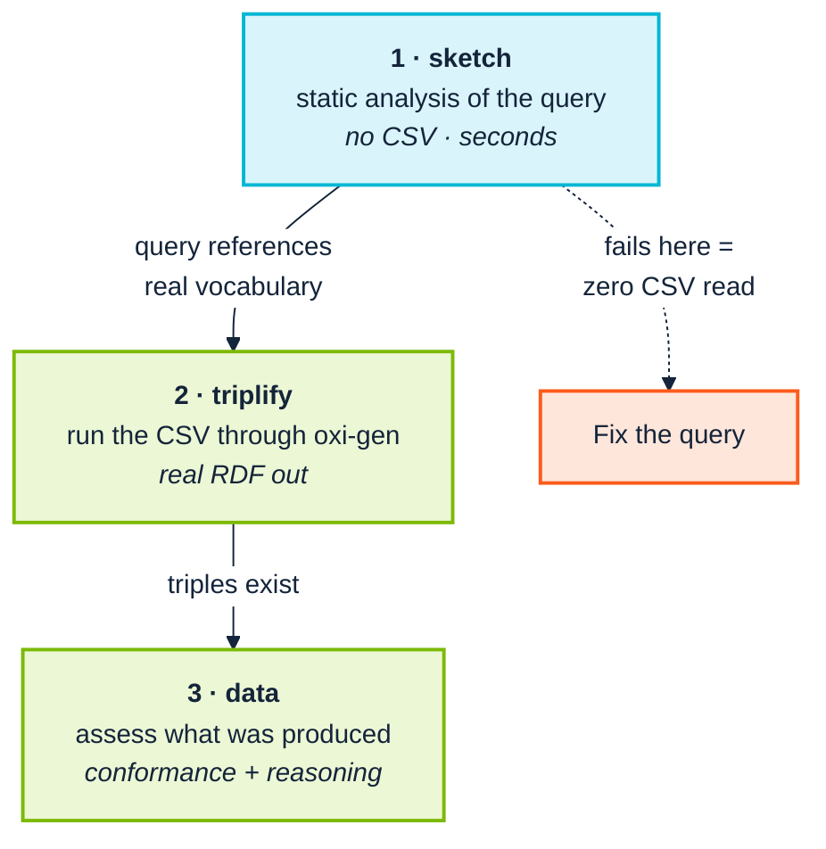

<p align="center">
  
</p>

# 10. Ingest and transform

> *Part III — The practice · SemOps stage 6 · Operating-model layer 4*

> **Stories answered here**
> *As a data engineer, I want to know a transformation is wrong before I run it
> over four million rows.*
> *As a data steward, I want to know whether a finding is our problem or an
> upstream vocabulary's.*

SemOps layer 4 asks for ETL orchestration, incremental ingestion, data-quality
checks, error handling and provenance capture. This toolchain covers the
**quality and correctness** half thoroughly and the **orchestration** half not
at all — there is no scheduler here, and Airflow, Argo or Prefect remain the
right answers for that ([Chapter 14](14-coverage-and-gaps.md)).

What it does provide is a three-stage pipeline arranged on one principle:
**cheapest check first**.



---

## 10.1 Before the pipeline: drafting from a CSV

Most real ingestion starts with a CSV somebody emailed you, and the first
question is what the ontology should even look like.

The extension's *Infer Ontology + Query from CSV* profiles a raw CSV — sniffing
types and cardinality — and drafts **both** a starter ontology fragment and a
CONSTRUCT query wired to it. It is a starting point, not an answer: an inferred
model reflects the shape of one extract, not the shape of the domain, and
[Chapter 2](02-people-and-cognition.md)'s exemplar-driven expert will find its
boundary cases in minutes.

The *Query Workbench* is the more durable tool. It gives a live, debounced
preview of the transformation's real triplified output against sample rows —
using Oxigraph, with TARQL semantics reproduced via a standard SPARQL `VALUES`
injection — alongside a static sketch of the CONSTRUCT template and conformance
warnings against the ontology.

The point is the loop length. Discovering a wrong `BIND` after a full pipeline
run is a twenty-minute round trip; discovering it in a live preview is
immediate, and immediate feedback is what makes people willing to iterate on a
transformation rather than accepting the first one that runs without erroring.

---

## 10.2 Stage 1: `sketch` — before any CSV is read

`sketch` is pure static analysis of the query text against the ontology. It
answers *"does this transformation even reference vocabulary the ontology
declares?"* without touching a single row of data.

```bash
python -m ontology_suite sketch \
  --queries examples/acme_robotics \
  --ontology examples/acme_robotics/acme-org-v1.ttl \
  --import-dir examples/acme_robotics \
  --out-dir out/sketch
```

```
Findings: 35 total (0 Violation, 0 Warning, 35 Info)
Sketch used 1 query file(s); 8 triples, 7 entities.
```

The summary line is the useful part: **8 triples, 7 entities from 1 query file**.
That is the shape the transformation will produce, derived from the query alone.
A reviewer who expected fifteen predicates and sees eight has found a bug before
any data moved.

> **Gotcha, hit while writing this chapter:** `--queries` expects a **directory**,
> not a file. Passing `--queries examples/acme_robotics/employees.rq` fails with
> `No files matching '*.sparql,*.rq,*.tarql,*.tq' found in
> examples/acme_robotics/employees.rq` — the path is treated as a folder to scan.
> The message names the patterns it looked for, which is enough to diagnose it,
> but the flag reads like it takes a file. Point it at the containing folder, or
> narrow with `--file-pattern`.

Because `sketch` needs no CSV, no `oxi-gen` binary and no data access, it is the
right gate for a pull request that changes a transformation query — it runs in
seconds and needs no production data in CI.

---

## 10.3 Stage 2: `triplify` — produce real RDF

```bash
python -m ontology_suite triplify \
  --csv-dir examples/acme_robotics \
  --queries examples/acme_robotics \
  --out-dir out/triplify
```

```
Triplified 1 file(s) into out/triplify
  - out/triplify/employees.ttl
```

This shells out to the real `oxi-gen` binary (auto-discovered, or passed with
`--oxi-gen-bin`). The output is genuine RDF:

```turtle
@prefix acme: <https://acme.example.org/ns/> .
@prefix foaf: <http://xmlns.com/foaf/0.1/> .

<https://acme.example.org/data/employee/E004> a acme:Employee , acme:Engineer ;
	foaf:mbox <mailto:margaret.hamilton@acme.example.org> ;
	foaf:name "Margaret Hamilton" ;
	acme:hasEmployeeId "E004" ;
	acme:hasRole "Test Engineer" ;
	acme:hasSkill "Automation" ;
	acme:worksIn <https://acme.example.org/data/department/QA> .
```

Useful flags in practice: `--test N` triplifies only the first *N* rows (fast
iteration on a large file), `--delimiter`/`--tab` for non-comma input,
`--no-header-row`, `--dedup N`, and `--ntriples` for line-oriented output that
diffs and streams well.

`--test` deserves a habit: run it before every full run. It costs seconds and it
catches the class of error where a transformation is syntactically fine and
semantically wrong.

---

## 10.4 Stage 3: `data` — assess what was actually produced

```bash
python -m ontology_suite data out/triplify/employees.ttl \
  --ontology examples/acme_robotics/acme-org-v1.ttl \
  --import-dir examples/acme_robotics \
  --engine sparql --out-dir out/data --fail-on never
```

```
Findings: 363 total (59 Violation, 185 Warning, 119 Info)
```

Around three hundred and sixty — the same run-to-run drift as
[Chapter 9](09-continuous-integration.md)'s unscoped figure, and the same
lesson applies identically. Scope it:

```bash
python -m ontology_suite data out/triplify/employees.ttl \
  --ontology examples/acme_robotics/acme-org-v1.ttl \
  --import-dir examples/acme_robotics \
  --engine sparql \
  --own-namespace "https://acme.example.org/" \
  --out-dir out/data_own --fail-on never
```

```
Findings: 36 total (12 Violation, 22 Warning, 2 Info)
```

> **36 or 37, depending on one thing.** The scoped data run returns 36 findings
> when the external DL reasoner fails to start and 37 when it succeeds — the
> extra one is `REA-021`, HermiT's unsatisfiability finding on `acme:Contractor`,
> discussed below. Everything else is identical. This is the *only* variation in
> the scoped figures anywhere in the manual, it has a known cause, and the
> difference is visible in the report: if `REA-021` is present you got the
> reasoner, and if `REA-022` is present you did not.

Note the namespace here is `https://acme.example.org/` — one level up from the
ontology's `https://acme.example.org/ns/` — because the data individuals live
under `https://acme.example.org/data/`. The filter is a literal IRI-prefix match,
so it must cover **both** the schema terms and the instance IRIs. Choosing that
prefix deliberately is part of designing your IRI scheme, and it is much easier
to get right at the start than to retrofit.

### What those findings actually say

Scoped, the findings become readable, and they fall into three genuinely
different kinds — a distinction worth teaching a team explicitly, because
treating them identically is what makes people ignore all three:

**Real data defects.** The largest group:

```
STR-006 [Violation]  Untyped object of a triple
   Object .../data/department/ENG of triple (.../employee/E001 acme:worksIn)
   is never given a type

DAT-002 [Warning]  Dangling IRI reference
   Reference target .../data/department/ENG is never used as a subject
```

Both are correct and both point at the same real gap: the transformation
produces employees who `worksIn` a department IRI, but **nothing in the pipeline
ever produces the departments themselves**. Every employee references a resource
that does not exist in the graph. That is exactly the class of defect this stage
exists to catch, and it is invisible in the CSV, invisible in the query text, and
obvious the moment you assess the output.

**Inherited schema problems.** `LOG-001`, `QUA-001` on `acme:hasSkill`,
`STR-003` and `STY-002` on `acme:reports_to` — the same ontology findings from
[Chapter 8](08-model-and-validate.md), reappearing because `data` evaluates the
ontology alongside the data. Not new information; not noise either. If the
schema is broken, the data built on it inherits the problem.

**Coverage signals, not errors.**

```
CNF-005 [Info]  Ontology class never populated
   Class acme:Contractor is declared in the ontology but the data graph
   never uses it as an rdf:type
```

Nothing is wrong. `acme:Contractor` is declared and this extract contains no
contractors. As an `Info` this is right, and it is genuinely useful: a class
that is *never* populated across any extract is either dead vocabulary or a
transformation that quietly stopped emitting it. Worth reviewing periodically;
never worth failing a build on.

### The reasoner, when it turns up

When the DL reasoner starts, the scoped run carries one extra finding:

```
REA-021 [Violation]  Class found unsatisfiable by an external DL reasoner
   acme:Contractor is unsatisfiable (equivalent to owl:Nothing)
   according to the hermit reasoner
```

HermiT has independently confirmed what the pattern-based `LOG-001` found by a
completely different route — a rule-based closure and a real description-logic
reasoner agreeing on the same contradiction. Two independent confirmations of
one deliberate flaw is the ideal outcome, and it is the reason the suite runs
both rather than choosing.

**When it does not start, you get `REA-022` instead**, and the run reports 36
rather than 37. This is not a difference between the `ontology` and `data`
commands, though an earlier draft of this manual presented it that way on the
strength of two runs. Running the `ontology` command three times in one session
settles it: the first invocation produced `LOG-001` + `REA-020` + `REA-021` with
HermiT working, and the second and third produced `LOG-001` + `REA-022` with it
failing. **Same command, same fixture, same session, different outcomes.**

The suite's own `ACME_ROBOTICS_WALKTHROUGH.md` names this directly — HermiT is
*"occasionally environment-flaky in ways unrelated to this fixture (a transient
internal error rather than a real unsatisfiability finding)"* — so it is known
instability in the owlready2/HermiT bridge that can hit any invocation, not a
mystery about code paths.

That is exactly [Chapter 4](04-from-research-to-industry.md)'s point, and the
correction is part of it: a research-lineage component's failure modes are yours
to discover, two data points are not a pattern, and what makes the dependency
safe to hold is that the wrapper says clearly which checks did not run instead
of reporting success.

### Large graphs

For a data graph too large to reason over in full, `--sample N` caps the
*reasoning* pass to a bounded-description sample of *N* named subjects while
still running the full (cheap) registry over everything:

```bash
python -m ontology_suite data out/triplify/employees.ttl \
  --ontology examples/acme_robotics/acme-org-v1.ttl \
  --sample 5000 --engine sparql --out-dir out/data
```

This is the Level-4 "operations at scale" adaptation in
[Chapter 6](06-stages-and-stories.md): reasoning is the expensive stage, and
sampling it is what keeps a nightly job inside its window.

---

## 10.5 Whose problem is it?

This is the question a data steward asks most often, and the three-way split
above is the answer in general form:

| Finding is about | Owner | Action |
|---|---|---|
| Your instance data | Data engineer | Fix the transformation or the source |
| Your ontology | Ontology owner | Fix the schema; it will recur on every extract |
| An upstream vocabulary | Nobody here | Filter it out of the gate; audit periodically |
| Coverage (`CNF-005`) | Data steward | Review, do not gate |

The most expensive mistake is treating row 3 as row 1 — engineers spending days
proving that a finding against someone else's vocabulary is not their fault.
`--own-namespace` exists to make that impossible.

---

## 10.6 What is not here

Stated plainly, because SemOps layer 4 asks for it and this toolchain does not
provide it:

- **Orchestration and scheduling.** No DAG, no retry logic, no backfill. Airflow,
  Argo Workflows or Prefect, calling these commands as steps.
- **Incremental ingestion.** Every run is a full pass. Incrementality is your
  pipeline's job.
- **Streaming.** This is batch. Kafka-shaped ingestion is out of scope.
- **Provenance capture.** The tooling does not stamp provenance onto the output.
  Named graphs at load time are the practical answer
  ([Chapter 13](13-operate-and-consume.md)), and it is far easier to do at ingest
  than to retrofit.

That last one is worth planning before your first production load, not after.
[Chapter 3](03-across-the-boundary.md) explains why it becomes urgent the moment
data crosses an organisational boundary.

---

## 10.7 Maturity checkpoint

Running `sketch` as a query-PR gate, `triplify` with `--test` before full runs,
and `data --own-namespace` on the output gives you **Level 3's data-quality
dimension**: quality checks automated, regressions caught early.

Level 3 also expects orchestrated ETL and ingestion monitoring, which are not
here. Level 4 expects continuous ingestion with error handling and retry logic —
also not here. Those are real gaps, not omissions from this chapter; see
[Chapter 14](14-coverage-and-gaps.md).

---

| ← [9. Continuous integration](09-continuous-integration.md) | [11. Rules and inference →](11-rules-and-inference.md) |
|---|---|
