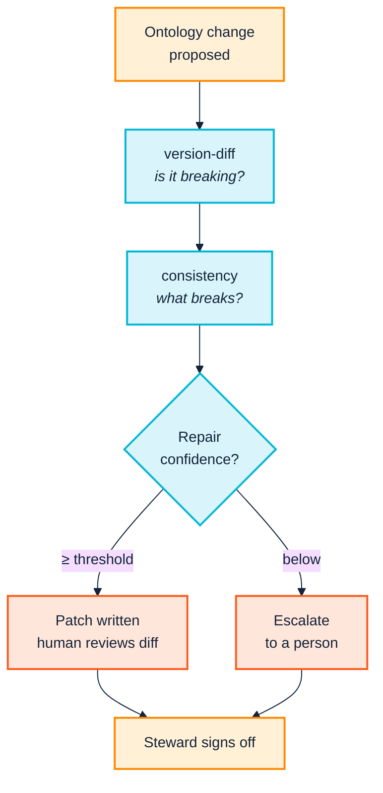

<p align="center">
  
</p>

# 11. Release and change

> *Part III — The practice · SemOps stages 1 and 4 · Operating-model layers 1 and 2*

> **Stories answered here**
> *As a domain steward, I need to know whether this release is breaking, and what
> breaks, before I approve it.*
> *As the person who has to fix the fallout, I want the mechanical part of the
> migration done for me.*

The SemOps overview puts Knowledge Lifecycle Management first and calls it *"the
backbone of semantic governance"* — versioning, schema evolution, change-impact
analysis, approval workflows. This chapter is the most directly governance-facing
in the manual, and it is where the toolchain does something genuinely unusual:
it turns *"is this a breaking change?"* from an opinion into a command.

---

## 11.1 Evidence-based semver: `version-diff`

```bash
python -m ontology_suite version-diff \
  examples/acme_robotics/acme-org-v1.ttl \
  examples/acme_robotics/acme-org-v2.ttl \
  --exclude-imports --out-dir out/version-diff --json
```

Real output:

```
Removed classes [MAJOR]:
  - acme:Engineer

Removed subclass edges [MAJOR]:
  - acme:Engineer no longer rdfs:subClassOf acme:Employee

Added classes [minor]:
  - acme:ProductManager
  - acme:SoftwareEngineer

Added properties [minor]:
  - acme:hireDate

Added subclass edges [minor]:
  - acme:ProductManager rdfs:subClassOf acme:Employee
  - acme:SoftwareEngineer rdfs:subClassOf acme:Employee

Added equivalentClass axioms [minor]:
  - acme:Engineer equivalentClass acme:SoftwareEngineer

Suggested version bump: MAJOR
```

Note the argument order: **old first, then new**. Reversed, you get a diff
describing the inverse release.

The verdict is derived from what happened to the axioms, not from what the
author believed they were doing. One removed class makes it MAJOR regardless of
the seven additive changes surrounding it, and regardless of anyone's view that
"nobody was using `Engineer` anyway."

That property is what makes it useful as a governance instrument. The release
conversation stops being *"do you think this is breaking?"* — a question where
the most confident person in the meeting tends to win — and becomes *"the diff
says MAJOR; who signs off?"*

**`--fail-on major`** makes it enforceable, and **`--json`** writes `diff.json`
alongside the human-readable `diff.txt`, which is what
[Chapter 3](03-across-the-boundary.md) recommends attaching to a partner-facing
change notice so downstream tooling can act on it without parsing prose.

---

## 11.2 Change impact: `consistency`

Knowing a release is breaking is half the answer. *What* breaks is the other
half.

The fixture's transformation query types every employee `acme:Engineer` — the
exact term v2 renames.

```bash
python -m ontology_suite consistency \
  --new examples/acme_robotics/acme-org-v2.ttl \
  --old examples/acme_robotics/acme-org-v1.ttl \
  --queries examples/acme_robotics \
  --import-dir examples/acme_robotics \
  --out-dir out/consistency
```

`consistency` runs the version diff *and* checks every transformation query
against the new ontology:

```
Suggested version bump: MAJOR

1 class(es) used in TARQL but not declared in the ontology set:
  [undeclared_class] acme:Engineer

1 suggested repair(s):
  [rename_iri] examples\acme_robotics\employees.rq (confidence 100%)
    Update to the renamed ontology term(s): acme:Engineer -> acme:SoftwareEngineer

Wrote 1/1 suggested repair(s) as .patch files under out/consistency/repairs
(confidence >= 50%). Re-run with --apply-repairs to apply them directly.
```

This is SemOps' "change-impact analysis" and "approval workflows for model
changes" made concrete. The steward approving this release is not being asked to
imagine consequences; they are looking at the affected file, the affected term,
and a proposed fix with a confidence score.

By default nothing is modified — repairs are written as reviewable `.patch`
files under `--out-dir/repairs`.

---

## 11.3 The migration annotation, and its direction

The 100% confidence above is not pattern-matching on names. It comes from an
explicit migration annotation in v2:

```turtle
acme:Engineer owl:equivalentClass acme:SoftwareEngineer .
```

> **The gotcha that costs an afternoon:** rename detection recognises this
> annotation in **one direction only** — asserted *from* the old, retiring IRI
> *to* the new one. `owl:equivalentClass` is logically symmetric, and any
> reasoner treats both directions identically, but writing it the other way
> round — `acme:SoftwareEngineer owl:equivalentClass acme:Engineer`, arguably
> the more natural way to write "here is the new term and what it replaces" —
> silently drops confidence to name-similarity guessing.

The failure is silent, which is what makes it expensive: you get a lower
confidence score and a repair that may fall below your threshold, with nothing
saying why.

**Always assert the migration annotation from the retiring IRI.** Make it a
review checklist item. Across an organisational boundary
([Chapter 3](03-across-the-boundary.md)) it is the difference between a partner's
tooling identifying the replacement automatically and a human reading your
release notes.

---

## 11.4 Applying repairs

```bash
python -m ontology_suite consistency \
  --new acme-org-v2.ttl --old acme-org-v1.ttl \
  --queries . --import-dir . \
  --apply-repairs --min-confidence 0.7 \
  --out-dir out/consistency
```

```
Applied 1/1 suggested repair(s) directly to their target files (confidence >= 70%).
```

Verified against a scratch copy. Before:

```sparql
?employee a acme:Employee, acme:Engineer ;
```

After:

```sparql
?employee a acme:Employee, acme:SoftwareEngineer ;
```

The confidence gate is the safety mechanism: a 100%-confidence rename backed by
an explicit annotation applies at a 0.7 threshold; a name-similarity guess does
not. Automate what is evidenced; escalate what is inferred.

### A caveat found by running it

The repair is a **textual substitution across the whole file, including
comments**. The fixture's query carries an explanatory comment:

```sparql
#   - every row is typed acme:Engineer, which v2.0.0 renames to
#     acme:SoftwareEngineer (with a migration annotation) -- this query is
```

After `--apply-repairs`, that comment reads:

```sparql
#   - every row is typed acme:SoftwareEngineer, which v2.0.0 renames to
#     acme:SoftwareEngineer (with a migration annotation) -- this query is
```

Now nonsense. Functionally harmless — comments do not execute — but it is a real
demonstration that the repair does not distinguish code from prose.

**The practical consequence:** prefer the default dry-run in automation, review
the `.patch` files, and apply. `--apply-repairs` is excellent for a developer
working locally who will read the diff before committing; it is a poor fit for
an unattended CI job that commits its own output.



---

## 11.5 The taxonomy layer: `pattern-consistency`

`consistency` has a documented blind spot: it has no notion of a **taxonomy** —
a controlled vocabulary of permitted values sitting on top of the ontology.
`pattern-consistency` checks that boundary and the three around it together:
ontology ↔ taxonomy ↔ transformation ↔ output data.

The fixture is built to exercise exactly this. `taxonomy.ttl` declares three
valid departments as SKOS concepts:

```turtle
dept:ENG a acme:Department, skos:Concept ;
    skos:inScheme acme:DepartmentTaxonomy ;
    skos:prefLabel "Engineering"@en .
```

`ENG`, `QA` and `SALES`. But `employees.csv` contains a row whose department is
`MKT`.

```bash
python -m ontology_suite pattern-consistency \
  --queries examples/acme_robotics \
  --ontology examples/acme_robotics/acme-org-v1.ttl \
  --ontology examples/acme_robotics/reference_vocab/foaf.rdf \
  --taxonomy examples/acme_robotics/taxonomy.ttl \
  --output-data out/triplify/employees.ttl \
  --out-dir out/pattern-consistency
```

```
== taxonomy <-> output data ==
  [undeclared_taxonomy_reference] .../data/department/MKT is used as the
  value of acme:worksIn in the data graph but is not declared as an
  individual anywhere in the given taxonomy set.
```

**Caught.** And the mechanism matters, because it is not the obvious one.

The transformation does not hard-code `MKT` anywhere. The department IRI is
built dynamically, per CSV row:

```sparql
BIND(IRI(CONCAT(..., ?department)) AS ?dept)
```

There is no fixed literal in the query text for a text-level check to flag. The
taxonomy↔transformation check — which looks for values hard-coded in the query
template — cannot see this, and correctly reports nothing. It is the
**`--output-data` layer** that catches it, by comparing the values that actually
appeared in the produced graph against the declared taxonomy.

This is worth dwelling on as a general principle:

> **A value that varies per data row cannot be validated by reading the
> transformation. It can only be validated by inspecting the output.** Any
> pipeline whose controlled values come from data rather than from the query
> text needs the output-data layer in its gate, not just the static checks.

Omit `--output-data` and this run reports clean — correctly, and uselessly.

> Note the two `--ontology` arguments. `foaf.rdf` is passed explicitly because
> the transformation uses `foaf:name` and `foaf:mbox`; without it, both are
> reported as undeclared properties. `--ontology` is repeatable, and
> `pattern-consistency` requires `--queries`, `--ontology` and `--taxonomy` —
> `--output-data` is the optional one, and the one that does the most work.

---

## 11.6 Governance: what the tooling does and does not do

SemOps layer 1 wants approval workflows, stewardship roles and audit trails.
**None of that is implemented here, and no tool should claim otherwise.** What
the toolchain provides is the *evidence an approval decision needs*:

| Governance question | Command | Evidence produced |
|---|---|---|
| Does this PR introduce a new problem in code we own? | `checks --own-namespace --fail-on Violation` | Pass/fail + findings scoped to your terms |
| Is this breaking, and does it need sign-off? | `version-diff --fail-on major` | MAJOR/minor/patch + the axioms behind it |
| What exactly breaks downstream? | `consistency` | Affected files, terms, and proposed repairs |
| Can any of it fix itself? | `consistency --apply-repairs --min-confidence` | Confidence-gated patches |
| Do controlled values still hold? | `pattern-consistency --output-data` | Values in data absent from the taxonomy |

The approval *workflow* — a branch protection rule requiring a named reviewer
when `version-diff` reports MAJOR — is a policy layered on top. That is the
correct division: the tool establishes facts, the organisation decides what to do
about them. A tool that tried to encode the decision would be wrong about it
within a quarter, because [Chapter 2](02-people-and-cognition.md)'s territorial
dynamics change faster than any configuration file.

For sequencing and rollback across an ontology/taxonomy/data rollout, the suite's
own `UPDATING.md` is the closest existing document to a governance playbook.

---

## 11.7 Maturity checkpoint

`version-diff` on every release, `consistency` before merging a breaking change,
and `pattern-consistency --output-data` where controlled vocabularies exist,
covers Level 3's change-management dimension and reaches into **Level 5's
"continuous semantic improvement loops"** — the diff → impact → repair cycle,
run routinely, is the closest this toolchain gets to Level 5.

The rest of Level 5 is organisational, and no command produces it.

---

| ← [10. Ingest and transform](10-ingest-and-transform.md) | [12. Operate and consume →](12-operate-and-consume.md) |
|---|---|
