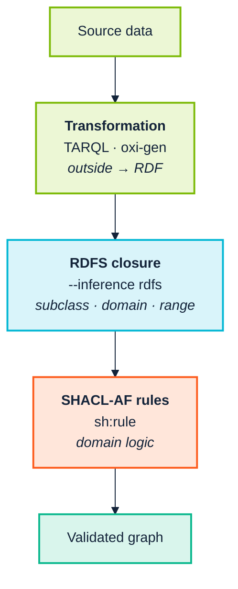

<p align="center">
  
</p>

# 11. Rules and inference

> *Part III — The practice · SemOps element 4 · Operating-model layer 2*

> **Stories answered here**
> *As a knowledge engineer, I want the model to derive what follows from the
> data, rather than making every consumer re-implement the same logic.*
> *As a SemOps engineer, I want to know what a rule will do to my gate before I
> turn it on.*

Every chapter so far has treated a graph as something to *check*. This one is
about deriving triples that were never asserted — and about the fact that the
moment you do, your gate is validating data that did not exist when the commit
was made.

SemOps names this as its own element — *Reasoning & Inference Operations*: rule
deployment and versioning, incremental strategies, validation of inferred
triples, regression tests for reasoning changes. It is the element most often
skipped, because inference feels like a modelling luxury until something
downstream re-implements it in application code for the fourth time.

---

## 11.1 A third tool

Rules need a tool the previous chapters have not used. The Ontology Quality
Suite does not run SHACL-AF rules — there is no `--advanced` flag on any of its
subcommands — and the VS Code extension does not either. Both validate.

| | **SHACL Engine** |
|---|---|
| Repository | [pwin/SHACL_Engine](https://github.com/pwin/SHACL_Engine) |
| Distribution | [PyPI: `shacl`](https://pypi.org/project/shacl/) · npm: `shacl-wasm`, `shacl-wasm-node` |
| What it is | A SHACL validator in Rust — CLI, Python bindings, and a WebAssembly build |
| Why it is here | It is the engine that runs **SHACL-AF rules**, and the native engine behind the suite's `--engine native+sparql` |

```bash
pip install shacl        # CLI + Python bindings
npm install shacl-wasm   # ESM build for bundlers
```

It is the same engine the suite already uses for validation, so adopting rules
does not add a second semantics — it exposes more of an engine you are running
already.

From Python, rules are reached through the `inference` argument rather than a
separate flag:

```python
import shacl
shapes = shacl.Shapes.from_file("shapes.ttl")          # compile once
report = shapes.validate_file("data.ttl",
                              inference="rules")        # or "rules-iterated"
print(report.conforms, len(report.results))
```

> **Check your version before believing any of this.** While writing this
> chapter the engine repository was at **0.1.7**, PyPI published **0.1.6**, and
> the ontology suite's own environment had **0.1.5** installed — and 0.1.5's
> Python binding does not support rules at all:
>
> ```
> inference='rules' -> ERROR: unknown inference "rules"; use "none" or "rdfs"
> ```
>
> That is the right failure — it names what it accepts, and does not quietly
> validate without applying the rules. But it means a notebook or pipeline
> written against 0.1.7 fails outright on 0.1.5 rather than degrading. Pin the
> version, and check with `shacl --version`.

---

## 11.2 Three ways to derive a triple

Before reaching for rules, be clear which of three mechanisms you want. They
overlap, and choosing wrongly is the usual cause of a pipeline nobody can debug.



| Mechanism | Use it when | Chapter |
|---|---|---|
| **Transformation** (TARQL / oxi-gen) | The data is not RDF yet. One row in, some triples out | [10](10-ingest-and-transform.md) |
| **RDFS closure** (`--inference rdfs`) | You need `rdfs:subClassOf`/`subPropertyOf`/domain/range entailments, and nothing more | This chapter |
| **SHACL-AF rules** (`sh:rule`) | The derivation is *domain logic* — conditional, computed, or specific to your model | This chapter |

The distinction that matters in practice: **a transformation runs once, at
ingest, and its output is what you store. A rule runs at validation time, and
its output may never be stored at all.** If downstream consumers need the
derived triples, a rule alone does not give them to you — you need to
materialise and load them.

### Why RDFS closure is not optional trivia

SHACL follows `rdfs:subClassOf` when deciding class membership, and **nothing
else**. A shape targeting `ex:parent` via `sh:targetSubjectsOf` will not see a
subject that only has `ex:father`, however clearly `rdfs:subPropertyOf` says one
implies the other. Materialising the closure first closes that gap:

```bash
shacl -d data.ttl -s shapes.ttl --inference rdfs
```

It covers `rdfs2`, `rdfs3`, `rdfs5`, `rdfs7`, `rdfs9` and `rdfs11` — domain,
range, both hierarchies and their transitivity. The axiomatic and reflexive
rules are deliberately left out: they entail `rdf:type rdfs:Resource` for every
term, which no shape is improved by.

It is off by default because it changes the report — and a `sh:closed` shape in
particular starts seeing inferred predicates and failing on them.

---

## 11.3 Triple rules

`sh:subject`, `sh:predicate` and `sh:object` are node expressions evaluated per
focus node. Applied to the Acme fixture, the two most common shapes a rule
takes:

```turtle
acme:PersonRules a sh:NodeShape ;
    sh:targetClass acme:Employee ;

    # 1. Constant object: every Employee is also a foaf:Agent
    sh:rule [ a sh:TripleRule ;
        sh:subject sh:this ; sh:predicate rdf:type ; sh:object foaf:Agent ] ;

    # 2. Path object: one triple per value found
    sh:rule [ a sh:TripleRule ;
        sh:subject sh:this ; sh:predicate acme:colleague ;
        sh:object [ sh:path acme:worksIn/^acme:worksIn ] ] .
```

Rules are **off by default** and enabled with `-a`:

```bash
shacl -d data.ttl -s shapes.ttl --advanced
```

**The inferred triples are the cross product of the three expressions.** A path
yielding three values yields three triples — which is what you want for rule 2
and worth remembering before writing a rule whose subject expression is also a
path.

The node expressions available are SHACL-AF's: `sh:this`, a constant,
`[ sh:path P ]` with an optional `sh:nodes` operand,
`[ sh:filterShape S ; sh:nodes N ]`, `sh:union` and `sh:intersection`. Anything
else is an error rather than an empty result — see [§11.7](#117-what-is-not-there).

### Verified behaviour

Running a rule that types every `ex:Person` as `ex:Party`, then validating the
inferred `ex:Party` instances against a shape requiring a property none of them
have, gives **exactly one violation per source instance** — 1,000 violations on
the 1,000-instance dataset and 100,000 on the 100,000-instance one. Every focus
node, once each, no misses and no duplicates.

That is the check worth copying: **validate the derived data, so a rule that
silently does nothing shows up as a missing violation rather than as silence.**

---

## 11.4 SPARQL rules

`sh:construct` takes a `CONSTRUCT` query with `$this` pre-bound to the focus
node. This is where computation lives:

```turtle
acme:BoxRules a sh:NodeShape ;
    sh:targetClass acme:Box ;
    sh:rule [ a sh:SPARQLRule ; sh:construct """
        PREFIX acme: <https://acme.example.org/ns/>
        CONSTRUCT { $this acme:area ?a }
        WHERE { $this acme:width ?w ; acme:height ?h . BIND(?w * ?h AS ?a) }""" ] .
```

Verified: with `width 3` and `height 4`, a shape asserting
`sh:path acme:area ; sh:hasValue 12` conforms — the arithmetic runs and the
derived value is what validation sees.

Prefixes can come from an inline `PREFIX` line, as above, or from SHACL's own
`sh:declare`/`sh:prefixes` mechanism:

```turtle
acme: sh:declare [ sh:prefix "acme" ;
                   sh:namespace "https://acme.example.org/ns/"^^xsd:anyURI ] .

acme:Rules a sh:NodeShape ; sh:targetClass acme:Thing ;
    sh:rule [ a sh:SPARQLRule ; sh:prefixes acme: ;
              sh:construct """CONSTRUCT { $this acme:tagged true } WHERE { }""" ] .
```

> **The `sh:prefixes` link is required.** A rule that omits it and relies on a
> shapes-graph-level `sh:declare` alone is not resolved: the engine rejects the
> whole shapes graph with a SPARQL prefix error, at compile time, whether or not
> `-a` was passed. Verified against the W3C 1.2 rules corpus. Write
> `sh:prefixes` explicitly, or keep the `PREFIX` line inside the query.

---

## 11.5 Four ways to get a wrong answer

These produce silence, not errors. Every one reproduces exactly as described.

**A rule fires on its shape's targets, so a shape with no target does nothing.**
This is the most common mistake, because attaching a rule to a nested property
shape reads perfectly naturally:

```turtle
acme:S a sh:NodeShape ; sh:targetClass acme:Employee ;
    sh:property [ sh:path acme:name ;
        sh:rule [ … ] ] .        # never fires: this shape has no target
```

Verified: the rule never runs, nothing is inferred, and no message says so.

**One pass, so a transitive rule does not close.** SHACL-AF defines a single
iteration. A rule deriving `ex:sub` from two hops of `ex:sub` reaches two hops
and stops. On a chain `a→b→c→d`, one pass leaves `a` short of `d`:

```bash
shacl -d data.ttl -s shapes.ttl -a                    # one pass  -> a does not reach d
shacl -d data.ttl -s shapes.ttl -a --iterate-rules 10 # fixpoint  -> it does
```

`--iterate-rules` is outside the specification. A rule set with no fixpoint —
one minting a fresh term each round — stops with an error rather than running
until memory does.

**Rules at the same `sh:order` cannot see each other's inferences.** Two rules
both at the default order 0 each see the graph as it was before either ran.
Verified with a two-step chain (`Person → Step1 → Step2`): at equal order,
`Step2` is never reached; with `--iterate-rules 5`, it is. Give the consumer a
higher `sh:order`, or iterate.

**Negation is not monotonic, and iteration exposes it.** A conclusion drawn from
absence *outlives* the absence, because rules only ever add triples:

```turtle
# Round 1 marks ex:a as Unnamed. Round 2's rule then gives it a name.
# The mark stays. It is simply no longer true.
```

SHACL 1.2 Rules answers this by requiring a stratified rule set; SHACL-AF does
not, so it is the author's problem. If a rule tests for absence, either keep to
a single pass or ensure nothing later supplies what it tested for.

> **And one that is not a hazard:** rules never modify the graph you passed in.
> The expanded graph is a new one, so a report is always relative to an input
> you still have.

---

## 11.6 Rules at scale

Measured on this manual's own benchmark data, whole-process wall time, two rules
(one triple rule, one SPARQL rule) plus validation of the derived triples:

| instances | triples | validate only | rules + validate |
|---:|---:|---:|---:|
| 1,000 | ~6,900 | — | 0.9s |
| 10,000 | ~69,000 | — | 1.1s |
| 100,000 | ~690,000 | 2.7s | **11.9s** |
| 100,000, `--iterate-rules 5` | ~690,000 | — | 18.7s |

Rules cost roughly **4.5× validation alone** at 100k, and iterating to five
rounds roughly 7×. In absolute terms that is twelve seconds to derive and
validate over two-thirds of a million triples, which is comfortably inside a CI
budget.

For context on the validation half, the same engine against pySHACL on the same
data, with identical result counts at every size:

| instances | ours | pySHACL | speedup |
|---:|---:|---:|---:|
| 1,000 | 0.040s | 2.992s | 75× |
| 10,000 | 0.199s | 24.369s | 122× |
| 100,000 | 1.808s | 206.250s | 114× |

Two caveats the engine is candid about, and which matter more than the ratio.
**Loading dominates** — at 100k, validation is 0.46s of the 1.81s total, so the
first place to look for speed is the parser, not the validator. And the index
holds the graph **three times over**, once per permutation, with no streaming
path: budget roughly 3 × 12 bytes per triple plus the interned strings, and do
not reach for this on a graph too large to hold three sorted copies of.

---

## 11.7 What is not there

Stated plainly, because a rule engine's gaps are where the silent wrong answers
live.

| Not implemented | Consequence |
|---|---|
| **SHACL functions** (`sh:SPARQLFunction`) | A rule calling one errors — `unsupported node expression`, exit 2 — rather than returning empty |
| **Result annotations** (`sh:resultAnnotation`) | Extra properties from a SPARQL constraint's solution are not copied onto results |
| **SHACL 1.2 Rules** (`RULE { } WHERE { }`) | A different design from SHACL-AF; its test corpus is vendored but not wired into the conformance harness |
| **OWL-RL pre-inference** | RDFS is available and opt-in; nothing beyond it |
| **Rules in the WebAssembly build** | **The WASM API has no rules at all** — see below |

### The WASM build cannot run rules

This is the gap most likely to catch you out, because everything else about the
WASM build is the same engine. Its API exposes `inference: "none" | "rdfs"` and
nothing more — there is no `advanced` option and no `iterateRules`.

The consequence is sharp. Given a shapes graph whose SPARQL rule the native
engine rejects at compile time, the native CLI exits 2 with an error, and the
**WASM build returns `conforms = true` with zero results** — verified directly
against the same file. One says *"I could not check this"*; the other says
*"this is fine"*.

That is precisely the distinction [Chapter 4](04-from-research-to-industry.md)
argues is the whole difference between a gate you can trust and one you cannot,
and here it falls on the browser side. **If you are validating in the editor or
the browser and your shapes carry rules, the rules are not running.** Use the
native CLI or the Python binding for anything rule-bearing, and treat the WASM
build as validation-only.

### Named graphs are flattened

Worth repeating here because rules make it sharper: quad syntaxes parse, and
then every named graph and the default graph are merged into one before
validation. A rule's inferences are not attributed to any graph. See
[Chapter 13](13-operate-and-consume.md) §13.1.

---

## 11.8 Rules are a governed artefact

Everything [Chapter 12](12-release-and-change.md) says about ontology change
applies to rules, with one addition: **a rule change alters the meaning of data
you have already validated.** Adding a rule that types every `Employee` as an
`Agent` retroactively brings every `Agent` shape to bear on your whole
employee table.

Four practices:

- **Version rules with the shapes, in the same repository.** They are not
  configuration.
- **Pin `--advanced` and `--iterate-rules` in CI**, exactly as
  [Chapter 9](09-continuous-integration.md) pins `--engine`. Same commit, same
  answer, on every machine.
- **Validate the derived triples, not just the source.** A rule that stops
  firing is invisible unless something downstream asserts it should have.
- **Treat `--iterate-rules > 1` as a deliberate, documented decision.** It is
  outside the specification, so another SHACL processor will not reproduce your
  results.

### Exit codes make this gateable

```
0   conforms
1   violations found
2   could not validate  (bad input, unsupported feature, compile error)
```

Verified across all three. That separation is what lets a CI job distinguish
*"the data is wrong"* from *"the rules did not compile"* — and a job that treats
them the same will eventually go green on a rule set that never ran.

---

> **Run it:** [notebook 2 — Rules and inference](../notebooks/02-rules-and-inference.ipynb)
> runs every rule form above and reproduces all four silent-failure hazards.

## 11.9 Maturity checkpoint

Rules run in CI, versioned alongside the shapes, with derived triples validated
and the flags pinned, is most of SemOps element 4 — *Reasoning & Inference
Operations*. It is the element
[Chapter 14](14-coverage-and-gaps.md) previously marked **partial** on the
strength of the suite's `owlrl` closure and reasoner checks alone.

What is still missing at Level 4 scale: incremental reasoning — every run here
is a full pass — and performance monitoring of inference jobs. Both remain
genuine gaps.

---

| ← [10. Ingest and transform](10-ingest-and-transform.md) | [12. Release and change →](12-release-and-change.md) |
|---|---|
