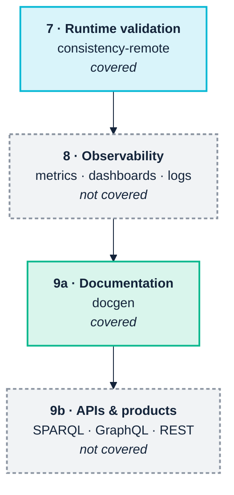

<p align="center">
  
</p>

# 13. Operate and consume

> *Part III — The practice · SemOps stages 7–9 · Operating-model layer 6*

> **Stories answered here**
> *As a platform owner, I want the same checks that guard the repository to run
> against what is actually in the triple store.*
> *As an application developer or an agent, I need documentation of what the
> terms mean and a guarantee they will not change under me.*

The last three pipeline stages — runtime validation, observability, and
consumption — are where a knowledge graph either earns its keep or quietly
becomes a cost centre. This is also where the toolchain's coverage is thinnest,
and this chapter is explicit about which parts are real and which are grey.



---

## 13.1 Runtime validation against a live store

Everything so far has run against files in a repository. The moment the org
chart moves from Git-tracked Turtle into a real triplestore, a new question
appears: **is what is actually loaded still consistent with what we think we
shipped?**

Repository checks cannot answer that. A store drifts through partial loads,
manual fixes, an update applied to one environment and not another, or a graph
someone forgot to reload.

```bash
python -m ontology_suite consistency-remote \
  --query-endpoint http://localhost:3030/acme/sparql \
  --manifest graphs.json \
  --auth-user admin --auth-password secret \
  --out-dir out/consistency-remote
```

> **`graphs.json` is not bundled with the fixture, and cannot be.** Unlike every
> other command in Part III, this one has no runnable file to point at, because
> a manifest binds *your* store's named-graph URIs — which nobody else can know.
> You write it once, as below.

### The manifest is the interesting part

A triplestore holds triples, not project metadata. Fuseki has no built-in link
from a named graph back to the transformation query that produced it, nor from a
data graph to the ontology graph it is supposed to conform to. The manifest is
where a project records that binding explicitly:

It is a JSON file, and short enough to write by hand:

```json
{
  "graphs": [
    {
      "graph_uri": "https://acme.example.org/graph/ontology/2.0.0",
      "role": "ontology"
    },
    {
      "graph_uri": "https://acme.example.org/graph/triplified/employees",
      "role": "triplified_data",
      "source_tarql": "queries/employees.rq",
      "ontology_graph_uri": "https://acme.example.org/graph/ontology/2.0.0",
      "notes": "nightly load from the HR extract"
    }
  ]
}
```

Five fields, of which two are optional:

| Field | Applies to | Meaning |
|---|---|---|
| `graph_uri` | both | The named graph's URI **as the store knows it** |
| `role` | both | Exactly `"ontology"` or `"triplified_data"` — no other value means anything |
| `source_tarql` | data only | Local path to the query that produced this graph |
| `ontology_graph_uri` | data only | Which `"ontology"` graph this data must conform to |
| `notes` | both | Free text; ignored by the tooling, read by humans |

Or build it in Python, which is worth doing if the URIs come from somewhere
programmatic:

```python
from ontology_suite.remote.manifest import GraphManifest, GraphBinding

GraphManifest(bindings=[
    GraphBinding(graph_uri="https://acme.example.org/graph/ontology/2.0.0",
                 role="ontology"),
    GraphBinding(graph_uri="https://acme.example.org/graph/triplified/employees",
                 role="triplified_data",
                 source_tarql="queries/employees.rq",
                 ontology_graph_uri="https://acme.example.org/graph/ontology/2.0.0"),
]).save("graphs.json")
```

### Finding out what your graph URIs actually are

The manifest must use the store's own URIs, not what you think you loaded. Ask
the endpoint:

```sparql
SELECT ?g (COUNT(*) AS ?triples)
WHERE { GRAPH ?g { ?s ?p ?o } }
GROUP BY ?g ORDER BY DESC(?triples)
```

Run that first, every time, against a store you did not load yourself. A graph
URI that differs by a trailing slash is the most common reason a three-way check
reports nothing at all.

> **`role` is not validated, and a typo costs you the whole check.** A manifest
> saying `"triplified-data"` — hyphen instead of underscore — loads without
> complaint, contributes zero data bindings, and the run completes successfully
> having compared nothing. Verified. It is the same silent-zero shape as the
> `--own-namespace` near-miss in
> [Chapter 9](09-continuous-integration.md) §9.4, and the same defence applies:
> confirm the check can fail before trusting that it passed. Point it at a graph
> you know is wrong, once, and watch it complain.

That structure enables a genuine **three-way check**: the live data graph, the
ontology graph it claims to conform to, and the local query file that produced
it — all compared together. It catches the specific and common failure where the
repository is perfectly consistent and the store is a version behind.

`--sample-limit` caps how many triples are pulled per named graph, which is what
makes this viable against a production-sized store.

### Named graphs are a decision you make once

[Chapter 3](03-across-the-boundary.md) argued that per-partner named graphs are
the highest-value cross-boundary decision, and this is where it pays off. The
manifest model assumes named graphs; a store where everything was merged into the
default graph cannot express these bindings at all, and cannot answer "which
supplier asserted this?" either.

It is nearly free at load time and effectively impossible to retrofit.

> **But SHACL validation itself does not see them.** This is a boundary worth
> knowing exactly, because it is easy to assume otherwise once your data is
> partitioned. SHACL is defined over *one* data graph, and the engines behave
> accordingly: quad syntaxes (TriG, N-Quads) parse fine, and every named graph
> plus the default graph is merged into a single graph before validation.
> Verified — a TriG file holding three subjects across two named graphs and the
> default graph produces a report identical to the same triples flattened into
> one Turtle file. There is no graph-selection option, no per-graph report, and
> a rule's inferences are not attributed to a graph.
>
> So named graphs give you **provenance and lifecycle** — which partner sent
> what, which graph to reload, which to drop — and they do not give you
> **scoped validation**. If you need "validate supplier A's contribution against
> supplier A's contract," extract that graph and validate it as its own
> document. The `manifest.json` model above is built for exactly that: it binds
> each graph to the ontology it should conform to, and checks them one at a
> time rather than as a union.

---

## 13.2 Documentation as a product: `docgen`

SemOps lists documentation as a first-class element — *"without it, semantic
systems become opaque"* — and it is the artefact
[Chapter 2](02-people-and-cognition.md) identified as the answer to the
priesthood problem.

```bash
python -m ontology_suite docgen \
  --ontology examples/acme_robotics/acme-org-v1.ttl \
  --out-dir out/docgen
```

Real output:

```
Wrote out/docgen/ontology_doc_data.json: prefix='acme', 4 classes,
  2 object properties, 3 datatype properties, 1 sections,
  5 external terms (0 resolved).
Wrote out/docgen/ontology-documentation.html
4 class diagram(s) written to: out/docgen/class-diagrams
```

You get a self-contained `ontology-documentation.html` — class and property
tables, diagrams, and one concise-bounded-description diagram per class — plus
`ontology_doc_data.json`, which is the machine-readable version. That JSON is
easy to overlook and is the more strategically useful of the two: it is what you
feed a documentation portal, a catalogue, or — per
[Chapter 5](05-genai-and-agents.md) — an agent that needs to know what your terms
mean.

### Two rough edges found while running it

**`--ref` does not sniff serialisation format.** Passing the FOAF vocabulary,
which is published as RDF/XML:

```bash
python -m ontology_suite docgen --ontology acme-org-v1.ttl \
  --ref reference_vocab/foaf.rdf --out-dir out/docgen
```

fails with an rdflib Turtle parse error — the RDF/XML comment header is read as
Turtle:

```
rdflib.plugins.parsers.notation3.BadSyntax: at line 4 of <>:
Bad syntax (expected '.' or '}' or ']' at end of statement)
```

Convert the vocabulary to Turtle first, or pass only Turtle files to `--ref`.
This is a small thing that costs ten confusing minutes, and it is worth knowing
before it happens to you rather than after.

**External-term resolution did not engage in this run.** Even with
`--ref reference_vocab/org.ttl` supplied, the output still reported
*"5 external terms (0 resolved)"*. `foaf:Person` and `org:OrganizationalUnit`
are correctly *listed* as external terms in both cases — the documentation is
accurate about what it does and does not know — but their upstream definitions
were not pulled into the page. Reported as observed; the behaviour may be
sensitive to how the reference file declares its terms.

Neither undermines the command. The generated page is genuinely the artefact to
put in front of a domain expert, and being explicit about unresolved external
terms is better than silently omitting them.

### Make it automatic

The maturity model expects documentation *"auto-generated on every commit"* at
Level 3. That is one CI step:

```yaml
- name: Reference documentation
  run: |
    uv run ontology-quality-suite docgen \
      --ontology ontology/acme-org.ttl --out-dir docs/reference
- uses: actions/upload-pages-artifact@v3
  with:
    path: docs/reference
```

Documentation that regenerates itself is documentation that stays true.
Documentation maintained by hand is documentation that was true once.

---

## 13.3 Observability: not covered

SemOps stage 8 wants graph size and growth metrics, query-performance
dashboards, SPARQL log analysis, data-quality KPIs, provenance tracking and
anomaly detection. **None of this is in either tool.** Prometheus, Grafana and
Loki are the right answers, exactly as the pipeline blueprint says.

There is one thing worth doing that costs almost nothing, though, and it is the
bridge between what you have and what you need:

> **Every check run writes `full_results.csv`. Retain them, timestamped.**

That file is a time series of your semantic quality. Findings-by-severity over
time, per check ID, is a genuine data-quality KPI, and it comes free from
artefacts CI is already producing. Most teams delete them with the build.

The specific signal to watch is not the absolute count but the **trend in
Warnings**. Violations get fixed because they fail the build. Warnings
accumulate silently, and an accumulating Warning count is the observable
signature of [Chapter 1](01-the-business-case.md)'s decay — visible in your own
CI artefacts a year before anyone notices the model has drifted.

---

## 13.4 Knowledge products and APIs: not covered

SemOps stage 9 wants SPARQL endpoints, GraphQL and REST APIs, search indexes,
and data products. Neither tool serves an API, and neither should — that is
application development, not quality tooling.

The SemOps material's own microservices guidance is the reference here, and its
core architectural point is sound: for low-latency semantic APIs, embed the
SPARQL engine **in** the service rather than putting a service in front of a
remote triplestore.

| Language | Engine | Best at |
|---|---|---|
| Rust | Oxigraph | Highest throughput, lowest latency |
| Python | RDFLib | Analytics, AI/LLM integration |
| Node.js | Comunica | Streaming, web-native, federated |
| Prolog | SWI `semweb` | Rule-heavy, expert-system style |
| Java | Jena / Fuseki | Enterprise-standard, stable |

Note that Oxigraph appears twice in this manual's world — as the recommended
Rust API engine here, and as the WASM engine the VS Code extension already runs
in-process ([Chapter 7](07-the-toolchain.md)). That is not a coincidence so much
as a signal: the same embeddable engine serves the editor and the endpoint.

### What consumption demands from everything upstream

Whether the consumer is a React application, a dashboard, or an agent
([Chapter 5](05-genai-and-agents.md)), it needs four things — and all four are
produced by earlier chapters, not by the API layer:

| Consumer needs | Produced by | Chapter |
|---|---|---|
| Stable IRIs that do not change meaning | Evidence-based semver, migration annotations | [12](12-release-and-change.md) |
| To know what a term means | `docgen`, `rdfs:label` coverage (`QUA-001`) | This chapter, [8](08-model-and-validate.md) |
| Confidence the data conforms | `data`, `consistency-remote` | [10](10-ingest-and-transform.md), this chapter |
| To know who asserted what | Named graphs | [3](03-across-the-boundary.md), §13.1 |

An API built on a graph that lacks these is an API that will be wrong
occasionally and unpredictably — which is worse than being wrong reliably,
because consumers stop being able to calibrate their trust.

---

## 13.5 Maturity checkpoint

`consistency-remote` against a live store, plus `docgen` on every commit, covers
part of Level 4's *"semantic APIs managed and monitored"* — the *managed* half.

The *monitored* half needs an observability stack this toolchain does not
provide, and Level 4 also expects Kubernetes deployment, automated environment
promotion, and continuous ingestion with retry logic. Those are real gaps, and
[Chapter 14](14-coverage-and-gaps.md) is where they are counted honestly rather
than glossed.

---

| ← [12. Release and change](12-release-and-change.md) | [14. Coverage and gaps →](14-coverage-and-gaps.md) |
|---|---|
