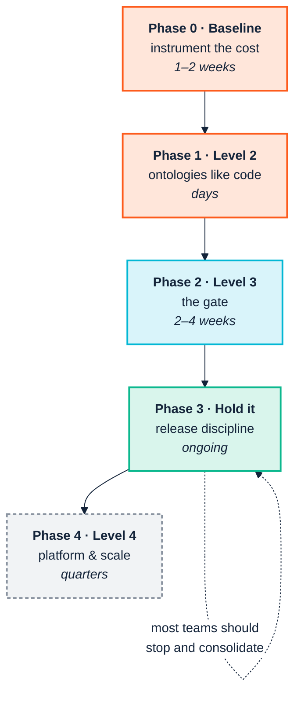

<p align="center">
  
</p>

# 14. Adoption roadmap

> *Part IV — The ledger*

The maturity model tells you where you are. This chapter tells you what to do on
Monday.

The sequencing principle throughout: **automate before you accelerate.** Every
transition below establishes a control before it increases throughput, for the
reason [Chapter 5](05-genai-and-agents.md) sets out — an organisation that raises
its change rate before it has a gate has industrialised the production of
unreviewed model.



---

## Phase 0 — Baseline before you build

**One to two weeks. Skipping this is the most common and most expensive
mistake.**

Once the ontology exists you can no longer measure what it saved, because the
counterfactual is gone. Capture the numbers first.

| Do this | Why |
|---|---|
| Ask four analysts to tag two weeks of calendar time as "reconciling definitions" | Produces a cost figure in the business's own terms ([Ch. 1](01-the-business-case.md)) |
| Record mean lead time for the last five integrations | The curve you are claiming to bend |
| Time one lineage question end to end | The most legible before/after story you will get |
| Name the owner | Governance abandonment is the terminal failure mode. If nobody's objectives mention this, you do not have a programme |
| Pick a first use case with a *visible* failure | Legible beats valuable. An embarrassing three-week regulator question is worth more as a first case than a larger diffuse inefficiency |

**Exit criterion:** you can state, in one sentence and with a number, what is
broken today.

---

## Phase 1 — Reach Level 2: ontologies like code

**Days. This is a decision more than a project.**

| Step | Command or action |
|---|---|
| Ontology, shapes, queries into Git | — |
| Install the extension on every modeller's machine | `.vsix` from the [webapp repo](https://github.com/pwin/consolidated-ontology-quality-suite-webapp) |
| Establish the local loop | *Run Local Checks*, Ontology Outline, *Show Metrics* |
| Run the tightest gate by hand | `ontology --ontology <yours> --import-dir vendor/vocab` |
| Vendor your imports | Copy upstream vocabularies into `vendor/vocab`; never rely on `--allow-network` |
| Record your namespace | Copy the exact `@prefix` string somewhere the team can find. You will need it repeatedly, and getting it wrong fails silently ([Ch. 9](09-continuous-integration.md)) |

Two habits to establish now, while it is cheap:

**Design the IRI scheme deliberately.** Schema terms and instance data should sit
under a common prefix you can filter on — `https://acme.example.org/ns/` and
`https://acme.example.org/data/` share `https://acme.example.org/`, which is what
makes `--own-namespace` usable across both
([Ch. 10](10-ingest-and-transform.md)). Retrofitting an IRI scheme is a migration.

**Decide named graphs before the first production load.** Per-source named graphs
are nearly free at load time and effectively impossible to retrofit
([Ch. 12](12-operate-and-consume.md)).

**Exit criterion:** every modeller sees findings in their editor, and the
ontology's history is in Git.

---

## Phase 2 — Reach Level 3: the gate

**Two to four weeks. This is the transition worth real effort.**

It converts "we have standards" into "the standards are enforced without anyone
remembering to enforce them" — and it is the prerequisite for everything in
Phases 3 and 4.

### Week 1 — the gate that cannot be ignored

```bash
ontology-quality-suite ontology \
  --ontology ontology/acme-org.ttl --import-dir vendor/vocab \
  --fail-on Violation
```

Start here, not with the full registry. It is the narrowest, highest-signal
check, and a gate people trust from day one is worth more than a comprehensive
one they learn to bypass.

### Week 2 — scope the registry, then add it

```bash
ontology-quality-suite checks \
  --ontology ontology/acme-org.ttl --import-dir vendor/vocab \
  --own-namespace "https://acme.example.org/" \
  --engine sparql --fail-on Violation
```

**Do not skip `--own-namespace`.** Unscoped, the fixture in this manual produces
close to 300 findings where 5 are yours, and the total drifts between runs; the
gate is dead within two sprints ([Ch. 9](09-continuous-integration.md)). And do
not reach for `--exclude-imports` instead — verified, it introduces four *false*
findings, which damages trust faster than noise does. The scoped run returns the
same 5 findings every time, which is what a gate has to do.

Verify the filter is live by pointing it at a known-failing input once. A gate
that cannot fail is indistinguishable from a gate that passes.

### Week 3 — the pipeline stages

| PR touches | Gate |
|---|---|
| A transformation query | `sketch` — needs no CSV, runs in seconds |
| Data | `data --own-namespace`, plus `--sample N` if large |
| A taxonomy | `pattern-consistency --output-data` |

`--output-data` is not optional in practice. Without it, per-row controlled
values are invisible ([Ch. 11](11-release-and-change.md)).

### Week 4 — documentation and artefacts

```bash
ontology-quality-suite docgen --ontology ontology/acme-org.ttl \
  --out-dir docs/reference
```

Publish it. Then **retain `full_results.csv` from every run, timestamped** — it
costs nothing and becomes your only quality time series
([Ch. 13](13-coverage-and-gaps.md)).

**Exit criterion:** a pull request that breaks the ontology fails, and the
failure names something the team owns.

---

## Phase 3 — Hold it: release discipline

**Ongoing. Most teams should stop and consolidate here.**

| Practice | Command | Cadence |
|---|---|---|
| Evidence-based semver | `version-diff old.ttl new.ttl --json` | Every release |
| Change impact | `consistency --new … --old … --queries …` | Every breaking change |
| Migration annotations | `oldTerm owl:equivalentClass newTerm` — **from the retiring IRI** | Every rename |
| Wide audit | `checks` with imports, unscoped, `--fail-on never` | Weekly, or on upstream change |
| Live-store check | `consistency-remote --manifest graphs.json` | After every deployment |

Add one governance control, which is a branch protection rule rather than a
command: **a MAJOR bump requires a named reviewer.** The tool establishes the
fact; the platform enforces the policy ([Ch. 11](11-release-and-change.md)).

And one review-checklist item that will otherwise cost you an afternoon per
occurrence: migration annotations are read **directionally**, from the retiring
IRI to the replacement. Written the other way round, rename detection silently
degrades to name-similarity guessing.

### If you work across organisational boundaries

Three additions, all cheap ([Ch. 3](03-across-the-boundary.md)):

- **Publish your check registry** as a directory partners can point
  `--registry`/`--shapes`/`--sparql` at, so they validate before submitting
  rather than after rejection.
- **Accept CSV.** The triplify path means a partner never authors RDF.
- **Attach `diff.json`** to every change notice, so partner tooling can act
  without parsing your prose.

---

## Phase 4 — Level 4, and knowing when not to

**Quarters, and mostly not semantic work.**

Level 4 is Kubernetes deployment, environment promotion, continuous ingestion
with retry logic, an observability stack, and managed semantic APIs. Almost none
of it is in this toolchain, and almost none of it needs specialist semantic
tooling ([Ch. 13](13-coverage-and-gaps.md)).

What *is* here for Level 4:

| Need | Command |
|---|---|
| Speed at scale | `--engine native+sparql` |
| Large data graphs | `data --sample N` |
| Live-store validation | `consistency-remote --sample-limit N` |

> **Consider not doing Phase 4.** A team solidly at Level 3, with a gate that
> holds and releases that are evidence-based, has captured most of the available
> value. Level 4 is justified by *scale* — many consumers, large graphs, strict
> availability. Pursued for its own sake it is an expensive way to acquire
> operational burden.
>
> And Level 5 is overwhelmingly organisational. A team frustrated that tooling
> will not carry them there has correctly identified that the remaining problem
> is [Chapter 2](02-people-and-cognition.md)'s, not the toolchain's.

---

## The first ninety days, on one page

| Days | Focus | Deliverable |
|---|---|---|
| **1–10** | Baseline | A number, a named owner, one legible use case |
| **11–20** | Level 2 | Ontology in Git; extension on every desk; IRI scheme decided |
| **21–40** | The gate | `ontology --fail-on Violation` in CI, and it has failed at least once |
| **41–60** | Scope and extend | `checks --own-namespace`; `sketch` on query PRs; first house rule written |
| **61–75** | Release discipline | `version-diff` on release; MAJOR requires a reviewer |
| **76–90** | Make it visible | `docgen` published; `full_results.csv` retained; report the baseline delta |

The last row matters more than it looks. A programme that reaches day 90 without
having reported back against Phase 0's number will be asked to justify itself in
a language it did not prepare for.

---

## The shortest version

If you read nothing else in this manual:

1. **Measure the cost before you fix it.** You cannot reconstruct the
   counterfactual.
2. **Name an owner.** Unowned ontologies decay silently, and decay is the
   dominant failure mode.
3. **Gate on `--fail-on Violation`, scoped with `--own-namespace`.** Unscoped
   gates die; `--exclude-imports` produces false findings.
4. **Assert migration annotations from the retiring IRI.** Symmetric in logic,
   directional in tooling.
5. **Automate before you accelerate.** Especially before adding agents.

---

| ← [13. Coverage and gaps](13-coverage-and-gaps.md) | [Appendix A: Diagram conventions →](diagram-style.md) |
|---|---|
